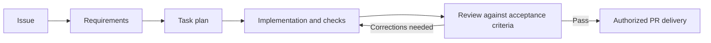

# Issue Flow

**A reusable development workflow, from issue to reviewed Pull Request.**

Issue Flow takes a GitHub or local issue through requirements, task planning,
implementation, verification and Pull Request delivery. It makes the steps
between a request and a reviewed change explicit: what to build, how to break
it into tasks, what evidence to collect and when the work is ready for a PR.

Start with its portable **Agent Skills** in your coding agent. They provide the
complete workflow or individual steps without installing the Issue Flow CLI.
An independent, experimental CLI is also available for unattended orchestration,
persistent execution state and monitoring.

> [!WARNING]
> **The whole project is experimental, including the Skills.** Skills are the
> recommended starting point, not a guarantee of production readiness. Use
> disposable or recoverable repositories for evaluation; real projects,
> production, critical systems and sensitive repositories are not recommended.
> Read the [project status](docs/project-status.md) for risks and precautions.

## How it works

```text
Issue Flow
├── Recommended: Agent Skills in your coding agent
│   └── A complete workflow or individually selected steps
└── Experimental alternative: CLI
    └── Headless orchestration, persistent state, queues and monitoring
```

Both paths start with an issue from **GitHub or local files**:



GitHub hosts issues, discussions and Pull Requests. Agent Skills provide reusable
instructions and resources; the host agent performs the work in your repository.
The CLI drives agent processes itself. Neither interface requires the other.

The workflow respects the repository's [conventions](docs/conventions.md).
Planning-only and local-only work can stop before implementation or publication.
Review the changes and evidence before merging; automated review does not replace
human review. Skills and the CLI have separate execution state, so choose one
interface for a run.

## Start with Agent Skills — recommended

Open the repository you want to work on in a compatible coding agent. Install the
complete workflow from that project's directory; this example targets Codex:

```bash
npx skills add fabioassuncao/issue-flow --skill resolve-issue -a codex
```

Select the installed Skill in your agent and ask:

```text
Use resolve-issue for GitHub issue 42 in manual mode.
```

Replace `42` with an issue in that repository. Manual mode produces requirements
and a task plan, then stops before implementation. Inspect them before asking
the agent to continue through implementation, verification and PR creation.

**[Start the Skills guide](skills/README.md)** for prerequisites, the complete
first-issue walkthrough, individual Skills, local issues and installation options.
See [host compatibility](docs/skills-compatibility.md) for other coding agents.
Installing `resolve-issue` alone is enough for the full workflow.

## Try the CLI — experimental

Use the CLI when evaluating unattended execution, persistent recovery, multi-issue
queues, per-phase agent selection or the live monitor. After completing the
[CLI prerequisites](docs/cli.md#requirements-and-installation), run from your
consumer repository:

```bash
npx issue-flow init
npx issue-flow run 42
```

Or install the CLI globally from its npm package:

```bash
npm install -g issue-flow
```

The `fabioassuncao/issue-flow` repository identifier used by the Skills installer
above is not the CLI package name. Passing it to `npm install` asks npm to install
the Git repository root, which is not an npm package in this monorepo.

`run` starts the full pipeline, including PR creation. Installing the CLI does
not install Skills. **[Read the CLI guide](docs/cli.md)** for setup, outputs,
monitoring, limitations and the command reference.

## Documentation and contributing

| I want to… | Start here |
|---|---|
| Use Agent Skills | [Skills guide](skills/README.md) |
| Choose a compatible agent | [Skill compatibility](docs/skills-compatibility.md) |
| Experiment with the CLI | [CLI guide and reference map](docs/cli.md) |
| Contribute documentation, Skills or code | [Contributing](CONTRIBUTING.md) |
| Understand the architecture | [Architecture and code organization](docs/code-organization.md) |
| Understand repository conventions | [Conventions](docs/conventions.md) and [Git naming](docs/git-conventions.md) |
| Evaluate maturity and risks | [Project status](docs/project-status.md) |
| See what changed | [Changelog](CHANGELOG.md) |

Report problems or propose work through the repository's
[issue templates](https://github.com/fabioassuncao/issue-flow/issues/new/choose).
Dated investigations live in [research](docs/research/); they are evidence,
not current operating instructions.

## License

[MIT](LICENSE). The autonomous execution loop draws on
[Geoffrey Huntley's Ralph pattern](https://ghuntley.com/ralph/).
