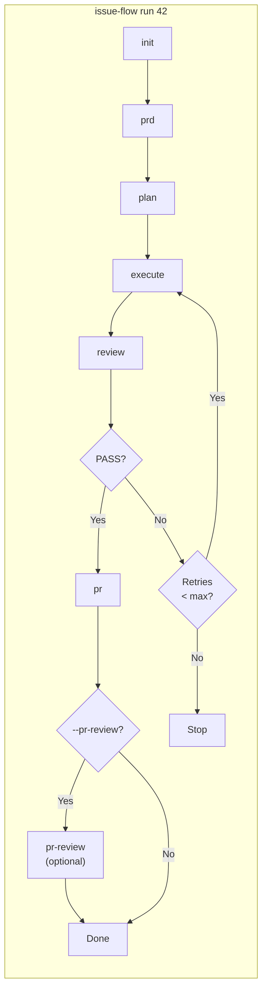

# Issue Flow

A CLI that turns issues into pull requests autonomously. Orchestrates the full pipeline -- plan, implement, review, and deliver -- via [Claude Code](https://docs.anthropic.com/en/docs/claude-code) Headless mode. Issues can come from GitHub or from plain files in your repository (see [Issue Sources](#issue-sources-providers)).

## Quick Start

```bash
# Verify prerequisites
npx issue-flow init

# Run the full pipeline for issue #42
npx issue-flow run 42
```

## Requirements

- **Node.js** >= 22.0.0
- **Git** installed and available in PATH
- **Claude Code** (`npm install -g @anthropic-ai/claude-code`)
- **GitHub CLI** (`gh`) authenticated (`gh auth login`) -- required only for GitHub issues; a run on [local issues](#issue-sources-providers) does not need it

Run `npx issue-flow init` to verify all prerequisites (`npx issue-flow init --local` when the issue lives in the repository).

## Installation

```bash
# Run directly via npx (no install needed)
npx issue-flow run 42

# Or install globally
npm install -g issue-flow
issue-flow run 42
```

## Pipeline Flow



The default order is **init -> prd -> plan -> execute -> review -> pr**, with **pr-review** appended only when explicitly requested (see [`pr-review`](#pr-review----review-a-pull-request)). Without `--pr-review`, the behavior is identical to previous versions.

Each phase can also be run independently: `issue-flow prd 42`, `issue-flow plan 42`, etc. The `analyze` command is available standalone for deeper issue analysis when needed, and `issue-flow pr-review [pr]` works as a standalone assisted code review, with or without an associated issue. The `generate` command creates issues separately: `issue-flow generate --prompt '...'`.

## Commands

### `run` -- Full pipeline (end-to-end)

```bash
# Run the complete pipeline for an issue
npx issue-flow run 42

# Resume from a specific phase
npx issue-flow run 42 --from execute

# Run on the current branch (no branch creation, no PR)
npx issue-flow run 42 --no-branch

# Watch the run live in the browser (see "Web Monitoring" below)
npx issue-flow run 42 --web

# Review the created Pull Request as a final phase
npx issue-flow run 42 --pr-review
```

Executes all phases in order: **init** -> **prd** -> **plan** -> **execute** -> **review** -> **pr**, plus the optional **pr-review**. Automatically resumes from the last incomplete phase if pipeline state exists. On review failure, runs correction cycles (re-execute + re-review) up to `maxCorrectionCycles`.

| Flag | Description |
|------|-------------|
| `--mode <mode>` | Execution mode: `auto` (default) or `manual` |
| `--from <phase>` | Resume from a specific phase |
| `--no-branch` | Run on the current branch without creating a new branch or PR |
| `--pr-review` | Review the created Pull Request after the `pr` phase (see [`pr-review`](#pr-review----review-a-pull-request)) |
| `--web` | Enable real-time web monitoring (see [Web Monitoring](#web-monitoring)) |
| `-v, --verbose` | Show Claude progress output in real time |

`--pr-review` is resolved like `--no-branch`: **flag > persisted value (`prReview.enabled` in `tasks.json`) > default (off)**. Opting in once persists `prReview.enabled` as soon as a `tasks.json` exists (including mid-pipeline resumes such as `--from pr --pr-review`), so a later run keeps the phase without repeating the flag. Combining `--pr-review` with `--no-branch` fails immediately with exit code `1` -- with no PR there is nothing to review. When the review comes back as `REQUEST_CHANGES`, the run prints the report path, **leaves the issue open** (locally and on the remote), does **not** mark `issueStatus: completed`, and still exits `0`.

It also accepts the [issue source flags](#flags) (`--local`, `--github`, `--prefer-local`, `--prefer-github`, `--ask`). The origin is resolved **once**, at the start, and the same issue content is handed to every phase.

### `init` -- Check prerequisites

```bash
npx issue-flow init
npx issue-flow init --local
```

Verifies that `claude`, `gh` (authenticated), and `git` (inside a repo) are available. Reports pass/fail for each with install hints.

`claude` and `git` are always blocking. `gh` is blocking only when the issue origin is GitHub: with `--local` (or `issues.preferredProvider: "local"` in `.issue-flow.json`) a missing or unauthenticated `gh` is reported as a warning and the environment still passes.

### `generate` -- Create a new issue

```bash
# Uses issues.defaultGenerateTarget (github by default)
npx issue-flow generate --prompt "Add dark mode support to the settings page"

# Explicit destination
npx issue-flow generate --prompt "..." --github
npx issue-flow generate --prompt "..." --local
npx issue-flow generate --prompt "..." --both
```

Analyzes the project and drafts the issue via Claude headless; the draft is then persisted by the selected provider(s).

| Flag | Destination |
|------|-------------|
| `--github` | GitHub only (current behavior) |
| `--local` | `issues/<N>/issue.md` + `issues/<N>/metadata.json` only, no network access |
| `--both` | GitHub **and** a local mirror that reuses the GitHub number and records `remote.ref` / `remote.syncedContentHash` |

The flags are mutually exclusive. With `--both`, the remote issue is created first because it owns the number: a failure there leaves nothing on disk, and a failure writing the mirror is reported with the URL that already exists.

### `analyze` -- Analyze an issue (standalone)

```bash
npx issue-flow analyze 42
```

Fetches issue data, analyzes the codebase, and produces a structured analysis saved to `issues/42/analysis.md`. This is a standalone command not part of the default `run` pipeline -- use it when you need a deeper pre-analysis before generating the PRD.

### `prd` -- Generate a PRD

```bash
npx issue-flow prd 42
```

Generates a Product Requirements Document from the issue analysis. Saves to `issues/42/prd.md`.

### `plan` -- Convert PRD to task plan

```bash
npx issue-flow plan 42
```

Converts the PRD into a structured `issues/42/tasks.json` with ordered user stories, acceptance criteria, and pipeline state.

### `execute` -- Run the story execution loop

```bash
npx issue-flow execute --issue 42
npx issue-flow execute --issue 42 --max-iterations 15
npx issue-flow execute --issue 42 --retry-forever
```

Runs the iterative agent loop. Each iteration is a fresh Claude instance that picks the next pending story, implements it, runs quality checks, and commits.

| Flag | Description |
|------|-------------|
| `--issue N` | Issue number -- reads artifacts from `issues/N/` |
| `--max-iterations N` | Stop after N iterations (default: unlimited) |
| `--retry-limit N` | Retry transient Claude failures up to N consecutive times (default: 10) |
| `--retry-forever` | Retry transient Claude failures indefinitely |
| `--web` | Enable real-time web monitoring (see [Web Monitoring](#web-monitoring)) |

### `review` -- Validate the implementation

```bash
npx issue-flow review 42
```

Verifies acceptance criteria, runs tests, and checks for regressions. Outputs `PASS` or `FAIL` with findings.

### `pr` -- Create a pull request

```bash
npx issue-flow pr 42
```

Creates a well-structured PR referencing the issue, with summary and test plan. When the issue has no remote counterpart (a local issue), the `Closes #N` reference is omitted and the PR body points at `issues/N/issue.md` instead.

### `pr-review` -- Review a Pull Request

```bash
# Review a specific Pull Request
npx issue-flow pr-review 184

# Discover the Pull Request from the current session/branch
npx issue-flow pr-review

# Associate the review with an issue (persists state in issues/42/tasks.json)
npx issue-flow pr-review 184 --issue 42

# Rewrite round 2 instead of appending a new one
npx issue-flow pr-review 184 --round 2
```

Reviews the Pull Request **as a whole** -- description, issue/PRD/implementation alignment, the full diff, code quality, architecture, complexity, duplication, adherence to project conventions, regressions, risks, test coverage, documentation, commit messages, and simplification opportunities. It complements the `review` phase, which is a conformance gate against the acceptance criteria of `tasks.json`.

The phase is **intended to be read-only**: Write/Edit are not in the tool allow-list, and the prompt forbids edits, commits and `gh pr review|comment|merge`. Bash stays available so the agent can run `gh`/`git` inspection commands — the restriction is policy plus allow-list, not a sandbox that can block every write. The report is persisted locally by the CLI, not by the agent.

| Flag | Description |
|------|-------------|
| `[pr]` | Pull Request number (discovered from the session when omitted) |
| `--issue <n>` | Issue the Pull Request belongs to -- enables state persistence in `issues/<n>/tasks.json` |
| `--round <n>` | Rewrite a specific review round instead of appending a new one |
| `--yes` | Skip the confirmation of the discovered Pull Request |
| `--fail-on <level>` | Verdict that fails the command: `request-changes` (default), `suggestions`, `none` |

The [issue source flags](#flags) do not apply: the command never fetches the issue content, so reviewing a PR with no associated issue is a supported case, not a failure.

#### Pull Request discovery

With no argument, the PR is resolved in this deterministic order:

1. The explicit argument (`184`, `#184` or a PR URL)
2. `pullRequest` in `issues/<N>/tasks.json`, written by the `pr` phase (when `--issue` is set)
3. `pullRequests[]` of the active in-memory session publisher (populated during `run --web` by `publishGitState` — not by reading `session.json` from disk)
4. `gh pr list --head <current branch>` -- the most recent PR (highest number)
5. Failure with an actionable message

The plan is preferred over the session so a stale or higher-numbered PR listed for the same branch cannot override the Pull Request this pipeline just opened. The command **never reviews a guessed PR**: when no source answers, it fails with exit code `1` instructing `issue-flow pr-review <number>`. When the PR comes from sources 2-4 in an interactive terminal, its number, title and branch are shown for a `(Y/n)` confirmation. The prompt is skipped in non-TTY environments, with `CI` set, with `--yes`, and when the phase runs from `run --pr-review` -- the discovered number is logged instead, so an automated run never hangs.

#### Artifacts

Reports are versionable and rounds are additive -- writing round N+1 never overwrites an earlier report nor drops entries from `index.json`:

```
issues/42/pr-review/          # issues/pr-184/pr-review/ when there is no associated issue
  pr-184-round-1.md
  pr-184-round-2.md
  index.json
```

The Markdown report always carries the same eight sections: executive summary, strengths, issues found, suggested improvements, architectural observations, risks identified, required before merge, and final recommendation. `index.json` is the structured counterpart, so integrations do not have to reparse Markdown:

```json
{
  "schemaVersion": 1,
  "pullRequest": { "number": 184, "title": "feat: …", "url": "…", "headBranch": "issue/42-dark-mode" },
  "rounds": [
    {
      "round": 1,
      "at": "2026-08-03T16:00:00Z",
      "recommendation": "APPROVE_WITH_SUGGESTIONS",
      "headSha": "abc1234…",
      "reportPath": "pr-184-round-1.md",
      "findings": [{ "severity": "high", "file": "src/api/handler.ts", "line": 42, "title": "…" }]
    }
  ]
}
```

`severity` is one of `blocker`, `high`, `medium`, `low`. `recommendation` is `null` when the agent output could not be parsed -- a malformed verdict is never coerced into `APPROVE`; the raw output is preserved in the report and the command exits `1`. The `title`, `url` and `headBranch` of `pullRequest` are `null` when `gh` could not supply them; the number is always known.

#### Exit codes

| Code | Meaning |
|------|---------|
| `0` | `APPROVE` or `APPROVE_WITH_SUGGESTIONS` |
| `2` | `REQUEST_CHANGES` |
| `1` | Execution failure: headless run, `gh`, PR not found, invalid options, or an unparseable verdict |

`--fail-on suggestions` also returns `2` for `APPROVE_WITH_SUGGESTIONS`; `--fail-on none` always returns `0` for any verdict. Code `1` is never suppressed by `--fail-on` -- it means the review did not happen.

#### Configuration (`.issue-flow.json`)

Where reports are published is configuration, not code. Precedence is **CLI > environment variable > `.issue-flow.json` > default**:

| Environment variable | `.issue-flow.json` key | Values | Default |
|----------------------|------------------------|--------|---------|
| `ISSUE_FLOW_PR_REVIEW_PUBLISHER` | `prReview.publisher` | `local` | `local` |

```json
{
  "prReview": {
    "publisher": "local"
  }
}
```

`local` writes the `.md` report and `index.json` under `issues/<N>/pr-review/`. Publishing back to GitHub is not implemented in v1 -- the publisher port exists so that adding it is a configuration change. An unknown value degrades to `local` with a warning instead of throwing.

## Issue Sources (Providers)

The demand reaches the pipeline through an **issue provider**, so every phase works the same way regardless of where the issue lives:

| Provider | Origin | Requires |
|----------|--------|----------|
| `github` (default) | GitHub issues, read through `gh` | `gh` installed and authenticated |
| `local` | `issues/<N>/issue.md` + `issues/<N>/metadata.json` | nothing beyond git -- works offline, in a repo with no remote, or on a demand that is not public yet |

The issue content is fetched **in the CLI** and injected into every prompt (`analyze`, `prd`, `plan`, `review`, `pr`). The agent never runs `gh issue view`, so all phases see byte-identical content and a local issue is not a special case for them.

> Running with no flags and no `.issue-flow.json` is indistinguishable from previous versions: GitHub is the preferred provider and the behavior is unchanged.

### Resolution and conflicts

`run` resolves the origin **once** and propagates the decision to every phase; standalone phase commands resolve on their own. Content is compared through `contentHash` -- a SHA-256 of the normalized title and body -- so the two copies are equal when the text is equal, regardless of formatting of line endings.

| Situation | Behavior |
|-----------|----------|
| Only the local copy exists | uses the local one |
| Only the GitHub issue exists | uses the remote one (unchanged flow) |
| Both, identical `contentHash` | reports the equivalence and continues with the preferred provider, no prompt |
| Both, different `contentHash` | reports the divergence (title, size, `updatedAt`, hash of each side) and applies `conflictPolicy` |
| Neither | fails with exit code 1, listing what each origin answered |

With `conflictPolicy: "ask"` **and** an interactive terminal, the versions are listed and you choose: `[1] Local  [2] GitHub  [3] Cancel` (cancelling exits non-zero). In CI or any non-TTY environment the prompt is never shown -- the preferred provider is used and a warning is printed, so an automated run can never hang. `prefer-local` and `prefer-github` never prompt.

### Flags

Available on `run`, `init`, `analyze`, `prd`, `plan`, `review` and `pr`:

| Flag | Effect |
|------|--------|
| `--local` | Prefer the local provider |
| `--github` | Prefer the GitHub provider (default) |
| `--prefer-local` | On divergence, use the local version without asking |
| `--prefer-github` | On divergence, use the GitHub version without asking |
| `--ask` | On divergence, ask which version to use (interactive terminals only) |

`--local` and `--github` are mutually exclusive, and so are `--prefer-local`, `--prefer-github` and `--ask`; passing more than one of a group fails with a clear message. Preferring an origin does not exclude the other: both are still queried, which is what makes divergence detectable.

### Configuration (`.issue-flow.json`)

The same project config file used by web monitoring carries an `issues` key. Precedence is **CLI flag > `.issue-flow.json` > default**:

```json
{
  "issues": {
    "defaultGenerateTarget": "github",
    "preferredProvider": "github",
    "conflictPolicy": "ask",
    "requireConfirmation": true
  }
}
```

| Key | Values | Default | Meaning |
|-----|--------|---------|---------|
| `defaultGenerateTarget` | `github` \| `local` \| `both` | `github` | Where `generate` creates the issue when no destination flag is given |
| `preferredProvider` | `github` \| `local` | `github` | Which origin wins when both have the issue |
| `conflictPolicy` | `ask` \| `prefer-local` \| `prefer-github` | `ask` | What to do on divergence |
| `requireConfirmation` | boolean | `true` | Reserved for confirmation prompts; validated but not consumed yet |

A missing file, invalid JSON or an invalid `issues` key falls back to the defaults with a warning -- it never throws. Every default reproduces the previous behavior.

### Local issue format

```
issues/42/
  issue.md        # H1 (first non-empty line) is the title, everything after it is the body
  metadata.json   # validated against the issue metadata schema
```

```json
{
  "schemaVersion": 1,
  "id": "42",
  "number": 42,
  "source": "local",
  "title": "Add dark mode support",
  "labels": ["enhancement"],
  "state": "open",
  "createdAt": "2026-08-03T12:00:00Z",
  "updatedAt": "2026-08-03T12:00:00Z",
  "contentHash": "sha256:…",
  "remote": {
    "provider": "github",
    "ref": "https://github.com/owner/repo/issues/42",
    "syncedAt": "2026-08-03T12:00:00Z",
    "syncedContentHash": "sha256:…"
  }
}
```

- `remote` is optional and written only by `generate --both`; all four of its fields go together.
- `contentHash` is **recalculated from `issue.md` on every read**, so editing the file by hand immediately shows up as a divergence against the GitHub copy instead of being silently ignored.
- `metadata.json` may be absent: when only `issue.md` exists, minimal metadata is derived (id, H1 title, `state: "open"`, file timestamps). An invalid `metadata.json` is a hard error naming the path and the offending field.
- Identifiers for new local issues are allocated above the highest number found in `issues/*/metadata.json` and, when `gh` is reachable, above the highest GitHub issue/PR number too, so a local issue never collides with a future remote one.

## Web Monitoring

`run` and `execute` support an optional (off by default) real-time monitoring mode: a local HTTP server serves a self-contained web UI showing live progress -- current phase and activity, user stories, commits, pull requests, logs, errors, and time estimates. The page is read-only, works offline (no CDN, no external resources), and polls the server at a configurable interval.

```bash
# Enable with defaults (http://127.0.0.1:3737)
npx issue-flow run 42 --web

# Custom port and polling interval
npx issue-flow run 42 --web --port 8080 --refresh 10
```

Monitoring never affects the pipeline: publishing failures are swallowed with a single warning, a busy port (`EADDRINUSE`) just skips the server, and killing the server or closing the browser mid-run has no effect on the execution. With `--web` off, the terminal output and behavior are byte-for-byte identical to previous versions.

### Configuration

Each setting resolves with the precedence **CLI flag > environment variable > `.issue-flow.json` > default**:

| CLI flag | Environment variable | `.issue-flow.json` key | Default |
|----------|----------------------|------------------------|---------|
| `--web` / `--serve` | `ISSUE_FLOW_WEB` | `web.enabled` | `false` |
| `--port <n>` | `ISSUE_FLOW_WEB_PORT` | `web.port` | `3737` |
| `--host <h>` | `ISSUE_FLOW_WEB_HOST` | `web.host` | `127.0.0.1` |
| `--refresh <s>` | `ISSUE_FLOW_WEB_REFRESH` | `web.refreshSeconds` | `5` |
| `--web-log-limit <n>` | `ISSUE_FLOW_WEB_LOG_LIMIT` | `web.logLimit` | `200` |
| `--web-no-logs` | -- | `web.includeLogs` | logs included |

`.issue-flow.json` lives at the project root and is entirely optional -- a missing file or invalid content falls back to the defaults with a warning:

```json
{
  "web": {
    "enabled": true,
    "port": 3737,
    "host": "127.0.0.1",
    "refreshSeconds": 5,
    "logLimit": 200,
    "includeLogs": true
  }
}
```

The server exposes `GET /` (the UI), `GET /api/status` (the JSON snapshot, also at `/status.json`), `GET /api/sessions`, and `GET /api/health`.

### Remote access via Tailscale

The server binds to `127.0.0.1` by default (local access only). To watch a run from another device -- e.g. your phone, over [Tailscale](https://tailscale.com) -- bind to your machine's Tailscale IP (`100.x.y.z`):

```bash
npx issue-flow run 42 --web --host 100.101.102.103
# then open http://100.101.102.103:3737 from any device in your tailnet
```

Binding to `0.0.0.0` also works but exposes the server to your entire local network -- the CLI prints an explicit warning when you do. The interface is strictly read-only (no control endpoints), but prefer the Tailscale IP over `0.0.0.0` when possible.

### `issues/N/session.json`

When monitoring is enabled, the same snapshot served over HTTP is also persisted to `issues/N/session.json` (atomic writes, throttled to ~1s, final state flushed at the end of the run). Abridged format:

```json
{
  "schemaVersion": 1,
  "sessionId": "…",
  "readOnly": true,
  "issue": { "number": 42, "url": "https://github.com/owner/repo/issues/42" },
  "status": "running",
  "startedAt": "2026-08-03T16:00:00Z",
  "elapsedSeconds": 754,
  "estimatedRemainingSeconds": 420,
  "progress": { "percent": 45, "phasesCompleted": 3, "phasesTotal": 6, "storiesCompleted": 4, "storiesTotal": 10 },
  "currentPhase": "execute",
  "currentActivity": { "story": "US-005", "tool": "Bash", "detail": "npm test", "since": "…" },
  "phases": [{ "name": "init", "status": "completed", "durationSeconds": 12, "error": null }],
  "stories": [{ "id": "US-001", "title": "…", "priority": 1, "passes": true, "completedAt": "…" }],
  "execution": { "iteration": 5, "retries": 0, "correctionCycle": 0, "maxCorrectionCycles": 3 },
  "git": { "branch": "issue/42-dark-mode", "baseBranch": "main", "commits": [{ "hash": "abc1234", "subject": "feat: …" }] },
  "pullRequests": [{ "number": 43, "url": "…", "title": "…" }],
  "logs": [{ "at": "…", "level": "info", "message": "…" }],
  "errors": [],
  "warnings": [],
  "lastError": null,
  "nextSteps": ["review", "pr"],
  "environment": { "node": "v22.0.0", "platform": "darwin" }
}
```

`session.json` is a runtime artifact -- if your project commits the `issues/` directory, add it to your `.gitignore`:

```gitignore
issues/*/session.json
issues/*/session.json.tmp
```

## Pipeline State & File Structure

Each issue's state is tracked in `issues/N/tasks.json`:

```
issues/42/
  issue.md       # Issue statement (local issues only -- title in the H1, body below)
  metadata.json  # Issue metadata (local issues only -- see Local issue format)
  prd.md         # Product requirements
  tasks.json     # Task plan with pipeline state and user stories
  progress.txt   # Execution log
  analysis.md    # Issue analysis (optional, from standalone analyze command)
  session.json   # Live session snapshot (only with web monitoring enabled)
  pr-review/     # PR review reports and index (only when the pr-review phase ran)
```

`issue.md` and `metadata.json` only exist for issues created or mirrored locally; a GitHub-only run never writes them.

### Versioning `issues/`

Committing `issues/` is **recommended** when you use local issues: the demand itself now lives in the directory, so `issue.md` and `metadata.json` are source, not build output -- leaving them untracked means the issue exists on one machine only. The planning artifacts (`prd.md`, `tasks.json`, `progress.txt`, `analysis.md`) are useful in review for the same reason. The one runtime artifact to keep out is the session snapshot:

```gitignore
issues/*/session.json
issues/*/session.json.tmp
```

The `pipeline` field tracks which phases have completed, enabling resume from any point:

```json
{
  "pipeline": {
    "prdCompleted": true,
    "jsonCompleted": true,
    "executionCompleted": false,
    "reviewCompleted": false,
    "prCreated": false
  }
}
```

### Pull Request and review state

The `pr` and `pr-review` phases add three optional fields. All of them are **absent** until the corresponding phase runs, so a `tasks.json` written by an earlier version keeps loading unchanged:

```json
{
  "pipeline": {
    "prCreated": true,
    "prReviewCompleted": true
  },
  "pullRequest": {
    "number": 184,
    "url": "https://github.com/owner/repo/pull/184",
    "headBranch": "issue/42-dark-mode",
    "createdAt": "2026-08-03T16:00:00Z"
  },
  "prReview": {
    "enabled": true,
    "pullRequestNumber": 184,
    "rounds": 2,
    "lastRecommendation": "APPROVE_WITH_SUGGESTIONS",
    "lastReviewedAt": "2026-08-03T16:30:00Z"
  }
}
```

| Field | Written by | Meaning |
|-------|-----------|---------|
| `pipeline.prReviewCompleted` | `pr-review` | `true` only on `APPROVE` / `APPROVE_WITH_SUGGESTIONS`; stays `false` on `REQUEST_CHANGES` |
| `pullRequest` | `pr` | The created PR, so later phases do not have to query GitHub again |
| `prReview.enabled` | `run --pr-review` | Persisted opt-in; the standalone command never turns it on |
| `prReview.rounds` | `pr-review` | Number of review rounds recorded under `issues/<N>/pr-review/` |
| `prReview.lastRecommendation` | `pr-review` | `APPROVE` \| `APPROVE_WITH_SUGGESTIONS` \| `REQUEST_CHANGES` |

## Development

```bash
cd packages/issue-flow

# Install dependencies
npm install

# Build
npm run build

# Type check
npm run typecheck

# Run tests
npm test

# End-to-end smoke tests for the issue providers (GitHub-only, local-only, both)
npm run smoke

# Watch mode
npm run dev
```

`npm run smoke` builds the CLI and drives it inside throwaway git repositories against deterministic stand-ins for `claude` and `gh` -- no network, no tokens. Pass `--keep` to inspect the generated workspaces.

For the full development setup and local testing guide, see [CONTRIBUTING.md](packages/issue-flow/CONTRIBUTING.md).

### Releases

Releases are published manually to npm by a maintainer. The official procedure —
changelog, version bump, tag, `npm publish`, and GitHub Release — is documented in
[CONTRIBUTING.md → Release process](packages/issue-flow/CONTRIBUTING.md#release-process).
Version history is in [CHANGELOG.md](CHANGELOG.md).

## Skills & Agents (Traditional Usage)

Issue Flow also ships as a set of **Claude Code skills** and a **sub-agent orchestrator** (`resolve-issue`) for interactive use. Skills can be installed in Claude Code or any tool that supports [Agent Skills](https://agentskills.io), and the sub-agent provides the full orchestrated pipeline with execution modes, auto-correction loop, and pipeline resumption.

```bash
# Install all skills via skills.sh
npx skills add fabioassuncao/issue-flow

# Install a specific skill
npx skills add fabioassuncao/issue-flow --skill generate-issue
```

For full documentation on skills, the sub-agent, installation via `npx skills add`, and headless/CI usage, see **[Skills & Sub-Agent Architecture](docs/skills-and-agents.md)**.

## License

[MIT](LICENSE)
