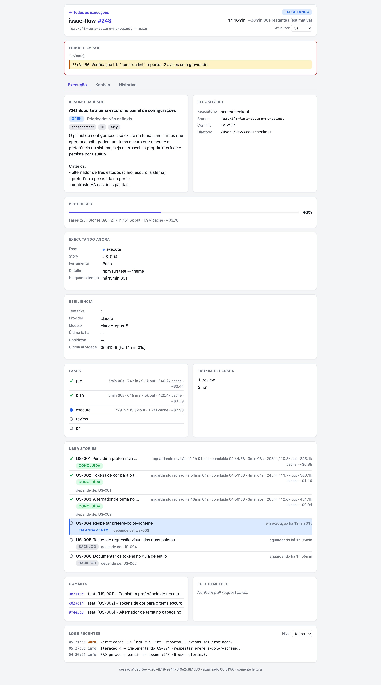
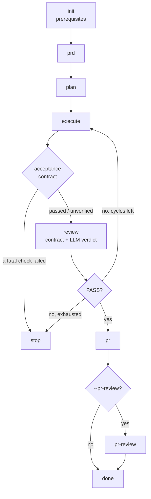
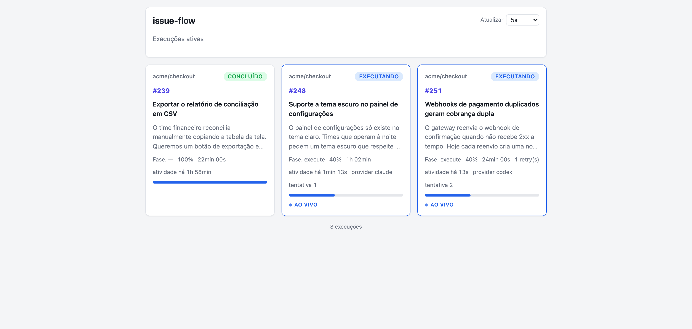
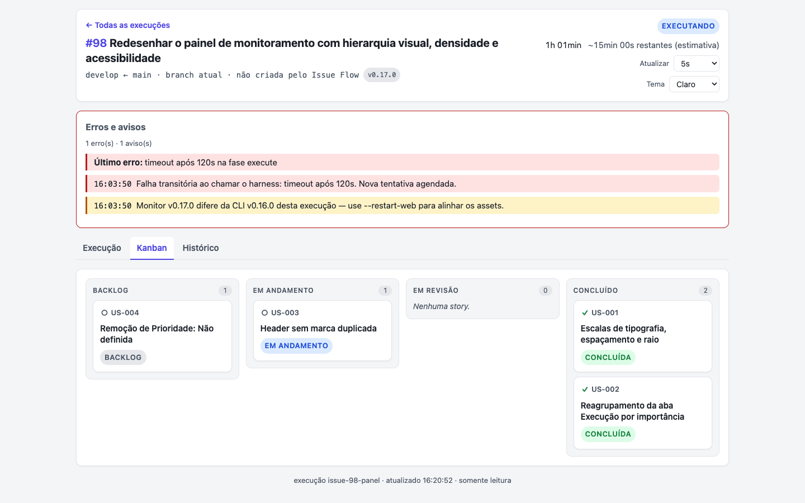

# Issue Flow

**Turn an issue into a reviewed Pull Request, without sitting in front of it.**

Issue Flow is a CLI that orchestrates the whole path — analyse, plan, implement,
verify, review, deliver — by driving a coding agent in headless mode. It works
with [Claude Code](https://docs.anthropic.com/en/docs/claude-code) (the default),
[Codex CLI](https://developers.openai.com/codex/noninteractive), Cursor CLI and
[Antigravity CLI](https://antigravity.google/docs/cli/getting-started/), one
agent per phase if you want. The issue can live on GitHub or as plain files in
the global storage.

It also ships as a set of [Agent Skills and a sub-agent](docs/skills-and-agents.md)
for interactive use inside Claude Code.

```bash
npx issue-flow init      # check prerequisites and repository conventions
npx issue-flow run 42    # prd → plan → execute → review → pr
npx issue-flow run 42 --web   # …and watch it live in the browser
```



---

## Table of contents

- [What it does](#what-it-does)
- [Requirements](#requirements)
- [Installation](#installation)
- [The pipeline](#the-pipeline)
- [Watching a run](#watching-a-run)
- [Commands at a glance](#commands-at-a-glance)
- [Where things are written](#where-things-are-written)
- [Configuration](#configuration)
- [Agents](#agents)
- [Adapting to your repository](#adapting-to-your-repository)
- [Unattended runs](#unattended-runs)
- [Skills and sub-agent](#skills-and-sub-agent)
- [Limitations and things worth knowing](#limitations-and-things-worth-knowing)
- [Documentation](#documentation)
- [Development](#development)

## What it does

- **A full issue-to-PR pipeline.** `prd` → `plan` → `execute` → `review` → `pr`,
  each phase a headless agent invocation with a prompt of its own. Every phase is
  also a standalone command.
- **An iterative execute loop.** Each iteration is a fresh agent instance that
  picks the highest-priority pending user story, implements it, runs quality
  checks and commits.
- **Objective verification before the LLM judges.** An
  [acceptance contract](docs/verification.md) — typecheck, lint, tests — runs at
  the end of `execute` and again before the `review` verdict. An empty contract
  finishes `unverified`, never green.
- **Multiple agents, one per phase.** A cheap model for `plan`, a strong one for
  `review`, whatever you want for `execute` — [selected explicitly](docs/agents.md),
  never inferred from which binary happens to be installed.
- **Resilience built for six-hour runs.** A [failure taxonomy](docs/resilience.md)
  that tells a rate limit from a failing test, per-kind retry budgets, provider
  failover with circuit breakers, an inactivity watchdog and an append-only event
  journal.
- **Multi-issue queues.** Point it at an Epic and it discovers sub-issues and
  dependencies, orders them, runs them on one branch and opens one Pull Request.
- **A live web monitor.** Read-only, offline, one card per active run across
  every project on the machine.
- **Issues from GitHub or from files.** The `local` provider needs nothing beyond
  git — no network, no remote, no `gh`.
- **It adapts to your repository.** Issue templates, labels, PR template, base
  branch, commit and branch conventions are [discovered, not imposed](docs/conventions.md).

## Requirements

- **Node.js** ≥ 22
- **Git**, available in `PATH`, inside a repository
- **A coding agent.** Claude Code (`npm install -g @anthropic-ai/claude-code`) by
  default; Codex CLI (`codex`), Cursor CLI (`cursor-agent`) and Antigravity CLI
  (`agy`) are opt-in alternatives — see [Agents](docs/agents.md)
- **GitHub CLI** (`gh`), authenticated — required only for GitHub issues. A run
  on [local issues](docs/issues.md) does not need it

`npx issue-flow init` verifies all of it and tells you what is missing
(`npx issue-flow init --local` when the issue lives outside GitHub).

## Installation

```bash
npx issue-flow run 42          # run directly, no install
npm install -g issue-flow      # or install globally
```

## The pipeline



| Phase | What it produces |
|-------|------------------|
| `init` | A pass/fail gate on the environment. Nothing is written |
| `prd` | `prd.md` — the requirements, derived from the issue |
| `plan` | `tasks.json` — ordered user stories with acceptance criteria |
| `execute` | Commits, one story at a time, each with quality checks |
| `review` | A `PASS`/`FAIL` conformance verdict against the acceptance criteria |
| `pr` | The Pull Request, with a summary and a test plan |
| `pr-review` | Optional. A whole-PR review — diff, architecture, risks, coverage |

A failing `review` triggers correction cycles (re-execute + re-review) up to
`maxCorrectionCycles` (3 by default). `analyze` exists as a standalone
deep-analysis command and is deliberately **not** part of `run`.

Each phase can be run on its own — `issue-flow prd 42`, `issue-flow plan 42` — and
`run` resumes from the first incomplete phase automatically.

```bash
issue-flow run 42 --from execute   # start at a given phase
issue-flow run 42 --no-branch      # current branch, no branch creation, no PR
issue-flow run 42 --pr-review      # add the whole-PR review at the end
issue-flow run 42,43,50            # a queue: one branch, one PR
issue-flow resume                  # continue an interrupted run, explicitly
```

Full reference: [**Commands**](docs/commands.md).

## Watching a run

`--web` starts a local, read-only dashboard. It is a single server per machine,
detached from any one run, and it shows every active pipeline from every project
at once:

```bash
issue-flow run 42 --web              # http://localhost:3737
issue-flow run 42 --web --host 127.0.0.1   # this machine only
issue-flow web stop
```

| | |
|---|---|
|  |  |
| One card per active run | Stories by status, with a detail drawer |

The panel binds to `0.0.0.0` by default and warns about it. Full documentation —
tabs, the HTTP API, remote access, single-instance behaviour:
[**Web monitoring**](docs/web-monitor.md).

For the terminal, five commands read the state of a run without touching it:

```bash
issue-flow ps        # every live run on this machine
issue-flow status    # what is running, in which phase, since when
issue-flow runs      # history: how each issue ended, and why
issue-flow logs --follow
issue-flow usage 42 --by harness   # tokens and cost per invocation
```

## Commands at a glance

| Command | What it does |
|---------|--------------|
| `run <issues...>` | The full pipeline, for one issue or a queue |
| `resume [issue]` | Continue an interrupted pipeline, explicitly |
| `generate` | Draft and create an issue on GitHub, locally, or both |
| `init` | Check prerequisites and report (or create) missing conventions |
| `analyze`, `prd`, `plan`, `execute`, `review`, `pr`, `pr-review` | The phases, standalone |
| `status`, `ps`, `runs`, `logs`, `usage`, `pause`, `cancel` | Operate a running pipeline |
| `agent`, `policy`, `conventions`, `routing` | Inspect what was resolved, and why |
| `web serve`, `web stop` | The monitoring server |

Every flag is documented in [**Commands**](docs/commands.md).

## Where things are written

**Nothing is written inside your repository.** Every artifact lives in a
machine-wide storage tree keyed by a deterministic project id:

```
~/.issue-flow/projects/<project-id>/issues/42/
  prd.md          tasks.json      progress.txt
  session.json    events.jsonl    pr-review/
  issue.md        metadata.json   # local issues only
```

Two clones of the same repository share the same project id, so history follows
the repository rather than the folder. `ISSUE_FLOW_HOME` relocates the whole
tree — useful for CI and sandboxes. A legacy `<projectRoot>/issues/` directory
from an earlier release is copied in automatically on first use and then left
read-only.

Full layout, `tasks.json` and `session.json` field reference, token/cost
accounting and the migration: [**Storage and artifacts**](docs/storage.md).

## Configuration

Everything resolves through one ladder: **CLI flag > environment variable >
`.issue-flow.json` > `~/.issue-flow/config.json` > default**. Nothing is
mandatory.

```json
{
  "agent":      { "provider": "claude", "phases": { "plan": { "provider": "codex" } } },
  "issues":     { "preferredProvider": "github" },
  "verify":     { "level": "L1" },
  "web":        { "enabled": true, "host": "127.0.0.1" },
  "resilience": { "profile": "continuous" }
}
```

Full reference — every key, every default, every environment variable:
[**Configuration**](docs/configuration.md).

## Agents

The default is Claude Code, and with no `agent` configuration the argv is exactly
what it always was. The other three are opt-in, per phase if you want:

```bash
issue-flow agent                                   # what resolved, and from which layer
issue-flow run 42 --agent codex                    # everything on Codex
issue-flow run 42 --agent-phase plan=codex \
                  --agent-phase review=claude:claude-sonnet-5
```

Permission is semantic (`read-only` / `workspace` / `autonomous`) and each runner
translates it to its own sandbox flags. Claude reports USD; Codex and Antigravity
report tokens only; Cursor reports neither — so a mixed run prints one cost line
per agent instead of a single misleading total.

Install, authentication (including CI), the permission matrix, the token-economy
guide and troubleshooting: [**Agents**](docs/agents.md).

## Adapting to your repository

Most repositories already decided how issues are titled, which labels exist, what
a Pull Request body looks like and which branch is the base. Issue Flow discovers
those decisions and follows them:

```bash
issue-flow policy          # what was discovered, and where each value came from
issue-flow init --apply    # create only what is genuinely missing
```

Discovery covers Issue Templates and Forms (including the organization's), Issue
Types, the real labels, the PR template, `CODEOWNERS`, `AGENTS.md` / `CLAUDE.md`
and the branch/commit conventions declared by commitlint, release-please,
semantic-release or Changesets. **Labels are never created** and nothing that
exists is ever overwritten.

Prompts can be extended per repository with
`.issue-flow/prompts/<name>.append.md`.

See [**Conventions**](docs/conventions.md) and
[**Git conventions**](docs/git-conventions.md).

## Unattended runs

```bash
issue-flow run 42 --continuous --background
```

`--continuous` names an intent — *keep going without me* — and expands to the six
behaviours it implies: network and rate limits retried forever, wider budgets for
the other transient failures, provider failover, a queue that skips a failing
issue, the event journal, and the inactivity watchdog. Every one of them stays
individually settable, and an explicit flag always wins.

What no profile, file or flag can do is buy a retry for a failure that needs a
person: a failing test, a missing credential, a mistyped flag and a repository
stuck mid-merge are clamped to zero attempts.

See [**Resilience**](docs/resilience.md).

## Skills and sub-agent

Issue Flow also ships as [Agent Skills](https://agentskills.io) and a
`resolve-issue` sub-agent for interactive use inside Claude Code:

```bash
npx skills add fabioassuncao/issue-flow
npx skills add fabioassuncao/issue-flow --skill generate-issue
```

The skills and the CLI are two paths to the same decisions, and that parity is a
tested contract — the bridge between them is `issue-flow policy --json`. See
[**Skills & sub-agent**](docs/skills-and-agents.md).

## Limitations and things worth knowing

- **Artifacts are machine-local.** They live under `~/.issue-flow`, not in the
  repository, so they are not shared through git. Local issues are machine-local
  too — use `generate --both` to keep the demand on GitHub as well.
- **The CLI and the skills do not share artifacts.** The skills and the
  `resolve-issue` sub-agent write to `<projectRoot>/issues/{N}/`; the CLI writes
  to `~/.issue-flow`. A run started on one surface cannot be resumed on the
  other — pick one per issue.
- **`--mode manual` is not a CLI planning mode.** On the CLI it is recorded in the
  run header and refuses `--background`; it does not stop the pipeline after the
  artifacts. That behaviour belongs to the `resolve-issue` sub-agent.
- **Per-story cost is an approximation.** The harness reports usage per
  invocation, not per story. When one iteration completes several stories, its
  tokens and cost are split evenly among them.
- **USD cost only appears when the harness reports it.** `null` means *not
  reported*, never zero, and Issue Flow does not estimate a price unless you turn
  estimation on explicitly.
- **The `web` key of the global `config.json` is not read yet.** Web settings
  resolve CLI > env > `.issue-flow.json` > default.
- **Dependency discovery from issue text is heuristic.** Structured sub-issues and
  GitHub Issue Dependencies are exact; the textual fallback is deliberately
  conservative and flags what only it found.
- **`--pr-review` is read-only by policy, not by sandbox.** Write tools are
  excluded and the prompt forbids edits, but Bash stays available for `git`/`gh`
  inspection.
- **Shadow routing acts on nothing.** It records what it would have chosen;
  `recommend` and `active` are not implemented yet.
- **The web panel is read-only by contract.** There are no write routes, and none
  are planned before `capabilities` is non-empty.

## Documentation

| Document | What it covers |
|----------|----------------|
| [Commands](docs/commands.md) | Every command and flag, and the exit codes |
| [Configuration](docs/configuration.md) | The precedence ladder, every key, every environment variable |
| [Agents](docs/agents.md) | Claude, Codex, Cursor, Antigravity: selection, auth, permission, token economy |
| [Issue sources](docs/issues.md) | GitHub vs. local, conflicts, hierarchies and queues |
| [Storage and artifacts](docs/storage.md) | The global tree, `tasks.json`, `session.json`, tokens and cost, migration |
| [Web monitoring](docs/web-monitor.md) | The dashboard, the HTTP API, remote access |
| [Resilience](docs/resilience.md) | Failure taxonomy, retries, failover, watchdog, journal, decomposition |
| [Verification and routing](docs/verification.md) | Acceptance contract, independent reviewer, shadow router, escalation |
| [Conventions](docs/conventions.md) | How the repository's own conventions are discovered and applied |
| [Git conventions](docs/git-conventions.md) | Branch, commit and Pull Request title |
| [Skills & sub-agent](docs/skills-and-agents.md) | The interactive usage model and the parity contract |
| [Contributing](packages/issue-flow/CONTRIBUTING.md) | Environment, scripts, local testing, release process |
| [Changelog](CHANGELOG.md) | Version history |

Dated investigations that produced knowledge rather than rules live in
[`docs/research/`](docs/research/).

## Development

```bash
cd packages/issue-flow
npm install
npm run build          # tsup → dist/
npm run typecheck
npm test
npm run smoke          # end-to-end, against deterministic stand-ins for claude and gh
npm run check          # biome + typecheck
```

`npm run smoke` builds the CLI and drives it inside throwaway git repositories
against deterministic stand-ins for `claude` and `gh` — no network, no tokens.
Pass `--keep` to inspect the generated workspaces.

Releases are published manually to npm by a maintainer; the procedure is in
[CONTRIBUTING.md → Release process](packages/issue-flow/CONTRIBUTING.md#release-process).

Based on [Geoffrey Huntley's Ralph pattern](https://ghuntley.com/ralph/) for
autonomous agent loops.

## License

[MIT](LICENSE)
