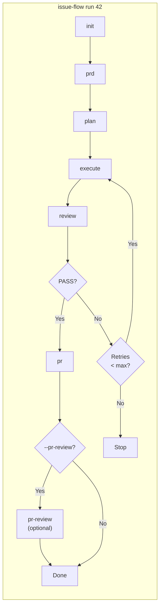

# Issue Flow

A CLI that turns issues into pull requests autonomously. Orchestrates the full pipeline -- plan, implement, review, and deliver -- via [Claude Code](https://docs.anthropic.com/en/docs/claude-code) Headless mode. Issues can come from GitHub or from plain files in your repository (see [Issue Sources](#issue-sources-providers)).

## Quick Start

```bash
# Verify prerequisites
npx issue-flow init

# Run the full pipeline for issue #42
npx issue-flow run 42
```

## Requirements

- **Node.js** >= 22.0.0
- **Git** installed and available in PATH
- **Claude Code** (`npm install -g @anthropic-ai/claude-code`) -- default agent
- **Codex CLI** (optional, `codex`) -- alternative agent; see [Agents](#agents)
- **GitHub CLI** (`gh`) authenticated (`gh auth login`) -- required only for GitHub issues; a run on [local issues](#issue-sources-providers) does not need it

Run `npx issue-flow init` to verify all prerequisites (`npx issue-flow init --local` when the issue lives in the repository).

## Installation

```bash
# Run directly via npx (no install needed)
npx issue-flow run 42

# Or install globally
npm install -g issue-flow
issue-flow run 42
```

## Pipeline Flow



The default order is **init -> prd -> plan -> execute -> review -> pr**, with **pr-review** appended only when explicitly requested (see [`pr-review`](#pr-review----review-a-pull-request)). Without `--pr-review`, the behavior is identical to previous versions.

Without any `agent` configuration the pipeline still runs on Claude Code, with the same argv as before. Codex is opt-in: see [Agents](#agents).

Each phase can also be run independently: `issue-flow prd 42`, `issue-flow plan 42`, etc. The `analyze` command is available standalone for deeper issue analysis when needed, and `issue-flow pr-review [pr]` works as a standalone assisted code review, with or without an associated issue. The `generate` command creates issues separately: `issue-flow generate --prompt '...'`.

## Commands

Every artifact the pipeline reads or writes lives in the issue directory of the [global storage](#global-storage):

```
~/.issue-flow/projects/<project-id>/issues/42/
```

Throughout this document that path is abbreviated to `~/.issue-flow/…/issues/42/`. Nothing is written to `<projectRoot>/issues/` any more: an existing legacy directory is copied into the global storage the first time a command touches the project, and is then left untouched -- see [Migrating from `issues/`](#migrating-from-issues).

### `run` -- Full pipeline (end-to-end)

```bash
# Run the complete pipeline for an issue
npx issue-flow run 42

# Resume from a specific phase
npx issue-flow run 42 --from execute

# Run on the current branch (no branch creation, no PR)
npx issue-flow run 42 --no-branch

# Watch the run live in the browser (see "Web Monitoring" below)
npx issue-flow run 42 --web

# Review the created Pull Request as a final phase
npx issue-flow run 42 --pr-review

# Several issues at once -- both forms are equivalent
npx issue-flow run 42,43,50
npx issue-flow run 42 43 50

# Continue User Story numbering from the last used in this project
npx issue-flow run 42 --continue

# Force User Story numbering to start at a specific number
npx issue-flow run 42 --start-us 27
```

Executes all phases in order: **init** -> **prd** -> **plan** -> **execute** -> **review** -> **pr**, plus the optional **pr-review**. Automatically resumes from the last incomplete phase if pipeline state exists. On review failure, runs correction cycles (re-execute + re-review) up to `maxCorrectionCycles`.

| Flag | Description |
|------|-------------|
| `--mode <mode>` | Execution mode: `auto` (default) or `manual` |
| `--from <phase>` | Resume from a specific phase |
| `--no-branch` | Run on the current branch without creating a new branch or PR |
| `--pr-review` | Review the created Pull Request after the `pr` phase (see [`pr-review`](#pr-review----review-a-pull-request)) |
| `-y, --yes` | Run the whole discovered hierarchy without asking (see [Multiple issues](#multiple-issues-and-hierarchies)) |
| `--only` | Run just the issues informed, without their hierarchy |
| `--continue` | Continue User Story numbering from the last one used in this project (see [User Story numbering continuity](#user-story-numbering-continuity)) |
| `--start-us <n>` | Force User Story numbering to start at `n`, ignoring history. In a queue it applies to the first issue only; the rest continue from history |
| `--retry-limit N` | Retry transient Claude failures in the `execute` phase up to N consecutive times (default: 10) |
| `--retry-forever` | Retry transient Claude failures in the `execute` phase indefinitely |
| `--on-issue-failure <mode>` | In a queue, what one failing issue does to the rest: `stop` (default, ends the run), `skip` (set it aside, run the independent issues, come back to it at the end) or `block` (set it aside for a human and never come back) |
| `--continuous` / `--resilient` | Long-running profile: keep going without supervision (see below) |
| `--no-failover` | Never migrate a phase to another agent provider |
| `--auto-decompose` | Act on a decomposition report instead of only writing it |
| `--web` | Enable real-time web monitoring (see [Web Monitoring](#web-monitoring)) |
| `--inactivity-timeout <s>` | Stop the agent after this many seconds with no output at all (`0` = off, default 600). A second, tighter instrument beside `--timeout`: it tells a long task from a stuck one |
| `--agent <claude\|codex>` | Run every phase on this agent (overrides `phases` too) |
| `--agent-model <model>` | Same, for the model |
| `--agent-phase <phase>=<provider>[:<model>]` | Override one phase (repeatable) |
| `-v, --verbose` | Show agent progress output in real time |

`--pr-review` is resolved like `--no-branch`: **flag > persisted value (`prReview.enabled` in `tasks.json`) > default (off)**. Opting in once persists `prReview.enabled` as soon as a `tasks.json` exists (including mid-pipeline resumes such as `--from pr --pr-review`), so a later run keeps the phase without repeating the flag. Combining `--pr-review` with `--no-branch` fails immediately with exit code `1` -- with no PR there is nothing to review. When the review comes back as `REQUEST_CHANGES`, the run prints the report path, **leaves the issue open** (locally and on the remote), does **not** mark `issueStatus: completed`, and still exits `0`.

It also accepts the [issue source flags](#flags) (`--local`, `--github`, `--prefer-local`, `--prefer-github`, `--ask`). The origin is resolved **once**, at the start, and the same issue content is handed to every phase.

#### Multiple issues and hierarchies

`run` accepts one issue or several, and before starting anything it asks the provider [what the issue is related to](#hierarchy-and-dependency-discovery). When the answer is "nothing", the run is exactly the single-issue pipeline it has always been: no prompt, no extra output, no artifact.

When a larger structure *is* found, the pipeline **stops before the first phase** and shows what it discovered:

```
Issue #50 is part of a larger structure:
  Main issue:   #50 Discover dependencies between issues
  Total issues: 4
  Suggested order:
    1. #50 Discover dependencies between issues (requested)
    2. #51 Multiple issues as input (after #50)
    3. #52 Sequential multi-issue execution (after #51, high)
    4. #53 One consolidated Pull Request (after #52)
Which scope should run? [1] Only the issues informed (1)  [2] The whole hierarchy (4)  [3] Cancel:
```

Answering `2` (or just pressing Enter) runs the whole thing; `1` trims it to what you typed; `3` cancels without executing anything.

**Order of execution.** The queue is ordered by, in this precedence: **dependencies and blocks** (a hard constraint -- an issue never starts before something it depends on has finished) → **hierarchy** (a parent before its children) → **priority labels** (`high` > `medium` > `low`; an issue with no priority label sorts after every labelled one) → **issue number**. A dependency **cycle** is refused with an explicit error instead of being resolved into an arbitrary order.

**Non-interactive runs.** Outside a TTY (CI, a pipe) the answer must come from a flag: `--yes` runs the whole hierarchy, `--only` runs just what you informed. With **several issues informed**, passing neither **fails with exit code 1** rather than guessing -- picking silently would either implement issues nobody approved or ignore a dependency you were never told about. With a **single issue** informed, there is nothing to guess: the run falls back to that issue alone, with a warning, so a command that always worked keeps working. The same rule applies to a discovered dependency **cycle** -- refused for a multi-issue request, degraded to the single issue you asked for otherwise. `--yes` and `--only` cannot be combined.

**How a queue runs.** Every issue goes through the same phases as always (`prd` → `plan` → `execute` → `review`), each with its own `tasks.json`, its own [session](#web-monitoring) and its own token/cost accounting, all inside a single process -- nothing has to be restarted between issues. What the queue owns is what is shared:

- **one branch** for the whole queue: the first issue's `plan` phase names it, and every later issue's plan is made to use it, so no issue creates a second branch;
- **commits scoped per issue**: inside a queue the execute prompt commits as `feat(issue-51): [Story ID] - [Story Title]` (and `fix(issue-51): …` for review corrections), so `git log` on the shared branch stays readable. A single-issue run keeps the historical `feat: [Story ID] - [Story Title]`;
- **one Pull Request** at the end, covering every issue (see [`pr`](#pr----create-a-pull-request));
- **one consolidated summary**, with a per-issue breakdown of stories, duration and cost.

**Failure and resume.** A failure stops the queue where it happened: the branch and every commit already made are kept untouched, and the queue records which issue failed and in which phase. Re-running the same command resumes from that issue -- the ones already completed are never redone, and the confirmation is not asked again:

```bash
npx issue-flow run 50        # stops at #52, in the execute phase
npx issue-flow run 50        # resumes at #52; #50 and #51 are left alone
```

`--from <phase>` addresses the issue the queue is resuming, not the ones after it.

The coordination state lives in `~/.issue-flow/projects/<project-id>/queues/<queue-id>/execution-plan.json` (see [Global Storage](#global-storage)); each issue's own artifacts stay exactly where they were.

### `init` -- Check prerequisites and standardize the repository

```bash
npx issue-flow init                 # prerequisites + what conventions are missing. Writes nothing
npx issue-flow init --apply         # create the missing files
npx issue-flow init --json          # the plan, for tooling and for the init-repository skill
npx issue-flow init --scope apps/api
npx issue-flow init --check-only    # prerequisites only, as earlier releases did
```

Verifies that `claude`, `gh` (authenticated), and `git` (inside a repo) are available. Reports pass/fail for each with install hints. When the resolved agent is Codex, `codex --version` and `codex login status` are checked too. A first-run agent prompt appears only on a TTY, outside CI, and only when no `agent` configuration exists; `--no-agent-prompt` skips it. Non-interactive runs never ask and never write an agent preference.

`claude` and `git` are always blocking. `gh` is blocking only when the issue origin is GitHub: with `--local` (or `issues.preferredProvider: "local"` in `.issue-flow.json`) a missing or unauthenticated `gh` is reported as a warning and the environment still passes.

It then reports the repository's conventions and what a baseline would add. That half never changes the exit code -- a repository missing a template is not a broken environment -- so a script that treats `init` as a prerequisite gate sees exactly the pass/fail it always did.

Each file gets one of three verdicts:

| Verdict | Meaning |
|---|---|
| `create` | Missing, and the repository has no equivalent |
| `keep` | Something equivalent already exists -- left untouched |
| `review` | Present but inconsistent; reported, never rewritten |

**Nothing that exists is ever overwritten**, even when it differs from the defaults: adapting to the repository is the point. **Running it twice writes nothing the second time.** With `--apply` it can create Issue Forms, the template chooser, a Pull Request template, `AGENTS.md`, `CLAUDE.md`, `docs/conventions.md` and a baseline `.github/labels.json`.

The same capability is available interactively through the [`init-repository`](skills/init-repository/SKILL.md) skill, which calls this command rather than re-deriving the analysis.

> Full behavior -- the default convention set, the `AGENTS.md`/`CLAUDE.md` policy, and what happens for each repository state -- is in [**Conventions**](docs/conventions.md).

### `generate` -- Create a new issue

```bash
# Uses issues.defaultGenerateTarget (github by default)
npx issue-flow generate --prompt "Add dark mode support to the settings page"

# Explicit destination
npx issue-flow generate --prompt "..." --github
npx issue-flow generate --prompt "..." --local
npx issue-flow generate --prompt "..." --both
```

Analyzes the project and drafts the issue via Claude headless; the draft is then persisted by the selected provider(s).

| Flag | Destination |
|------|-------------|
| `--github` | GitHub only (current behavior) |
| `--local` | `issue.md` + `metadata.json` in `~/.issue-flow/…/issues/<N>/` only, no network access |
| `--both` | GitHub **and** a local mirror that reuses the GitHub number and records `remote.ref` / `remote.syncedContentHash` |

The flags are mutually exclusive. With `--both`, the remote issue is created first because it owns the number: a failure there leaves nothing on disk, and a failure writing the mirror is reported with the URL that already exists.

#### `--continuous`: a profile, not a mechanism

Unattended work needs about six behaviours turned on at once, and asking for six
flags is asking for five of them to be forgotten. `--continuous` (alias
`--resilient`) names the intent -- *keep going without me* -- and expands to what
that intent implies:

| Behaviour | What the profile sets |
|-----------|-----------------------|
| Network and rate limits | retried **forever**, with the ceiling of the backoff still in force |
| Timeouts, stalls, provider crashes | wider attempt budgets |
| Provider failover | on |
| A failing issue in a queue | `--on-issue-failure skip` |
| The event journal | on (`events.jsonl`) |
| The inactivity watchdog | on (10 minutes of silence) |

**Every one of those stays adjustable on its own, and an explicit flag always
beats the profile.** `--continuous --no-failover` is a coherent request and
means exactly what it says; so do `--continuous --on-issue-failure stop` and
`--continuous --inactivity-timeout 0`.

What the profile can never do is buy an attempt for a failure that needs a
person: `authentication`, `configuration`, `repository_state` and
`task_execution` are clamped to zero attempts **after** the profile is applied.
A failing test is not retried into passing, and a missing credential is not
waited out.

With failover enabled, provider health is learned from real invocations and
persisted in the project's `providers.json`. `provider_down`, provider crashes,
rate limits, timeouts and stalls can move the next attempt through the configured
chain; `network` stays on the same provider because changing a remote service
does not repair the user's connection, and `task_execution` never fails over.
An unavailable provider enters exponential cooldown (60s, 120s, 240s, up to 30
minutes) and admits exactly one `half_open` probe when the cooldown expires. If
every provider is cooling down, the run waits for the shortest remaining
cooldown instead of failing. Authentication blocks by default; opting into it
requires both `failoverOnAuth: true` and an authentication retry policy whose
`failover` is not `never`.

### `resume` -- Continue an interrupted pipeline

```bash
issue-flow resume            # the most recently attempted unfinished issue
issue-flow resume 42         # a specific issue
issue-flow resume --all      # every unfinished issue of this project, in order
```

| Flag | Description |
|------|-------------|
| `--all` | Resume every unfinished issue of the project instead of one |
| `--mode <mode>` | Execution mode: `auto` (default) or `manual` |

Resumption always worked -- you re-ran the same `run` and the pipeline picked up
where it stopped -- but only *implicitly*, as a side effect of two mechanisms
agreeing. `resume` makes every step of it explicit, in this order:

1. **Ownership.** A live owner of `run.lock` refuses the resume, naming its pid,
   host and last heartbeat; a dead one is taken over and reported.
2. **The plans.** `execution-plan.json` when the project has a queue,
   `tasks.json` otherwise.
3. **The journal.** The last `phase:start` with no `phase:end` in
   `events.jsonl` is what was running when the process died -- the one fact the
   snapshot does not keep. (Only available when the journal is enabled; without
   it the resume continues from the plan alone.)
4. **The repository preflight.** A rebase, merge or cherry-pick in progress, an
   unresolved conflict, a detached HEAD or a branch that is not the plan's stops
   the resume with the command that gets out of it. **Nothing is repaired
   automatically** -- no `reset --hard`, no `--abort`, no implicit `stash`.
   A dirty working tree is allowed when the resume continues the very phase that
   was interrupted, and blocks when it does not.
5. **The phase.** `run`'s own answer -- the first incomplete phase -- stated out
   loud before anything runs.

`run` is unchanged: its automatic resume behaves exactly as it always has.

### When an issue turns out to be too large

A phase that keeps timing out, a plan with thirty stories, five iterations in a
row that finish nothing: each is ambiguous alone and any one of them can be a
slow afternoon. Two or more of them agreeing is the same thing said twice, and
what it is saying is that the demand was never one issue.

Before proposing a split, Issue Flow tries the cheaper remedy: after the journal
records the second timeout in the same phase, its next attempt gets **2×** the
configured/default timeout. The widening is capped at 2× and never compounds;
`--timeout 0` remains unlimited.

When a **failed** run carries at least two of these signals, Issue Flow writes
`decomposition.md` in the issue directory and marks the issue `blocked` with a
pointer to it:

| Signal | Threshold |
|--------|-----------|
| Timeouts on the same phase | 2 |
| User stories in the plan | more than 15 |
| Iterations in a row completing no story | 5 |
| Files touched on the branch | more than 40 |
| Characters in the issue body | more than 20 000 |
| The execute loop ran out of iterations | — |

The report names every signal **with the number that crossed the line**, proposes
a cut of the pending stories in priority order, and stops there: splitting an
issue is a product decision, and the default is a report rather than an act.

A run that failed because the network went down is **not** decomposed. Network
and rate-limit retries are not size signals, and reacting to an outage with
"have you considered splitting this issue?" would be worse than silence.

`--auto-decompose` creates the proposed sub-issues through `issue-flow generate`
(so the repository's label and template policy applies to each of them). It
refuses to run when the branch already carries committed stories: splitting on
top of half-finished work leaves commits belonging to no issue, and that needs a
person.

### Operating a long run: `status`, `runs`, `logs`, `pause`, `cancel`

A six-hour unattended execution needs answers the pipeline itself cannot give
you while it is busy. These five commands read the state that already exists --
`run.lock`, `tasks.json`, `session.json`, `execution-plan.json` and
`events.jsonl` -- and none of them touches the pipeline.

```bash
issue-flow status                 # what is running, in which phase, since when
issue-flow status 42 --json       # the same, assembled as JSON
issue-flow runs                   # history: how each issue ended, and why
issue-flow logs 42 --kind retry   # the journal, filtered to what matters
issue-flow logs --follow          # …and kept open as it grows
issue-flow usage 42 --by harness  # cost and tokens per invocation, from tasks.json
issue-flow pause                  # ask the run to stop, with a checkpoint
issue-flow cancel 42              # stop it, and mark it so `resume` reports it
```

| Command | What it answers |
|---------|-----------------|
| `status [issue] [--json]` | Who owns the run (pid, host, last heartbeat), which phase and attempt each issue is on, how long since the last activity, and where a queue stands |
| `runs` | One line per issue: status, duration and the first line of the failure |
| `logs [issue] [--follow] [--tail n] [--kind a,b]` | The append-only journal, in order and filtered. Needs the journal enabled (`resilience.journal.enabled`, or `--continuous`) |
| `usage [issue] [--since date] [--by harness\|provider\|model\|purpose\|status] [--json]` | Reader over `tasks.json.executions`. Never stores an aggregate. Absence of telemetry prints a message, it does not crash |
| `pause` | Sends `SIGTERM` to the owner, which writes a checkpoint, stops the agent with a grace period and closes its journal before exiting |
| `cancel [issue]` | The same stop, plus marking the issue so a later `resume` reports it instead of silently continuing |

`pause` and `cancel` deliberately do nothing themselves beyond signalling: the
owning process already knows how to stop well, and a second implementation of
that from outside would be a worse one. Neither ever signals a **stale** owner.

### `analyze` -- Analyze an issue (standalone)

```bash
npx issue-flow analyze 42
```

Fetches issue data, analyzes the codebase, and produces a structured analysis saved to `~/.issue-flow/…/issues/42/analysis.md`. This is a standalone command not part of the default `run` pipeline -- use it when you need a deeper pre-analysis before generating the PRD.

### `prd` -- Generate a PRD

```bash
npx issue-flow prd 42
```

Generates a Product Requirements Document from the issue analysis (`analysis.md` in the same directory, when the standalone `analyze` command produced one). Saves to `~/.issue-flow/…/issues/42/prd.md`.

### `plan` -- Convert PRD to task plan

```bash
npx issue-flow plan 42

# Continue from the last User Story number used in this project
npx issue-flow plan 42 --continue

# Force numbering to start at a specific number, ignoring history
npx issue-flow plan 42 --start-us 27
```

Converts the PRD into a structured `~/.issue-flow/…/issues/42/tasks.json` with ordered user stories, acceptance criteria, and pipeline state.

| Flag | Description |
|------|-------------|
| `--continue` | Continue User Story numbering from the last one used in this project |
| `--start-us <n>` | Force User Story numbering to start at `n`, ignoring history |

`--continue` and `--start-us` are mutually exclusive -- passing both fails immediately with a clear error and exit code `1`. See [User Story numbering continuity](#user-story-numbering-continuity) below.

#### User Story numbering continuity

`US-NNN` numbering no longer restarts at `US-001` on every `plan` run. Each execution resolves the next number through a cascade, and the decision is always printed -- never silent:

1. **Automatic recovery** (default, no flag needed): the highest `US-NNN` number already used anywhere in the project is recovered by scanning every `~/.issue-flow/…/issues/*/tasks.json` for the project, regardless of which issue produced it. The scan is tolerant of ids that do not follow the `US-NNN` format -- an id like `story-5` or `add-auth` is parsed leniently (or skipped, never thrown on) rather than failing the whole scan.
2. **No history found** (the project's first `plan` run ever): numbering starts at `US-001`.
3. **Explicit override**: `--continue` names the automatic recovery explicitly (same number as the default, only the log message differs), and `--start-us <n>` forces a specific starting number, ignoring history entirely -- useful after a manual backlog reorganization.

Every decision is printed to the terminal, for example:

```
Continuing User Story numbering from US-016 — last used was US-015 (issue #32).
Starting User Story numbering at US-001 (no previous history found for this project).
User Story numbering forced to US-027 via --start-us.
```

The decision is also persisted in the project's `metadata.json` (`userStoryNumbering`, see [Global Storage](#global-storage)) for audit, though the *next* decision is always resolved by re-scanning `tasks.json` files from scratch -- the persisted record is never read back to decide anything.

The resolved number is passed to the `plan` prompt as strong context, instructing Claude to continue numbering from there instead of restarting at `US-001`; there is no programmatic renumbering pass after generation in this release.

### `execute` -- Run the story execution loop

```bash
npx issue-flow execute --issue 42
npx issue-flow execute --issue 42 --max-iterations 15
npx issue-flow execute --issue 42 --retry-forever
```

Runs the iterative agent loop. Each iteration is a fresh Claude instance that picks the next pending story, implements it, runs quality checks, and commits.

| Flag | Description |
|------|-------------|
| `--issue N` | Issue number -- reads artifacts from `~/.issue-flow/…/issues/N/` |
| `--max-iterations N` | Stop after N iterations (default: unlimited) |
| `--retry-limit N` | Retry transient Claude failures up to N consecutive times (default: 10) |
| `--retry-forever` | Retry transient Claude failures indefinitely |
| `--web` | Enable real-time web monitoring (see [Web Monitoring](#web-monitoring)) |

### `review` -- Validate the implementation

```bash
npx issue-flow review 42
```

Verifies acceptance criteria, runs tests, and checks for regressions. Outputs `PASS` or `FAIL` with findings.

### `pr` -- Create a pull request

```bash
npx issue-flow pr 42
```

Creates a well-structured PR referencing the issue, with summary and test plan. When the issue has no remote counterpart (a local issue), the `Closes #N` reference is omitted and the PR body points at the local `issue.md` instead.

**Inside a queue** ([multiple issues](#multiple-issues-and-hierarchies)) the phase runs **once**, after the last issue, and produces a **single** Pull Request for the whole branch. Its body additionally carries:

- an **Issues implemented** section, in execution order;
- one `Closes #N` line per issue that has a GitHub counterpart, so merging the PR closes all of them (issues with no remote are skipped, exactly as in a single-issue PR);
- a **Pending** section listing the issues discovered but not executed (the ones trimmed by `--only` or by your answer to the confirmation) and any issue left with unresolved review findings.

The reference to the Pull Request is recorded in the queue's `execution-plan.json` and replicated into every issue's `tasks.json`, so `issue-flow pr-review --issue <any issue of the queue>` finds it. A single-issue run is unchanged: no extra section is added and the body is what it has always been.

### `pr-review` -- Review a Pull Request

```bash
# Review a specific Pull Request
npx issue-flow pr-review 184

# Discover the Pull Request from the current session/branch
npx issue-flow pr-review

# Associate the review with an issue (persists state in the issue's tasks.json)
npx issue-flow pr-review 184 --issue 42

# Rewrite round 2 instead of appending a new one
npx issue-flow pr-review 184 --round 2
```

Reviews the Pull Request **as a whole** -- description, issue/PRD/implementation alignment, the full diff, code quality, architecture, complexity, duplication, adherence to project conventions, regressions, risks, test coverage, documentation, commit messages, and simplification opportunities. It complements the `review` phase, which is a conformance gate against the acceptance criteria of `tasks.json`.

The phase is **intended to be read-only**: Write/Edit are not in the tool allow-list, and the prompt forbids edits, commits and `gh pr review|comment|merge`. Bash stays available so the agent can run `gh`/`git` inspection commands — the restriction is policy plus allow-list, not a sandbox that can block every write. The report is persisted locally by the CLI, not by the agent.

| Flag | Description |
|------|-------------|
| `[pr]` | Pull Request number (discovered from the session when omitted) |
| `--issue <n>` | Issue the Pull Request belongs to -- enables state persistence in `~/.issue-flow/…/issues/<n>/tasks.json` |
| `--round <n>` | Rewrite a specific review round instead of appending a new one |
| `--yes` | Skip the confirmation of the discovered Pull Request |
| `--fail-on <level>` | Verdict that fails the command: `request-changes` (default), `suggestions`, `none` |

The [issue source flags](#flags) do not apply: the command never fetches the issue content, so reviewing a PR with no associated issue is a supported case, not a failure.

#### Pull Request discovery

With no argument, the PR is resolved in this deterministic order:

1. The explicit argument (`184`, `#184` or a PR URL)
2. `pullRequest` in `~/.issue-flow/…/issues/<N>/tasks.json`, written by the `pr` phase (when `--issue` is set)
3. `pullRequests[]` of the active in-memory session publisher (populated during `run --web` by `publishGitState` — not by reading `session.json` from disk)
4. `gh pr list --head <current branch>` -- the most recent PR (highest number)
5. Failure with an actionable message

The plan is preferred over the session so a stale or higher-numbered PR listed for the same branch cannot override the Pull Request this pipeline just opened. The command **never reviews a guessed PR**: when no source answers, it fails with exit code `1` instructing `issue-flow pr-review <number>`. When the PR comes from sources 2-4 in an interactive terminal, its number, title and branch are shown for a `(Y/n)` confirmation. The prompt is skipped in non-TTY environments, with `CI` set, with `--yes`, and when the phase runs from `run --pr-review` -- the discovered number is logged instead, so an automated run never hangs.

#### Artifacts

Reports are versionable and rounds are additive -- writing round N+1 never overwrites an earlier report nor drops entries from `index.json`:

```
~/.issue-flow/…/issues/42/pr-review/   # …/issues/pr-184/pr-review/ when there is no associated issue
  pr-184-round-1.md
  pr-184-round-2.md
  index.json
```

With no `--issue`, the Pull Request number becomes the issue identifier of the directory (`pr-184`): the global storage accepts non-numeric identifiers, so a review with no associated issue still gets a first-class directory of its own.

The Markdown report always carries the same eight sections: executive summary, strengths, issues found, suggested improvements, architectural observations, risks identified, required before merge, and final recommendation. `index.json` is the structured counterpart, so integrations do not have to reparse Markdown:

```json
{
  "schemaVersion": 1,
  "pullRequest": { "number": 184, "title": "feat: …", "url": "…", "headBranch": "feat/42-dark-mode" },
  "rounds": [
    {
      "round": 1,
      "at": "2026-08-03T16:00:00Z",
      "recommendation": "APPROVE_WITH_SUGGESTIONS",
      "headSha": "abc1234…",
      "reportPath": "pr-184-round-1.md",
      "findings": [{ "severity": "high", "file": "src/api/handler.ts", "line": 42, "title": "…" }]
    }
  ]
}
```

`severity` is one of `blocker`, `high`, `medium`, `low`. `recommendation` is `null` when the agent output could not be parsed -- a malformed verdict is never coerced into `APPROVE`; the raw output is preserved in the report and the command exits `1`. The `title`, `url` and `headBranch` of `pullRequest` are `null` when `gh` could not supply them; the number is always known.

#### Exit codes

| Code | Meaning |
|------|---------|
| `0` | `APPROVE` or `APPROVE_WITH_SUGGESTIONS` |
| `2` | `REQUEST_CHANGES` |
| `1` | Execution failure: headless run, `gh`, PR not found, invalid options, or an unparseable verdict |

`--fail-on suggestions` also returns `2` for `APPROVE_WITH_SUGGESTIONS`; `--fail-on none` always returns `0` for any verdict. Code `1` is never suppressed by `--fail-on` -- it means the review did not happen.

#### Configuration (`.issue-flow.json`)

Where reports are published is configuration, not code. Precedence is **CLI > environment variable > `.issue-flow.json` > default**:

| Environment variable | `.issue-flow.json` key | Values | Default |
|----------------------|------------------------|--------|---------|
| `ISSUE_FLOW_PR_REVIEW_PUBLISHER` | `prReview.publisher` | `local`, `github` | `local` |

```json
{
  "prReview": {
    "publisher": "local"
  }
}
```

`local` writes the `.md` report and `index.json` under `~/.issue-flow/…/issues/<N>/pr-review/`. An unknown value degrades to `local` with a warning instead of throwing.

`github` does all of that **and** posts the report as a comment on the Pull Request. It composes rather than replaces: the local artifacts are what the correction cycle and `resume` read, and the comment is an additional audience. Each round's comment carries an invisible marker (`<!-- issue-flow:review:<round> -->`), so republishing a round -- a retried phase, a re-run after a correction, a resume -- **updates** that comment instead of stacking another copy on the Pull Request. A later round is a different statement and gets its own comment.

### `web` -- Manage the monitoring server

```bash
# Stop the single monitoring server, if one is running
npx issue-flow web stop

# Internal: run the monitor in the foreground. Spawned detached by --web --
# there is normally no reason to invoke this yourself.
npx issue-flow web serve --port 3737 --host 127.0.0.1 --refresh 5
```

`web stop` is the explicit counterpart to `--web`'s automatic start (see [Web Monitoring → Single instance](#single-instance-detached-from-the-pipeline)): it signals the detached server referenced by [`~/.issue-flow/web.lock`](#issue-flowweblock) to shut down and waits for the lock file to be removed, or reports that no monitor is running. `web serve` is what `--web` spawns behind the scenes the first time on a machine; running it by hand only matters for debugging the monitor itself, independent of any pipeline run.

### `agent` -- Inspect and set the coding agent

```bash
npx issue-flow agent                 # resolved provider/model per phase, with provenance
npx issue-flow agent --json          # versioned JSON for Agent Skills
npx issue-flow agent use codex --model gpt-5.6 --global
npx issue-flow agent use claude --project
npx issue-flow agent use codex --phase execute --project
```

`--json` is a published contract (`schemaVersion` in the payload). See [Agents](#agents) and [`docs/agents.md`](docs/agents.md).

### `policy` -- Inspect the repository's own conventions

```bash
# What this repository declares about itself, and where each value came from
npx issue-flow policy

# Resolve the policy of a subdirectory, in a monorepo
npx issue-flow policy --scope apps/api

# The same, as versioned JSON -- this is the bridge for the Agent Skills
npx issue-flow policy --json
```

Repositories usually already decided how issues are titled, which labels exist, what a Pull Request body looks like and what an agent may do. This command shows what Issue Flow discovered of those decisions:

| Source | Where it is looked for |
|---|---|
| Issue Templates and Forms | `.github/ISSUE_TEMPLATE/**`, `docs/ISSUE_TEMPLATE/**`, the root, plus the single-file `ISSUE_TEMPLATE.md` variant of each |
| Organization Issue Templates | `gh api graphql`, only when the local tree has none -- a repository with no `.github/ISSUE_TEMPLATE/` still serves the organization's on github.com |
| Pull Request template | `.github/PULL_REQUEST_TEMPLATE.md`, the `PULL_REQUEST_TEMPLATE/` directory of several, `docs/`, the root |
| Labels | `gh label list` -- the labels that **really exist**, never a guessed taxonomy |
| Issue Types | `gh api orgs/{org}/issue-types`, when the plan exposes them |
| Base branch | `origin/HEAD`, then an existing local `main`/`master` |
| Agent instructions | `AGENTS.md` and `CLAUDE.md`, from the root down to `--scope` |
| Governance | `CONTRIBUTING.md`, `CODE_OF_CONDUCT.md`, `CODEOWNERS` |
| Referenced documents | the markdown links of `AGENTS.md`, followed one level -- an index is followed, `docs/` is never scanned blindly |

Everything is best-effort: a repository that declares none of this resolves to an empty policy, **with no error and no warning**, and every flow keeps the defaults it had before. A missing or unauthenticated `gh`, or no network at all, degrades the same way -- the `Sources` section then reports the source as `[unavailable]`, so "declares nothing" is never confused with "we could not find out". Every network call carries a timeout, and each kind of data costs at most one `gh` invocation, cached once per process.

Nothing consumes the resolved policy yet: this is the foundation plus its inspection command. `--json` emits a `schemaVersion`-stamped document, which is how the Agent Skills read it -- they are markdown and cannot import TypeScript.

#### Configuration (`.issue-flow.json`)

The `policy` key both **declares** what discovery cannot infer and **turns off** what it gets wrong. Precedence is **CLI > `ISSUE_FLOW_POLICY_*` > `.issue-flow.json` > discovered > defaults**:

```json
{
  "policy": {
    "enabled": true,
    "issues": { "titleConvention": "[Area] Title" },
    "pullRequests": { "baseBranch": "develop", "titleConvention": "type(scope): subject" },
    "git": { "branchConvention": "feat/{slug}", "commitConvention": "conventional" },
    "discovery": { "labels": false }
  }
}
```

| Key | Effect |
|---|---|
| `enabled` | `false` runs no discovery at all -- not a single `stat()` or network call |
| `issues.titleConvention` | Declares an issue title convention; nothing discovers one |
| `issues.allowLabelCreation` | `true` lets Issue Flow create a label the repository does not have. **Defaults to `false`**, which is a deliberate change of behavior -- see below |
| `pullRequests.baseBranch` | Overrides the branch discovered from git |
| `pullRequests.titleConvention`, `git.branchConvention`, `git.commitConvention`, `git.pullRequestTitleConvention`, `git.issueReference`, `git.typeMap` | Declared in `.issue-flow.json`, or discovered from commitlint / release-please / semantic-release / Changesets / `action-semantic-pull-request`. See [`docs/git-conventions.md`](docs/git-conventions.md) |
| `contextBudget` | Token budget for the policy summary injected into prompts (default `1500`). Over it, a whole section is replaced by a pointer -- never truncated mid-rule |
| `discovery.{issueTemplates,pullRequestTemplate,docs,codeowners,labels,issueTypes}` | Turns a single discovery pass off, leaving the others running |

The environment variables are `ISSUE_FLOW_POLICY` (the `enabled` toggle), `ISSUE_FLOW_POLICY_CONTEXT_BUDGET`, `ISSUE_FLOW_POLICY_BASE_BRANCH`, `ISSUE_FLOW_POLICY_BRANCH_CONVENTION`, `ISSUE_FLOW_POLICY_COMMIT_CONVENTION`, `ISSUE_FLOW_POLICY_PR_TITLE_CONVENTION` and `ISSUE_FLOW_POLICY_ISSUE_TITLE_CONVENTION`. A declaration you do not write stays absent rather than becoming `null`, so it never erases what discovery found. A file with no `policy` key is unchanged, and an invalid one degrades to the defaults with a warning.

#### What consumes the policy

| Flow | What it does with the policy |
|---|---|
| `generate` | Follows the applicable Issue Template, picks an Issue Type, uses only labels that exist, applies the title convention |
| `analyze` | Judges completeness against the template's required fields, and reads the policy documents rather than guessing |
| `plan` | Names the branch by the repository's convention |
| `execute` | Chooses the commit type by the repository's convention instead of always `feat` |
| `pr` | Diffs and targets the **resolved base branch**, and writes the body to the repository's Pull Request template |
| `review`, `pr-review` | Add repository-policy conformance as an explicit axis, citing the document behind every rule |

**Labels are never created.** A label the draft suggests but the repository does not have is dropped with a warning. This is intentional: a team that deleted `high`/`medium`/`low` in favor of a native priority field, or `bug`/`enhancement` in favor of Issue Types, made a decision, and silently recreating those labels undoes it repository-wide. `issues.allowLabelCreation: true` restores the previous behavior.

#### Per-repository prompt overrides

A repository can adjust any prompt without forking:

| File | Effect |
|---|---|
| `.issue-flow/prompts/<name>.append.md` | Appended to the packaged prompt. **The recommended form** |
| `.issue-flow/prompts/<name>.md` | Replaces the packaged prompt entirely |

`append` is recommended because replacing a whole prompt makes the repository inherit its maintenance: improvements shipped by later releases stop reaching it, silently. With both present the replacement wins, with a warning. With none, the prompt is exactly the packaged one.

A repository that declares no policy renders every prompt **byte for byte** as it did before this layer existed -- pinned by a test over every file in `prompts/`.

## Agents

The pipeline talks to a coding agent through `runHeadless` / `executeClaude`. Those facades stay; the binary they spawn is selected per phase. **Default is Claude Code.** Without any `agent` configuration the argv is the same as before -- Codex is opt-in and is never inferred from which binary happens to be installed.

```bash
npx issue-flow agent                              # resolved provider/model per phase
npx issue-flow run 42 --agent codex               # emergency: every phase on Codex
npx issue-flow run 42 --agent-phase plan=codex --agent-phase execute=codex:gpt-5.6
```

| Layer (highest wins) | Example |
|----------------------|---------|
| `--agent` / `--agent-model` | overwrite **everything**, including `phases` |
| `--agent-phase <phase>=<provider>[:<model>]` | one phase only |
| `ISSUE_FLOW_AGENT`, `ISSUE_FLOW_AGENT_MODEL`, `ISSUE_FLOW_CODEX_*` | no per-phase env vars |
| `.issue-flow.json` → `agent` | project default and `phases` |
| `~/.issue-flow/config.json` → `agent` | machine default |
| Built-in | `claude`, no `--model` |

A phase override is **partial**: declaring only `model` keeps the provider. `issue-flow agent` prints provenance so a silent merge cannot hide which layer won.

**Permission** is semantic (`read-only` / `workspace` / `autonomous`) and each runner translates it. Codex `--sandbox` is always explicit; `autonomous` stays `workspace-write` (never `danger-full-access` unless opted in). `$CODEX_HOME/config.toml` can escalate `--sandbox` -- `ignoreUserConfig: true` is the CI recommendation. See [`docs/agents.md`](docs/agents.md) for install, auth, the token-economy guide and troubleshooting.

## Issue Sources (Providers)

The demand reaches the pipeline through an **issue provider**, so every phase works the same way regardless of where the issue lives:

| Provider | Origin | Requires |
|----------|--------|----------|
| `github` (default) | GitHub issues, read through `gh` | `gh` installed and authenticated |
| `local` | `issue.md` + `metadata.json` in `~/.issue-flow/…/issues/<N>/` | nothing beyond git -- works offline, in a repo with no remote, or on a demand that is not public yet |

The issue content is fetched **in the CLI** and injected into every prompt (`analyze`, `prd`, `plan`, `review`, `pr`). The agent never runs `gh issue view`, so all phases see byte-identical content and a local issue is not a special case for them.

> Running with no flags and no `.issue-flow.json` is indistinguishable from previous versions: GitHub is the preferred provider and the behavior is unchanged.

### Resolution and conflicts

`run` resolves the origin **once** and propagates the decision to every phase; standalone phase commands resolve on their own. Content is compared through `contentHash` -- a SHA-256 of the normalized title and body -- so the two copies are equal when the text is equal, regardless of formatting of line endings.

| Situation | Behavior |
|-----------|----------|
| Only the local copy exists | uses the local one |
| Only the GitHub issue exists | uses the remote one (unchanged flow) |
| Both, identical `contentHash` | reports the equivalence and continues with the preferred provider, no prompt |
| Both, different `contentHash` | reports the divergence (title, size, `updatedAt`, hash of each side) and applies `conflictPolicy` |
| Neither | fails with exit code 1, listing what each origin answered |

With `conflictPolicy: "ask"` **and** an interactive terminal, the versions are listed and you choose: `[1] Local  [2] GitHub  [3] Cancel` (cancelling exits non-zero). In CI or any non-TTY environment the prompt is never shown -- the preferred provider is used and a warning is printed, so an automated run can never hang. `prefer-local` and `prefer-github` never prompt.

### Hierarchy and dependency discovery

A provider may also answer *how an issue relates to the others*. The GitHub provider reconciles three mechanisms that only partially overlap, so a repository is covered whichever one it adopted:

| Source | Reads | Produces |
|--------|-------|----------|
| [Sub-issues](https://docs.github.com/rest/issues/sub-issues) | `GET /repos/{owner}/{repo}/issues/{n}/sub_issues` and the `parent` field of the issue payload | `children`, `parent` |
| [Issue Dependencies](https://docs.github.com/rest/issues/dependencies) | `GET …/issues/{n}/dependencies/blocked_by` and `…/blocking` | `blockedBy`, `blocking` |
| Issue body (heuristic) | `Depends on #N`, `Depends-on: #N`, `Blocked by #N`, `Requires #N`, `Blocks #N` and their Portuguese spellings (`Depende de`, `Bloqueada por`, `Requer`, `Bloqueia`), plus task list items `- [ ] #N` | `blockedBy`, `blocking`, `children` |
| Timeline cross-references | `GET …/issues/{n}/timeline` | `referencedBy` (Pull Requests excluded) |

Every source is queried through `gh api` and is allowed to fail on its own: an organization without Issue Dependencies enabled simply gets those two fields empty -- a 404 costs a field, never the discovery.

The textual fallback is **heuristic**, and its limits are deliberate:

- fenced code blocks and inline code spans are stripped first, so `#42` inside a snippet is never a dependency;
- a keyword only creates a relation when it is **immediately** followed by the id -- "blocked by the redesign discussed in #12" is a mention, not a dependency;
- `#N, #M and #O` after a single keyword are all read, and a parenthetical gloss between them does not end the list (`Depends on #50 (discovery) and #51 (ordering)` names two dependencies);
- a task list item counts as a sub-issue only when the citation **opens** it (`- [ ] #21 Title`); an item that merely mentions an issue in its prose (`- [ ] Reuse the graph of issue #50`) is a note, not a sub-issue;
- everything else becomes a plain `reference`, which **never** orders execution;
- an id that only the heuristic found is flagged as such, and [`run`](#run----full-pipeline-end-to-end) marks it with `~` in the confirmation summary.

From these relations the CLI builds a **dependency graph**, walking hierarchy and dependencies breadth-first from the issues you asked for. Plain mentions are recorded but never expanded -- a "see also #12" must not drag an unrelated issue into a plan you are about to confirm. Traversal is bounded by **25 nodes and depth 3** by default; hitting either limit is reported rather than silently truncating. A dependency cycle does not break discovery: the graph is returned with the cycle recorded, and it is the ordering step that refuses to run (see [`run`](#run----full-pipeline-end-to-end)).

The `local` provider does not implement discovery: a local issue simply has no relations, and everything below behaves as it did for a single issue.

### Flags

Available on `run`, `init`, `analyze`, `prd`, `plan`, `review` and `pr`:

| Flag | Effect |
|------|--------|
| `--local` | Prefer the local provider |
| `--github` | Prefer the GitHub provider (default) |
| `--prefer-local` | On divergence, use the local version without asking |
| `--prefer-github` | On divergence, use the GitHub version without asking |
| `--ask` | On divergence, ask which version to use (interactive terminals only) |

`--local` and `--github` are mutually exclusive, and so are `--prefer-local`, `--prefer-github` and `--ask`; passing more than one of a group fails with a clear message. Preferring an origin does not exclude the other: both are still queried, which is what makes divergence detectable.

### Configuration (`.issue-flow.json`)

The same project config file used by web monitoring carries an `issues` key. Precedence is **CLI flag > `.issue-flow.json` > default**:

```json
{
  "issues": {
    "defaultGenerateTarget": "github",
    "preferredProvider": "github",
    "conflictPolicy": "ask",
    "requireConfirmation": true
  }
}
```

| Key | Values | Default | Meaning |
|-----|--------|---------|---------|
| `defaultGenerateTarget` | `github` \| `local` \| `both` | `github` | Where `generate` creates the issue when no destination flag is given |
| `preferredProvider` | `github` \| `local` | `github` | Which origin wins when both have the issue |
| `conflictPolicy` | `ask` \| `prefer-local` \| `prefer-github` | `ask` | What to do on divergence |
| `requireConfirmation` | boolean | `true` | Reserved for confirmation prompts; validated but not consumed yet |

A missing file, invalid JSON or an invalid `issues` key falls back to the defaults with a warning -- it never throws. Every default reproduces the previous behavior.

### Local issue format

```
~/.issue-flow/projects/<project-id>/issues/42/
  issue.md        # H1 (first non-empty line) is the title, everything after it is the body
  metadata.json   # validated against the issue metadata schema
```

```json
{
  "schemaVersion": 1,
  "id": "42",
  "number": 42,
  "source": "local",
  "title": "Add dark mode support",
  "labels": ["enhancement"],
  "state": "open",
  "createdAt": "2026-08-03T12:00:00Z",
  "updatedAt": "2026-08-03T12:00:00Z",
  "contentHash": "sha256:…",
  "remote": {
    "provider": "github",
    "ref": "https://github.com/owner/repo/issues/42",
    "syncedAt": "2026-08-03T12:00:00Z",
    "syncedContentHash": "sha256:…"
  }
}
```

- `remote` is optional and written only by `generate --both`; all four of its fields go together.
- `contentHash` is **recalculated from `issue.md` on every read**, so editing the file by hand immediately shows up as a divergence against the GitHub copy instead of being silently ignored.
- `metadata.json` may be absent: when only `issue.md` exists, minimal metadata is derived (id, H1 title, `state: "open"`, file timestamps). An invalid `metadata.json` is a hard error naming the path and the offending field.
- Identifiers for new local issues are allocated above the highest number found among the project's issue directories in the global storage -- which includes anything migrated out of a legacy `issues/` tree, so a number already used before the migration is never reissued -- and, when `gh` is reachable, above the highest GitHub issue/PR number too, so a local issue never collides with a future remote one.

## Web Monitoring

`run` and `execute` support an optional (off by default) real-time monitoring mode: a local HTTP server serves a self-contained web UI showing live progress -- current phase and activity, user stories, commits, pull requests, logs, errors, and time estimates. The page is read-only, works offline (no CDN, no external resources), and polls the server at a configurable interval.

At the top of the page, two cards give the full context of the run without leaving the browser: **"Resumo da issue"** (issue number, title, full description, labels, and open/closed state -- with a neutral "Não definida" placeholder for priority, since the `Issue` domain has no such field) and **"Repositório"** (current branch, short HEAD commit, repository name, and the project's working directory). The **"User stories"** card shows, per story, a status badge (`backlog` / `in_progress` / `in_review` / `done`), its existing pass/fail indicator and duration, and, when declared, the story IDs it depends on. All three cards degrade gracefully to neutral placeholders (`—`, "Sem título", "Sem descrição") whenever the underlying `session.json` predates these fields or a value simply isn't available (no remote configured, no commits yet, etc.) -- nothing about the pre-existing sections (progress, current phase, next steps, commits, PRs, logs) changes.

### Views: "Execução", "Kanban" and "Histórico"

Below the header and the alerts, the panel is split into three tabs. **"Execução"** includes the live resilience projection (current attempt, provider/model, last `FailureKind`, cooldown, and last real agent activity). **"Kanban"** is a second reading of the same data: every user story laid out in four columns -- **Backlog**, **Em andamento**, **Em revisão**, **Concluído** -- grouped by the story's `status`, each column showing its own story count. A story whose `status` is absent (older `session.json`) or unrecognized falls into Backlog rather than disappearing, and every column renders even when it is empty, so an empty plan still shows the board instead of a blank page. **"Histórico"** reads the append-only journal and lists the run's pipeline, retry, failure, and failover events, with pipeline/resilience filters. When journaling is disabled or the files do not exist, it renders an empty state.

Each card carries the story id, its title, a short excerpt of the description (clamped to three lines -- the full text stays in the DOM), a status badge, and the same `✓`/`○` completion indicator the "User stories" card uses. Clicking a card -- or focusing it and pressing Enter -- opens a **side drawer** with the story's full title, status, description, acceptance criteria, declared dependencies, and its duration and completion time when known. A section for the story's update history is rendered only if a future `session.json` publishes one; today no such field exists, so the section is simply absent. The drawer closes on the overlay, the close button, or `Esc`, and returns focus to the card that opened it.

Switching tabs never interrupts polling: both views are re-rendered on every refresh, so the Kanban is already current the moment it is opened, and an open drawer stays open across refreshes, updating in place (it closes on its own if the story disappears from the plan). The drawer issues **no** additional network requests -- everything it shows already came with the snapshot.

Like the rest of the panel, both views are strictly read-only: `snapshot.readOnly` stays `true`, `capabilities` stays empty, and the interface exposes no control that edits, deletes, reorders, or changes the status of anything.

```bash
# Enable with defaults (http://127.0.0.1:3737)
npx issue-flow run 42 --web

# Custom port and polling interval
npx issue-flow run 42 --web --port 8080 --refresh 10

# Stop the monitor explicitly (see "Single instance" below)
npx issue-flow web stop
```

### Single instance, detached from the pipeline

There is at most **one** monitoring server per machine, and it outlives any single `run`/`execute` invocation:

- The first `--web` invocation on a machine spawns the server as its own **detached background process** (`child_process.spawn(..., { detached: true })`) instead of binding inline -- the pipeline process that triggered it can exit normally (including a plain, non-`--web` `Ctrl-C`) without taking the monitor down with it. Ownership is tracked in [`~/.issue-flow/web.lock`](#issue-flowweblock).
- Every subsequent `--web` invocation, from the same project or a different one, detects the live instance (`pid` alive + `GET /api/health` answers) and **reuses it** instead of starting a second one -- no port conflicts, no silently-degraded second monitor.
- The server is single-instance, not single-session: it watches the whole `~/.issue-flow` tree and reflects **every** active run, from every project, at once (see [Multiple sessions](#multiple-sessions) below). Opening the same `http://host:port` URL while a second, unrelated `run --web` starts elsewhere shows both.
- Stop it explicitly with:

  ```bash
  npx issue-flow web stop
  ```

  This sends the process a graceful shutdown signal and waits for `web.lock` to be removed; with no monitor running, it says so and exits `0`. There is no other way to stop it short of killing the `pid` from `web.lock` directly -- closing every browser tab or every `run --web` invocation on purpose does **not** stop it, by design, since it may still be serving other sessions.

If the global storage tree itself is unavailable (e.g. no resolvable home directory and no `ISSUE_FLOW_HOME` override), monitoring falls back to the pre-single-instance behavior instead of being lost entirely: the server binds **inline**, in the pipeline's own process, serving only that run's snapshot from memory, with no lock file and no detached process. A warning is printed when this happens. This legacy mode has the same single-run scope monitoring always had before -- it exists purely so a broken global storage tree degrades gracefully rather than silently disabling `--web`.

### Multiple sessions

Because the server is decoupled from any one run, it cannot rely on that run's in-memory state -- instead it polls `~/.issue-flow/projects/*/issues/*/session.json` on disk (the same file each run already writes) and keeps every well-formed, recently-updated one as an **active session**. While a run is live, a 10-second mtime-only heartbeat keeps it visible without changing the snapshot content or its ETag; after 90 seconds without a heartbeat, the session is no longer reported.

The web UI always opens the executions dashboard when at least one session exists: one card per execution (repository name, issue number and title, short description, current phase, progress, elapsed time, status, and a live indicator when `status` is `running`). Clicking a card opens that session's detail view (issue summary, repository, progress, Kanban, logs); a "Todas as execuções" control returns to the dashboard even when only one run exists. The UI re-checks `GET /api/sessions` on every poll, so runs appear and disappear without a manual reload.

`GET /api/sessions` lists every active session, with summary fields for the dashboard cards (so the client does not need N× `/api/status` fetches just to paint the list). `issueDescription` is a short whitespace-collapsed preview (not the full issue body):

```json
[
  {
    "sessionId": "3f9e2b7a-…",
    "issueNumber": 42,
    "issueTitle": "Add multi-project dashboard",
    "issueDescription": "Short preview of the issue body…",
    "repositoryName": "acme/app",
    "currentPhase": "execute",
    "progressPercent": 40,
    "elapsedSeconds": 320,
    "status": "running",
    "startedAt": "2026-08-04T16:00:00Z",
    "updatedAt": "2026-08-04T16:05:00Z",
    "attempt": 2,
    "provider": "codex",
    "lastFailureKind": "provider_down",
    "cooldownUntil": "2026-08-04T16:06:00Z",
    "lastActivityAt": "2026-08-04T16:05:58Z",
    "statusUrl": "/api/status?session=3f9e2b7a-…",
    "eventsUrl": "/api/events?session=3f9e2b7a-…"
  }
]
```

`GET /api/status?session=<id>` returns that session's full snapshot (the same shape documented under [`session.json`](#sessionjson) below). Without `?session=`, `/api/status` keeps the pre-multi-session behavior when it is unambiguous: with **exactly one** active session it answers that one directly; with **zero** or **more than one**, it answers `404`/`409` respectively instead of guessing, with the `409` body listing every active `sessionId` so a client can disambiguate.

`GET /api/events?session=<id>` returns the journal entries for that active session, reading `events.1.jsonl` before `events.jsonl` and tolerating absent, partial, or malformed lines. The endpoint is read-only and returns `[]` when journaling is disabled.

Monitoring never affects the pipeline: publishing failures are swallowed with a single warning, a busy port (`EADDRINUSE`) just skips the server, and killing the server or closing the browser mid-run has no effect on the execution. With `--web` off, the terminal output and behavior are byte-for-byte identical to previous versions.

### Configuration

Each setting resolves with the precedence **CLI flag > environment variable > `.issue-flow.json` > default**:

| CLI flag | Environment variable | `.issue-flow.json` key | Default |
|----------|----------------------|------------------------|---------|
| `--web` / `--serve` | `ISSUE_FLOW_WEB` | `web.enabled` | `false` |
| `--port <n>` | `ISSUE_FLOW_WEB_PORT` | `web.port` | `3737` |
| `--host <h>` | `ISSUE_FLOW_WEB_HOST` | `web.host` | `127.0.0.1` |
| `--refresh <s>` | `ISSUE_FLOW_WEB_REFRESH` | `web.refreshSeconds` | `5` |
| `--web-log-limit <n>` | `ISSUE_FLOW_WEB_LOG_LIMIT` | `web.logLimit` | `200` |
| `--web-no-logs` | -- | `web.includeLogs` | logs included |

`.issue-flow.json` lives at the project root and is entirely optional -- a missing file or invalid content falls back to the defaults with a warning:

```json
{
  "web": {
    "enabled": true,
    "port": 3737,
    "host": "127.0.0.1",
    "refreshSeconds": 5,
    "logLimit": 200,
    "includeLogs": true
  }
}
```

The server exposes `GET /` (the UI), `GET /api/status[?session=<id>]` (the JSON snapshot, also at `/status.json`), `GET /api/sessions`, and `GET /api/health`.

### Remote access via Tailscale

The server binds to `127.0.0.1` by default (local access only). To watch a run from another device -- e.g. your phone, over [Tailscale](https://tailscale.com) -- bind to your machine's Tailscale IP (`100.x.y.z`):

```bash
npx issue-flow run 42 --web --host 100.101.102.103
# then open http://100.101.102.103:3737 from any device in your tailnet
```

Binding to `0.0.0.0` also works but exposes the server to your entire local network -- the CLI prints an explicit warning when you do. The interface is strictly read-only (no control endpoints), but prefer the Tailscale IP over `0.0.0.0` when possible.

### `session.json`

When monitoring is enabled, the same snapshot served over HTTP is also persisted to `~/.issue-flow/…/issues/N/session.json` (atomic writes, throttled to ~1s, final state flushed at the end of the run). Abridged format:

```json
{
  "schemaVersion": 1,
  "sessionId": "…",
  "readOnly": true,
  "issue": {
    "number": 42,
    "url": "https://github.com/owner/repo/issues/42",
    "title": "Dark mode",
    "description": "The full issue body, untruncated…",
    "labels": ["enhancement", "ui"],
    "state": "open"
  },
  "status": "running",
  "startedAt": "2026-08-03T16:00:00Z",
  "elapsedSeconds": 754,
  "estimatedRemainingSeconds": 420,
  "progress": { "percent": 45, "phasesCompleted": 3, "phasesTotal": 6, "storiesCompleted": 4, "storiesTotal": 10 },
  "currentPhase": "execute",
  "currentActivity": { "story": "US-005", "tool": "Bash", "detail": "npm test", "since": "…" },
  "phases": [
    {
      "name": "execute", "status": "completed", "durationSeconds": 754, "error": null,
      "inputTokens": 812, "outputTokens": 43120, "cacheReadTokens": 1284000,
      "cacheCreationTokens": 96400, "costUsd": 3.4187
    }
  ],
  "stories": [
    {
      "id": "US-001", "title": "…", "priority": 1, "passes": true, "completedAt": "…",
      "status": "done", "dependencies": [],
      "stage": "in_review", "stageSince": "2026-08-03T16:12:04Z", "stageDetail": null,
      "description": "…", "acceptanceCriteria": ["…"],
      "durationSeconds": 188, "inputTokens": 203, "outputTokens": 10780,
      "cacheReadTokens": 321000, "cacheCreationTokens": 24100, "costUsd": 0.8547
    }
  ],
  "metrics": {
    "totalInputTokens": 1104, "totalOutputTokens": 51890,
    "totalCacheReadTokens": 1502300, "totalCacheCreationTokens": 118900,
    "totalCostUsd": 4.1052
  },
  "execution": { "iteration": 5, "retries": 0, "correctionCycle": 0, "maxCorrectionCycles": 3 },
  "resilience": {
    "attempt": 2,
    "provider": "codex",
    "model": "gpt-5.6",
    "lastFailureKind": "provider_down",
    "cooldownUntil": "2026-08-03T16:14:00Z",
    "lastActivityAt": "2026-08-03T16:13:08Z"
  },
  "git": { "branch": "feat/42-dark-mode", "baseBranch": "main", "commits": [{ "hash": "abc1234", "subject": "feat: …" }] },
  "repository": {
    "name": "owner/repo",
    "remoteUrl": "git@github.com:owner/repo.git",
    "branch": "feat/42-dark-mode",
    "headCommit": "abc1234",
    "root": "/Users/me/code/repo"
  },
  "pullRequests": [{ "number": 43, "url": "…", "title": "…" }],
  "logs": [{ "at": "…", "level": "info", "message": "…" }],
  "errors": [],
  "warnings": [],
  "lastError": null,
  "nextSteps": ["review", "pr"],
  "environment": { "node": "v22.0.0", "platform": "darwin", "agent": "claude", "model": null }
}
```

`session.json` is a runtime artifact, rewritten from scratch on every run. It lives outside the working tree, so it never shows up in `git status` -- see [The legacy `issues/` directory](#the-legacy-issues-directory) if your project used to commit it.

`schemaVersion` stays `1`: every field described below is additive, and a `session.json` written by an earlier version still parses -- absent sections are filled with their neutral defaults (`null`, `[]`) rather than rejected.

### `issue` and `repository`

Both sections are published in the same window as `session:start`, so the **first** poll of `/api/status` already carries them -- there is no disk or `git` I/O per HTTP request.

| Field | Source | Notes |
|-------|--------|-------|
| `issue.number`, `issue.url` | The resolved issue | `url` is the remote reference; `null` for a local-only issue with no remote |
| `issue.title` | The resolved issue | `null` when unknown |
| `issue.description` | The issue body | Published **in full, never truncated** -- the consumer decides how to fold it |
| `issue.labels` | The issue | `[]` when the issue has none |
| `issue.state` | The provider | `open` / `closed` for the built-in providers; typed as `string \| null` so other providers can report their own |
| `repository.name` | `origin` remote | `owner/repo`; `null` without a remote |
| `repository.remoteUrl` | `origin` remote | As configured, minus any embedded `http(s)` credentials (`user:token@`) |
| `repository.branch` | Current checkout | Same value as `git.branch` |
| `repository.headCommit` | `git rev-parse --short HEAD` | `null` in a repository with no commits yet |
| `repository.root` | Project root | Absolute path the pipeline runs from |

There is no textual **priority** on the issue: the domain has no such attribute, and Issue Flow does not invent one. Consumers that want a priority derive it from `labels`.

Every `repository` field is collected independently and failure-tolerant -- no remote configured, no commits yet or a missing `git` binary each show up as `null` instead of failing the publication. `repository.name` inherits the lowercasing of the remote-URL normalizer, a known limitation: a repository named `Owner/Repo` is reported as `owner/repo`.

`repository.remoteUrl` is served unauthenticated by `/api/status` and persisted to `session.json`, so it is never the raw output of `git remote get-url origin`: an `http`/`https` remote's userinfo (`user:token@host/...`, the shape CI commonly uses to embed a PAT) is stripped before publication. SSH remotes are left untouched -- both `ssh://user@host/path` and the scp-like `user@host:path` shorthand require that user segment to connect at all (it is almost always the fixed `git` service account, never a secret), so removing it would just break the remote for no security benefit.

### Story `status`

Each entry of `stories[]` carries a board-style `status` (`backlog` | `in_progress` | `in_review` | `done`) and the `dependencies` declared in the plan, so a Kanban-style view does not have to reimplement the heuristic. The status is **recomputed on every reduction**, in this order:

1. `passes === true` → `done`
2. the current status is `in_review` → stays `in_review`
3. `currentActivity.story` is this story's id → `in_progress`
4. otherwise → `backlog`

Two consequences are worth stating explicitly:

- **`in_review` is never derived automatically.** It only ever enters through an explicit `status` in `tasks.json`, and once set it sticks until `passes` flips to `true`.
- **`passes` still wins.** A story declaring `status: "done"` with `passes: false` is reported as `backlog` (or `in_progress`): rule 1 governs, and `passes` remains the single source of truth for what the pipeline executes.

Each entry also carries the plan's `description` and `acceptanceCriteria`, so the panel's story drawer can show them without reading `tasks.json`. Both are copied straight from the plan on every `stories:update`. Like every other addition, they are tolerant on input: a `session.json` written before they existed parses with `""` and `[]`, never `undefined`.

### Story `stage`

Alongside `status`, each entry of `stories[]` also carries a finer-grained `stage`, `stageSince` (ISO timestamp of the event that produced the current stage) and `stageDetail` (a short human string, currently only used by `in_correction`). Where `status` is a four-value board summary, `stage` tracks the real pipeline cycle a story goes through — `execute` → `review` → correction (when needed) → done:

| `stage` | Set by | Meaning |
|---------|--------|---------|
| `pending` | `iteration:start` | Not the story `execute` is currently working on. |
| `executing` | `iteration:start` | The story `execute` is working on **right now** — the same story id published in the event's `storyId`, computed as "the highest-priority story with `passes: false`" (the exact rule `prompts/execute.md` gives the agent). |
| `awaiting_review` | `stories:update` | `passes` just flipped to `true`, but the `review` phase has not started yet. |
| `in_review` | `phase:start` (phase `review`) | The `review` phase is running. Every already-passing story moves here at once — `execute` only completes once every story passes, so there is never a not-yet-passing story to skip. |
| `in_correction` | `correction:cycle` | An automatic correction cycle is in progress; `stageDetail` carries a string like `"Cycle 1/3"`. Pipeline-wide, like `in_review`: `commands/run.ts`'s correction loop re-runs the whole `execute`+`review` cycle, with no notion of which story a review finding belongs to. |
| `done` | `phase:end` (phase `review`, success) | The `review` phase finished successfully. |
| `failed` | `phase:end` (any phase, failure) or `session:end` (run not completed) | The run stopped before the story finished — the `review` phase exhausted `maxCorrectionCycles`, an earlier phase failed, or the session ended while the story was still mid-flight. |

`done` and `failed` are the only terminal stages, and a run that ends always
lands every story on one of them: `phase:end` with `success: false` and
`session:end` close whatever was still `executing`, `in_review` or
`in_correction`. Without that, a failed run would leave the panel showing a
story as executing indefinitely, contradicting the "Agora" card on the same
snapshot.

Unlike `status`, `stage` is **not** recomputed from scratch on every reduction — it is set directly by the event that causes the transition (the same treatment `completedAt` gets), so `in_correction` correctly survives an unrelated `stories:update` in between. `iteration:start` and `correction:cycle` are the only two events extended for this: `iteration:start` gained an optional `storyId`, and `correction:cycle` already carried `cycle`/`maxCycles`.

`currentActivity.story` is also populated by `iteration:start` now, using the same `storyId` — previously this field was always empty during `execute` (that phase never streams, so it never published an `activity` event), which is what made the "Agora" card's `Story:` row show nothing during the phase that matters most.

Both `stage`/`stageSince`/`stageDetail` are additive and tolerant on input: a `session.json` written before this field existed parses with `stage: "pending"` and `stageSince`/`stageDetail: null`, the same values a fresh snapshot starts a story at.

### Tokens and cost

Every phase reports what it spent on the agent that ran it, and the same numbers show up in three places: the `Tokens:` line of the terminal summary, the web panel (per phase, per story, and the issue total), and `session.json`. `schemaVersion` stays `1` -- the fields below are additive, and a `session.json` written by an earlier version still loads.

On a homogeneous run (every phase on the same agent -- the only case that existed before this layer) the terminal `Tokens:` line is unchanged. On a mixed run the summary prints **one line per agent**. Codex does not report USD: `costUsd` stays absent ("not reported", never zero) on those phases, and a mixed-run total that showed only Claude's dollars would be silently wrong.

| Field | Where | Meaning |
|-------|-------|---------|
| `inputTokens` | `phases[]`, `stories[]` | Non-cached prompt tokens |
| `outputTokens` | `phases[]`, `stories[]` | Tokens generated by the model |
| `cacheReadTokens` | `phases[]`, `stories[]` | Prompt tokens served from the prompt cache |
| `cacheCreationTokens` | `phases[]`, `stories[]` | Prompt tokens written into the cache |
| `costUsd` | `phases[]`, `stories[]` | Cost in USD, as reported by the CLI |
| `durationSeconds` | `stories[]` | Wall-clock seconds attributed to the story |
| `metrics.total*` | root | The same five measures summed over the whole issue |

All of them are `number | null`, and `null` means **not reported** -- never zero. A phase that ran without the CLI ever returning usage data keeps its fields at `null`, and no surface renders a segment for a `null` value.

**Reading the numbers.** `inputTokens` alone badly understates what a run consumed: Issue Flow sends a large, mostly stable prompt on every invocation, so the bulk of the context is billed as cache reads (`cacheReadTokens`, cheap) or cache writes (`cacheCreationTokens`, slightly more expensive than plain input), and only the small varying tail lands in `inputTokens`. It is normal for `cacheReadTokens` to be two or three orders of magnitude larger than `inputTokens`. Use `costUsd` for "what did this cost", and the token fields to understand *why* it cost that.

Two limitations are worth knowing:

- **Per-story attribution is an approximation.** The CLI reports usage per invocation, not per story, and one iteration of the execute loop can flip more than one story to `passes: true`. When it does, that iteration's tokens, cost and duration are split **evenly** among the stories that completed in it (tokens rounded to integers) -- so a cheap story finishing alongside an expensive one gets the same share. When an iteration completes no story, nothing is attributed to any story and the numbers stay in the `execute` phase total only. Phase totals and `metrics.total*` never double-count the split: they come from the iteration itself, never from summing `stories[]`. Because each story's share is rounded independently, **summing the token fields across `stories[]` for one iteration can differ by a few tokens from that iteration's real total** -- do not treat `sum(stories[].inputTokens)` as authoritative; the `execute` phase total and `metrics.total*` are.
- **USD cost only appears when the CLI provides it.** `costUsd` and `metrics.totalCostUsd` are passed through from the `claude` CLI's own accounting (`total_cost_usd`). If your CLI version, model or plan does not report it, token counts still show up and every cost field stays `null`. Issue Flow never estimates a price from token counts unless you set `telemetry.pricing.estimate: true`, and an estimate is never labelled as a charge.

## Pipeline State & File Structure

Each issue's state is tracked in a directory of its own inside the [global storage](#global-storage), keyed by the project id and the issue identifier:

```
~/.issue-flow/projects/<project-id>/issues/42/
  issue.md       # Issue statement (local issues only -- title in the H1, body below)
  metadata.json  # Issue metadata (local issues only -- see Local issue format)
  prd.md         # Product requirements
  tasks.json     # Task plan with pipeline state and user stories
  progress.txt   # Execution log
  analysis.md    # Issue analysis (optional, from standalone analyze command)
  session.json   # Live session snapshot (only with web monitoring enabled)
  events.jsonl   # Append-only event journal (only with resilience.journal.enabled)
  events.1.jsonl # Previous journal generation, kept when events.jsonl rotates
  decomposition.md # "This issue looks larger than one run" report, when detected
  .last-branch   # Last branch the execution loop worked on
  archive/       # Artifacts superseded by a later iteration
  pr-review/     # PR review reports and index (only when the pr-review phase ran)
```

`session.json` and `events.jsonl` are two views of the same event stream: the snapshot is the *projection* the dashboard reads, and the journal is the *history* an audit reads -- one JSON line per event, in order, with a monotonic `seq`. The journal is opt-in (`resilience.journal.enabled`), rotates at `maxFileBytes` (10 MB by default) into `events.1.jsonl`, and replaying it through the reducer reproduces the snapshot.

`issue.md` and `metadata.json` only exist for issues created or mirrored locally; a GitHub-only run never writes them. Every path above is resolved by a single function (`getIssuePaths`), so no command can invent a layout of its own -- a test fails the build if any file outside `src/storage/` builds an issue path by hand.

Nothing here is inside your repository, so a run leaves your working tree untouched: no artifact to ignore, no artifact to commit, and no diff noise from `session.json`. The trade-off is that the artifacts are machine-local -- see below.

The `pipeline` field tracks which phases have completed, enabling resume from any point:

```json
{
  "pipeline": {
    "prdCompleted": true,
    "jsonCompleted": true,
    "executionCompleted": false,
    "reviewCompleted": false,
    "prCreated": false
  }
}
```

### Story status and dependencies in `tasks.json`

A user story may declare a few extra fields. All are **optional**, and absent means *not informed* -- a plan written without them keeps loading unchanged, and a round-trip through the pipeline never materialises them with an artificial value:

```json
{
  "userStories": [
    {
      "id": "US-002",
      "title": "…",
      "priority": 2,
      "passes": false,
      "status": "in_review",
      "dependencies": ["US-001"],
      "stage": "in_correction",
      "stageSince": "2026-08-03T16:12:04Z",
      "stageDetail": "Cycle 1/3"
    }
  ]
}
```

| Field | Values | Meaning |
|-------|--------|---------|
| `status` | `backlog` \| `in_progress` \| `in_review` \| `done` | Board-style status, purely **observational** |
| `dependencies` | `string[]` | Ids of other stories in the same plan |
| `stage` | See [Story `stage`](#story-stage) | Execution-stage hint, purely **observational** |
| `stageSince` | `string` (ISO) | Paired with `stage`, same observational treatment |
| `stageDetail` | `string` | Paired with `stage`, same observational treatment |

`passes` remains the source of truth for execution: no phase reads `status` (or `stage`) to decide what to run next, and a `status` of `done` on a story with `passes: false` does not make the execute loop skip it. What `status` does is seed the [snapshot's derived status](#story-status) -- the only way to get `in_review` onto the board, since the derivation never produces it on its own.

`dependencies` is validated **by shape only** (an array of strings). Issue Flow does not check that the referenced ids exist, and does not detect cycles.

`stage`/`stageSince`/`stageDetail` mirror the [session snapshot's fields of the same name](#story-stage), but nothing in the pipeline currently writes them back onto `tasks.json`, and — unlike `status`, which seeds the snapshot — a `stage` declared in a plan is **not** carried into the snapshot: the reducer derives every stage from pipeline events alone. They exist on `UserStory` so a plan that carries them still parses, not as an input knob.

### Per-story metrics in `tasks.json`

The execute loop also writes what each user story cost back into `tasks.json`, so the data outlives the session and does not depend on web monitoring being on. All six fields are **optional** and only appear once the story has completed at least one iteration:

```json
{
  "userStories": [
    {
      "id": "US-001",
      "title": "…",
      "priority": 1,
      "passes": true,
      "notes": "",
      "inputTokens": 203,
      "outputTokens": 10780,
      "cacheReadTokens": 321000,
      "cacheCreationTokens": 24100,
      "costUsd": 0.8547,
      "durationSeconds": 188
    }
  ]
}
```

They carry the same meaning as their [`session.json` counterparts](#tokens-and-cost), including both limitations: the values are the story's **even share** of the iteration that completed it, and `costUsd` is absent whenever the `claude` CLI did not report a price. Values accumulate across iterations, so a story that took two passes to finish shows the sum of both.

A `tasks.json` written before this feature keeps loading unchanged -- missing fields stay missing rather than being filled with zeros, which is what keeps "not reported" distinguishable from "cost nothing".

### Execution telemetry in `tasks.json`

Story metrics answer "what did this story cost". They do not say **who** produced the number, on which attempt, or whether a failed try spent tokens too. `plan.executions` is one row per agent invocation:

```json
{
  "executions": [
    {
      "id": "…",
      "purpose": "prd",
      "attempt": 1,
      "trigger": "initial",
      "agent": {
        "harness": "claude-code",
        "provider": "anthropic",
        "model": { "requested": null, "resolved": null, "source": "unavailable" }
      },
      "status": "failed",
      "usage": { "inputTokens": 412, "source": "provider" },
      "cost": { "status": "reported", "amount": 0.31, "currency": "USD" }
    }
  ]
}
```

- A task is not a single execution. Retries and failovers stay in the file.
- `{ "status": "reported", "amount": 0 }` is a real zero. `{ "status": "unknown" }` is not.
- Estimation is opt-in (`telemetry.pricing.estimate`). An estimate stores the rates it used and is never added to reported cost.
- `usage: null` means the provider reported nothing — never artificial zeros.
- Git (branch, commit, PR, changelog) never reads this field. Provider and model do not leak into those artefacts.
- A plan written before this field keeps loading; a round-trip does not materialize `executions: []`.

Read it with `issue-flow usage [--issue N] [--by harness]`. Disable writes with `telemetry.enabled: false` or `ISSUE_FLOW_TELEMETRY=0`.

### Pull Request and review state

The `pr` and `pr-review` phases add three optional fields. All of them are **absent** until the corresponding phase runs, so a `tasks.json` written by an earlier version keeps loading unchanged:

```json
{
  "pipeline": {
    "prCreated": true,
    "prReviewCompleted": true
  },
  "pullRequest": {
    "number": 184,
    "url": "https://github.com/owner/repo/pull/184",
    "headBranch": "feat/42-dark-mode",
    "createdAt": "2026-08-03T16:00:00Z"
  },
  "prReview": {
    "enabled": true,
    "pullRequestNumber": 184,
    "rounds": 2,
    "lastRecommendation": "APPROVE_WITH_SUGGESTIONS",
    "lastReviewedAt": "2026-08-03T16:30:00Z"
  }
}
```

| Field | Written by | Meaning |
|-------|-----------|---------|
| `pipeline.prReviewCompleted` | `pr-review` | `true` only on `APPROVE` / `APPROVE_WITH_SUGGESTIONS`; stays `false` on `REQUEST_CHANGES` |
| `pullRequest` | `pr` | The created PR, so later phases do not have to query GitHub again |
| `prReview.enabled` | `run --pr-review` | Persisted opt-in; the standalone command never turns it on |
| `prReview.rounds` | `pr-review` | Number of review rounds recorded under the issue's `pr-review/` directory |
| `prReview.lastRecommendation` | `pr-review` | `APPROVE` \| `APPROVE_WITH_SUGGESTIONS` \| `REQUEST_CHANGES` |

### The legacy `issues/` directory

Earlier releases wrote all of the above to `<projectRoot>/issues/N/`. That directory is now **legacy and read-only**: the first command that touches the project copies it into the global storage and never writes, renames or deletes anything inside it again (see [Migrating from `issues/`](#migrating-from-issues)). It is preserved on purpose -- rolling back to an earlier version of Issue Flow finds its data exactly where it left it.

Two consequences are worth knowing:

- **Artifacts are no longer shareable through git.** If your project used to commit `issues/` to review `prd.md` or `tasks.json`, those files are now under `~/.issue-flow` on the machine that ran the pipeline. The committed copies stay valid as a historical record, but they stop being updated.
- **Local issues are machine-local too.** With [local issues](#local-issue-format), `issue.md` and `metadata.json` are the demand itself rather than build output, and they now live outside the repository. A clone on another machine does not see them; `--both` (a GitHub issue plus a local mirror) is the way to keep the demand shared.

The root `.gitignore` of this repository keeps its `/issues` entry: it now guards the legacy directory of anyone running the pipeline from a checkout, so a migrated-from tree is never committed by accident.

## Global Storage

Issue Flow keeps every artifact in a machine-wide storage layer rooted at `~/.issue-flow`. It keeps each run's state out of your working tree and lets preferences be set once for all projects.

Every phase (`analyze`, `prd`, `plan`, `execute`, `review`, `pr`, `pr-review`, `run`) and the [local issue provider](#issue-sources-providers) resolve their paths here, through a single resolver that also triggers the [migration](#migrating-from-issues) of a legacy `issues/` tree on first use. The one part still on the way is the config file: the [precedence table](#precedence) below is implemented and tested, but `loadWebConfig()` does not read the global layer yet.

### Directory tree

```
~/.issue-flow/
  config.json                          # Machine-wide preferences (optional, see below)
  web.lock                             # PID + port of the active web monitor, if any (see below)
  projects/
    issue-flow-4b21c0e9f7a3/           # One directory per project: <slug>-<hash12>
      metadata.json                    # Project identity and timestamps
      providers.json                   # Durable agent health, circuit and cooldown state
      issues/
        42/                            # One directory per issue identifier
          issue.md                     # Issue statement (local issues only)
          metadata.json                # Issue metadata (local issues only)
          prd.md                       # Product requirements
          tasks.json                   # Task plan with pipeline state and user stories
          progress.txt                 # Execution log
          analysis.md                  # Issue analysis
          session.json                 # Live session snapshot (web monitoring)
          .last-branch                 # Last branch used for this issue
          archive/                     # Superseded artifacts
          pr-review/                   # PR review reports and index
      queues/
        50/                            # One directory per multi-issue queue
          execution-plan.json          # Order, per-issue status, shared branch, PR
```

`queues/` only exists once a run really coordinates more than one issue -- a single-issue pipeline never creates it. The queue id is the identifier of the **primary issue** (the first one informed), which is what lets `issue-flow run 50` find and resume the queue it started. See [Multiple issues and hierarchies](#multiple-issues-and-hierarchies).

Issue identifiers are not necessarily numeric -- `auth-refactor` and `pr-184` are valid directory names, exactly as in the local provider. Everything is resolved by `getIssuePaths(projectId, issueNumber)`; no call site joins these names by hand.

`metadata.json` at the project level records the identity of the project:

```json
{
  "schemaVersion": 1,
  "projectId": "issue-flow-4b21c0e9f7a3",
  "root": "/Users/me/Projects/issue-flow",
  "remoteUrl": "github.com/fabioassuncao/issue-flow",
  "createdAt": "2026-08-04T02:00:00Z",
  "updatedAt": "2026-08-04T02:00:00Z",
  "lastAttemptAt": null,
  "userStoryNumbering": {
    "nextNumber": 16,
    "source": "history",
    "issueNumber": "42",
    "decidedAt": "2026-08-04T02:00:00Z",
    "detail": "US-015 (issue #32)"
  }
}
```

`root` is the last known local checkout and is informative only -- identity lives in `projectId`. `remoteUrl` is `null` for a project with no `origin` remote. Unknown keys are ignored on read, so a file written by a newer release stays readable by an older one.

`userStoryNumbering` records the most recent `plan` numbering decision (see [User Story numbering continuity](#user-story-numbering-continuity)), for audit only -- it is absent until the first `plan` run through the numbering resolver and is never read back to decide a *later* numbering, which always re-scans `tasks.json`. `source` is one of `history` (recovered automatically, or via `--continue`), `start-us` (forced via `--start-us <n>`), or `none` (no history found, starting at `US-001`).

### Project id

Each project gets a deterministic id in the form `<slug>-<hash12>`:

| Part | Derivation |
|------|-----------|
| `slug` | Repository name, lowercased and reduced to `[a-z0-9-]`, runs of separators collapsed, truncated to 32 characters (`project` when nothing survives). Cosmetic only -- it makes the directory recognizable. |
| `hash12` | First 12 hex characters of the SHA-256 of the seed. This is what carries the identity. |

The seed is canonical rather than local:

| Condition | Seed | Slug from |
|-----------|------|-----------|
| `git remote get-url origin` resolves | `remote:<host>/<org>/<repo>` | Last segment of the remote path |
| No `origin` remote | `path:<absolute project root>` | `basename` of the project root |

The remote is normalized before hashing -- protocol, embedded credentials, SSH user, port, `.git` suffix and trailing slashes are stripped, and host plus path are lowercased. So `https://github.com/org/repo.git`, `git@github.com:org/repo.git` and `ssh://git@github.com:22/org/repo` all seed to `github.com/org/repo` and produce the **same id on every machine**: two clones of the same repository share their history, and moving or renaming the local folder is harmless. (One consequence of lowercasing the path: on a case-sensitive self-hosted server, `org/Repo` and `org/repo` collapse to the same id.)

The `remote:` / `path:` prefix is part of the hashed seed, so a project identified by path can never collide with one identified by remote.

**Known limitation of the path fallback.** For a repository with no `origin` remote, the absolute path *is* the identity. Moving or renaming that folder yields a different id, and the previous history is left behind under the old one -- nothing is deleted, but the new directory starts empty. Configuring a remote before adopting the global storage avoids this entirely.

### `ISSUE_FLOW_HOME`

`ISSUE_FLOW_HOME` relocates the whole tree:

```bash
ISSUE_FLOW_HOME=/tmp/issue-flow-ci npx issue-flow run 42
```

It is the single seam through which the root is resolved: set it and *every* path above moves with it. A relative value is resolved against the current working directory. Use it to isolate CI runs, sandboxes and test suites from the real `$HOME` -- Issue Flow's own tests point it at a temporary directory for exactly this reason. When it is unset, the root is `~/.issue-flow`.

### `~/.issue-flow/config.json`

Preferences that apply to every project, all keys optional:

```json
{
  "schemaVersion": 1,
  "storageDir": "/mnt/data/issue-flow",
  "web": {
    "port": 3737,
    "host": "127.0.0.1",
    "refreshSeconds": 5,
    "logLimit": 200
  },
  "retry": {
    "retryLimit": 10,
    "retryForever": false,
    "backoffBaseSeconds": 30,
    "backoffMaxSeconds": 900
  },
  "commit": {
    "signoff": false,
    "conventional": true
  },
  "resilience": {
    "profile": "default",
    "retry": {
      "network": { "retryForever": true, "maxDelayMs": 120000 },
      "rateLimit": { "retryForever": true, "maxDelayMs": 900000 },
      "providerDown": { "maxAttempts": 4, "failover": "after_attempts" }
    },
    "providers": {
      "failover": true,
      "chain": ["claude", "codex"],
      "cooldownMs": 60000,
      "maxCooldownMs": 1800000,
      "failureWindowMs": 300000,
      "failuresToTrip": 3
    },
    "queue": { "onIssueFailure": "skip", "maxIssueAttempts": 3 },
    "watchdog": { "inactivityTimeoutMs": 600000 },
    "journal": { "enabled": true, "maxFileBytes": 10485760 },
    "decompose": { "auto": false }
  },
  "agent": {
    "provider": "claude",
    "model": null,
    "codex": { "ignoreUserConfig": true },
    "phases": {
      "plan": { "provider": "codex", "codex": { "reasoningEffort": "low" } },
      "execute": { "provider": "codex", "model": "gpt-5.6" }
    }
  }
}
```

| Key | Meaning |
|-----|---------|
| `schemaVersion` | Format version of the file |
| `storageDir` | Alternative directory holding `projects/` |
| `web` | Machine-wide web monitoring defaults. Deliberately a subset of the `web` key of `.issue-flow.json`: `enabled` and `includeLogs` stay a per-project decision |
| `retry` | Retry and backoff preferences, mirroring the engine defaults |
| `commit` | Commit preferences (`signoff`, `conventional`) |
| `resilience` | Retry policy per failure kind, provider failover, queue behaviour, watchdog, journal and decomposition. The **same** object is accepted under the `resilience` key of `.issue-flow.json` -- they are two rungs of one ladder, not two formats (see [Convention-aware behaviour](docs/conventions.md#the-resilience-key)) |

Every field of `resilience` is optional and **none carries a default**, for the
reason the precedence table below states: this file is an intermediate rung, and
a default materialized here would be indistinguishable from a value you wrote.
A project that configures nothing resolves to an empty object, which is exactly
the behaviour of every release before the key existed. The environment covers
the scalar knobs one variable each -- `ISSUE_FLOW_RESILIENCE_PROFILE`,
`ISSUE_FLOW_RESILIENCE_FAILOVER_ON_AUTH`, `ISSUE_FLOW_RESILIENCE_FAILOVER`,
`ISSUE_FLOW_RESILIENCE_PROVIDER_CHAIN`,
`ISSUE_FLOW_RESILIENCE_PROVIDER_COOLDOWN_MS`,
`ISSUE_FLOW_RESILIENCE_PROVIDER_MAX_COOLDOWN_MS`,
`ISSUE_FLOW_RESILIENCE_PROVIDER_FAILURE_WINDOW_MS`,
`ISSUE_FLOW_RESILIENCE_PROVIDER_FAILURES_TO_TRIP`,
`ISSUE_FLOW_RESILIENCE_ON_ISSUE_FAILURE`,
`ISSUE_FLOW_RESILIENCE_MAX_ISSUE_ATTEMPTS`,
`ISSUE_FLOW_RESILIENCE_INACTIVITY_TIMEOUT_MS`, `ISSUE_FLOW_RESILIENCE_JOURNAL`,
`ISSUE_FLOW_RESILIENCE_JOURNAL_MAX_BYTES` and
`ISSUE_FLOW_RESILIENCE_AUTO_DECOMPOSE` -- while the per-kind `retry` table
travels whole as JSON in `ISSUE_FLOW_RESILIENCE_RETRY`.

The file is read by `loadGlobalConfig()`, which **never throws**. A missing file is silent -- it is the common case. Invalid JSON, a non-object root, an unreadable path or an invalid key each degrade to "no global preference" with a warning, and validation happens key by key: a typo under `retry` costs you `retry` only, never your `web` settings. Unknown keys are dropped without a warning, which is what keeps a file written by a newer release readable.

### `~/.issue-flow/web.lock`

Marks the single web monitoring server active on this machine. `pid` is the **detached `issue-flow web serve` process**, not the `run`/`execute` invocation that triggered it:

```json
{
  "pid": 41213,
  "port": 3737,
  "host": "127.0.0.1",
  "startedAt": "2026-08-04T02:00:00Z"
}
```

Before starting a monitor, `run --web` reads this file, checks that `pid` is a live process and that `GET /api/health` answers on `host:port`. When both hold, the existing instance is reused and no new server spawns. When either fails (dead `pid`, or a live one that does not answer), the lock is treated as stale, removed, and a freshly spawned instance claims it instead -- written with an exclusive create (`wx`) so two invocations racing to become the owner still agree on exactly one winner. The file is removed when the server closes, whether that is `issue-flow web stop` or the process exiting on its own.

### Precedence

Settings resolve from the highest-priority source that provides them:

| Priority | Source | Example |
|----------|--------|---------|
| 1 (highest) | CLI flag | `--port 4000` |
| 2 | Environment variable | `ISSUE_FLOW_WEB_PORT=4000` |
| 3 | `.issue-flow.json` in the project root | `{ "web": { "port": 4000 } }` |
| 4 | `~/.issue-flow/config.json` | `{ "web": { "port": 4000 } }` |
| 5 (lowest) | Built-in default | `3737` |

The merge is per key and shallow: a layer only participates with the keys it actually carries, so a global `config.json` that sets `web.host` but not `web.port` leaves a project-level `web.port` untouched. Nested objects (`web`, `retry`) are replaced whole rather than field by field.

As noted above, this is the documented and implemented precedence (`mergeConfigLayers()` in `src/config.ts`), but the global config file is not yet plugged into the commands: today `loadWebConfig()` still resolves **CLI flag > environment variable > `.issue-flow.json` > default**, as described under [Web Monitoring → Configuration](#configuration). This is about `config.json` only -- the storage tree itself is fully wired up.

The `resilience` key is the exception: `loadResilienceConfig()` reads all five rungs, `config.json` included, and merges `retry` one level deeper than the shallow rule above -- per failure kind **and** per field, because that table is two levels deep by construction.

The `agent` key climbs the same five rungs (`--agent` / `--agent-model` / `--agent-phase` > `ISSUE_FLOW_AGENT*` / `ISSUE_FLOW_CODEX_*` > `.issue-flow.json` > `~/.issue-flow/config.json` > default `claude`). `phases`, `claude` and `codex` merge **key by key**, not as a whole map: a project's `phases.plan` does not erase a global `phases.execute`. See [Agents](#agents).

Every `gh` invocation goes through that policy: a DNS blip during a
long run is retried on the `network` budget (8 attempts, 2s to 120s, jittered), a
rate limit waits exactly what the server's `Retry-After` asked for, and an expired
credential is **not** retried at all -- it stops immediately and prints the action
to take (`gh auth login`). The availability probes (`gh --version`, `gh auth
status`) use a smaller budget of their own, so an unreachable GitHub never stalls
an Issue that lives locally.

### Migrating from `issues/`

Migration is **automatic**: the first command that resolves a path for a project copies an existing `<projectRoot>/issues/` tree into the global storage before reading anything. There is no command to run and no flag to pass -- upgrading and running `issue-flow run 42` is all it takes.

It is **non-destructive by construction**: `<projectRoot>/issues/` is never modified, renamed or removed -- there is no removal option, not even opt-in. Migration is a copy that refuses to overwrite, which also makes it idempotent (running it twice copies nothing the second time) and resumable after a partial failure. Subdirectories (`archive/`, `pr-review/`) and dotfiles (`.last-branch`) come across intact.

When files are actually copied, the CLI prints the source directory, the destination directory and how many files moved across, plus a reminder that the legacy directory was left untouched. A run that copies nothing prints nothing, so the notice appears once and does not turn into per-command noise.

An existing global directory always wins: once artifacts live there, that is the source of truth, and a legacy directory left behind is simply preserved. The check also runs **per issue**, not only per project: an issue that appears under `<projectRoot>/issues/` after the project was migrated is picked up the first time it is resolved.

**Known scenario -- collaborators on different versions.** In a repository where `issues/` is committed and part of the team is still on an older release, state can be split for a while: the older version keeps writing into `<projectRoot>/issues/N/`, while an upgraded machine reads its own copy under `~/.issue-flow`. Nothing is lost or corrupted: the legacy tree stays intact and readable for the older version, and an issue the older version *creates* is pulled in by the per-issue check the first time an upgraded machine resolves it. What does not cross over is an *update* to an issue that has already been migrated -- once a global copy exists it wins, and a newer `tasks.json` committed by the older version is not merged into it. Upgrading the whole team, or moving the demand to GitHub issues, is what closes the gap.

## Development

```bash
cd packages/issue-flow

# Install dependencies
npm install

# Build
npm run build

# Type check
npm run typecheck

# Run tests
npm test

# End-to-end smoke tests for the issue providers (GitHub-only, local-only, both)
npm run smoke

# Watch mode
npm run dev
```

`npm run smoke` builds the CLI and drives it inside throwaway git repositories against deterministic stand-ins for `claude` and `gh` -- no network, no tokens. Pass `--keep` to inspect the generated workspaces.

For the full development setup and local testing guide, see [CONTRIBUTING.md](packages/issue-flow/CONTRIBUTING.md).

### Releases

Releases are published manually to npm by a maintainer. The official procedure —
changelog, version bump, tag, `npm publish`, and GitHub Release — is documented in
[CONTRIBUTING.md → Release process](packages/issue-flow/CONTRIBUTING.md#release-process).
Version history is in [CHANGELOG.md](CHANGELOG.md).

## Skills & Agents (Traditional Usage)

Issue Flow also ships as a set of **Claude Code skills** and a **sub-agent orchestrator** (`resolve-issue`) for interactive use. Skills can be installed in Claude Code or any tool that supports [Agent Skills](https://agentskills.io), and the sub-agent provides the full orchestrated pipeline with execution modes, auto-correction loop, and pipeline resumption.

```bash
# Install all skills via skills.sh
npx skills add fabioassuncao/issue-flow

# Install a specific skill
npx skills add fabioassuncao/issue-flow --skill generate-issue
```

For full documentation on skills, the sub-agent, installation via `npx skills add`, and headless/CI usage, see **[Skills & Sub-Agent Architecture](docs/skills-and-agents.md)**.

## License

[MIT](LICENSE)
