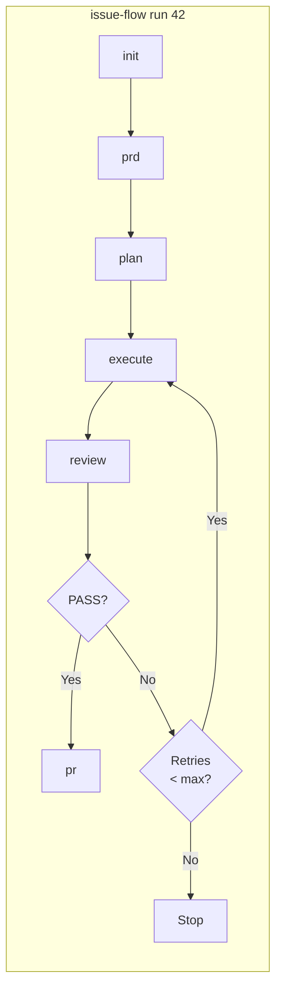

# Issue Flow

A CLI that turns GitHub issues into pull requests autonomously. Orchestrates the full pipeline -- plan, implement, review, and deliver -- via [Claude Code](https://docs.anthropic.com/en/docs/claude-code) Headless mode.

## Quick Start

```bash
# Verify prerequisites
npx issue-flow init

# Run the full pipeline for issue #42
npx issue-flow run 42
```

## Requirements

- **Node.js** >= 22.0.0
- **Git** installed and available in PATH
- **Claude Code** (`npm install -g @anthropic-ai/claude-code`)
- **GitHub CLI** (`gh`) authenticated (`gh auth login`)

Run `npx issue-flow init` to verify all prerequisites.

## Installation

```bash
# Run directly via npx (no install needed)
npx issue-flow run 42

# Or install globally
npm install -g issue-flow
issue-flow run 42
```

## Pipeline Flow



Each phase can also be run independently: `issue-flow prd 42`, `issue-flow plan 42`, etc. The `analyze` command is available standalone for deeper issue analysis when needed. The `generate` command creates issues separately: `issue-flow generate --prompt '...'`.

## Commands

### `run` -- Full pipeline (end-to-end)

```bash
# Run the complete pipeline for an issue
npx issue-flow run 42

# Resume from a specific phase
npx issue-flow run 42 --from execute

# Run on the current branch (no branch creation, no PR)
npx issue-flow run 42 --no-branch

# Watch the run live in the browser (see "Web Monitoring" below)
npx issue-flow run 42 --web
```

Executes all phases in order: **init** -> **prd** -> **plan** -> **execute** -> **review** -> **pr**. Automatically resumes from the last incomplete phase if pipeline state exists. On review failure, runs correction cycles (re-execute + re-review) up to `maxCorrectionCycles`.

| Flag | Description |
|------|-------------|
| `--mode <mode>` | Execution mode: `auto` (default) or `manual` |
| `--from <phase>` | Resume from a specific phase |
| `--no-branch` | Run on the current branch without creating a new branch or PR |
| `--web` | Enable real-time web monitoring (see [Web Monitoring](#web-monitoring)) |
| `-v, --verbose` | Show Claude progress output in real time |

### `init` -- Check prerequisites

```bash
npx issue-flow init
```

Verifies that `claude`, `gh` (authenticated), and `git` (inside a repo) are available. Reports pass/fail for each with install hints.

### `generate` -- Create a new issue

```bash
npx issue-flow generate --prompt "Add dark mode support to the settings page"
```

Analyzes the project and creates a detailed GitHub issue via Claude headless.

### `analyze` -- Analyze an issue (standalone)

```bash
npx issue-flow analyze 42
```

Fetches issue data, analyzes the codebase, and produces a structured analysis saved to `issues/42/analysis.md`. This is a standalone command not part of the default `run` pipeline -- use it when you need a deeper pre-analysis before generating the PRD.

### `prd` -- Generate a PRD

```bash
npx issue-flow prd 42
```

Generates a Product Requirements Document from the issue analysis. Saves to `issues/42/prd.md`.

### `plan` -- Convert PRD to task plan

```bash
npx issue-flow plan 42
```

Converts the PRD into a structured `issues/42/tasks.json` with ordered user stories, acceptance criteria, and pipeline state.

### `execute` -- Run the story execution loop

```bash
npx issue-flow execute --issue 42
npx issue-flow execute --issue 42 --max-iterations 15
npx issue-flow execute --issue 42 --retry-forever
```

Runs the iterative agent loop. Each iteration is a fresh Claude instance that picks the next pending story, implements it, runs quality checks, and commits.

| Flag | Description |
|------|-------------|
| `--issue N` | Issue number -- reads artifacts from `issues/N/` |
| `--max-iterations N` | Stop after N iterations (default: unlimited) |
| `--retry-limit N` | Retry transient Claude failures up to N consecutive times (default: 10) |
| `--retry-forever` | Retry transient Claude failures indefinitely |
| `--web` | Enable real-time web monitoring (see [Web Monitoring](#web-monitoring)) |

### `review` -- Validate the implementation

```bash
npx issue-flow review 42
```

Verifies acceptance criteria, runs tests, and checks for regressions. Outputs `PASS` or `FAIL` with findings.

### `pr` -- Create a pull request

```bash
npx issue-flow pr 42
```

Creates a well-structured PR referencing the issue, with summary and test plan.

## Web Monitoring

`run` and `execute` support an optional (off by default) real-time monitoring mode: a local HTTP server serves a self-contained web UI showing live progress -- current phase and activity, user stories, commits, pull requests, logs, errors, and time estimates. The page is read-only, works offline (no CDN, no external resources), and polls the server at a configurable interval.

```bash
# Enable with defaults (http://127.0.0.1:3737)
npx issue-flow run 42 --web

# Custom port and polling interval
npx issue-flow run 42 --web --port 8080 --refresh 10
```

Monitoring never affects the pipeline: publishing failures are swallowed with a single warning, a busy port (`EADDRINUSE`) just skips the server, and killing the server or closing the browser mid-run has no effect on the execution. With `--web` off, the terminal output and behavior are byte-for-byte identical to previous versions.

### Configuration

Each setting resolves with the precedence **CLI flag > environment variable > `.issue-flow.json` > default**:

| CLI flag | Environment variable | `.issue-flow.json` key | Default |
|----------|----------------------|------------------------|---------|
| `--web` / `--serve` | `ISSUE_FLOW_WEB` | `web.enabled` | `false` |
| `--port <n>` | `ISSUE_FLOW_WEB_PORT` | `web.port` | `3737` |
| `--host <h>` | `ISSUE_FLOW_WEB_HOST` | `web.host` | `127.0.0.1` |
| `--refresh <s>` | `ISSUE_FLOW_WEB_REFRESH` | `web.refreshSeconds` | `5` |
| `--web-log-limit <n>` | `ISSUE_FLOW_WEB_LOG_LIMIT` | `web.logLimit` | `200` |
| `--web-no-logs` | -- | `web.includeLogs` | logs included |

`.issue-flow.json` lives at the project root and is entirely optional -- a missing file or invalid content falls back to the defaults with a warning:

```json
{
  "web": {
    "enabled": true,
    "port": 3737,
    "host": "127.0.0.1",
    "refreshSeconds": 5,
    "logLimit": 200,
    "includeLogs": true
  }
}
```

The server exposes `GET /` (the UI), `GET /api/status` (the JSON snapshot, also at `/status.json`), `GET /api/sessions`, and `GET /api/health`.

### Remote access via Tailscale

The server binds to `127.0.0.1` by default (local access only). To watch a run from another device -- e.g. your phone, over [Tailscale](https://tailscale.com) -- bind to your machine's Tailscale IP (`100.x.y.z`):

```bash
npx issue-flow run 42 --web --host 100.101.102.103
# then open http://100.101.102.103:3737 from any device in your tailnet
```

Binding to `0.0.0.0` also works but exposes the server to your entire local network -- the CLI prints an explicit warning when you do. The interface is strictly read-only (no control endpoints), but prefer the Tailscale IP over `0.0.0.0` when possible.

### `issues/N/session.json`

When monitoring is enabled, the same snapshot served over HTTP is also persisted to `issues/N/session.json` (atomic writes, throttled to ~1s, final state flushed at the end of the run). Abridged format:

```json
{
  "schemaVersion": 1,
  "sessionId": "…",
  "readOnly": true,
  "issue": { "number": 42, "url": "https://github.com/owner/repo/issues/42" },
  "status": "running",
  "startedAt": "2026-08-03T16:00:00Z",
  "elapsedSeconds": 754,
  "estimatedRemainingSeconds": 420,
  "progress": { "percent": 45, "phasesCompleted": 3, "phasesTotal": 6, "storiesCompleted": 4, "storiesTotal": 10 },
  "currentPhase": "execute",
  "currentActivity": { "story": "US-005", "tool": "Bash", "detail": "npm test", "since": "…" },
  "phases": [{ "name": "init", "status": "completed", "durationSeconds": 12, "error": null }],
  "stories": [{ "id": "US-001", "title": "…", "priority": 1, "passes": true, "completedAt": "…" }],
  "execution": { "iteration": 5, "retries": 0, "correctionCycle": 0, "maxCorrectionCycles": 3 },
  "git": { "branch": "issue/42-dark-mode", "baseBranch": "main", "commits": [{ "hash": "abc1234", "subject": "feat: …" }] },
  "pullRequests": [{ "number": 43, "url": "…", "title": "…" }],
  "logs": [{ "at": "…", "level": "info", "message": "…" }],
  "errors": [],
  "warnings": [],
  "lastError": null,
  "nextSteps": ["review", "pr"],
  "environment": { "node": "v22.0.0", "platform": "darwin" }
}
```

`session.json` is a runtime artifact -- if your project commits the `issues/` directory, add it to your `.gitignore`:

```gitignore
issues/*/session.json
issues/*/session.json.tmp
```

## Pipeline State & File Structure

Each issue's state is tracked in `issues/N/tasks.json`:

```
issues/42/
  prd.md         # Product requirements
  tasks.json     # Task plan with pipeline state and user stories
  progress.txt   # Execution log
  analysis.md    # Issue analysis (optional, from standalone analyze command)
  session.json   # Live session snapshot (only with web monitoring enabled)
```

The `pipeline` field tracks which phases have completed, enabling resume from any point:

```json
{
  "pipeline": {
    "prdCompleted": true,
    "jsonCompleted": true,
    "executionCompleted": false,
    "reviewCompleted": false,
    "prCreated": false
  }
}
```

## Development

```bash
cd packages/issue-flow

# Install dependencies
npm install

# Build
npm run build

# Type check
npm run typecheck

# Run tests
npm test

# Watch mode
npm run dev
```

For the full development setup, local testing, and NPM publishing guide, see [CONTRIBUTING.md](packages/issue-flow/CONTRIBUTING.md).

## Skills & Agents (Traditional Usage)

Issue Flow also ships as a set of **Claude Code skills** and a **sub-agent orchestrator** (`resolve-issue`) for interactive use. Skills can be installed in Claude Code or any tool that supports [Agent Skills](https://agentskills.io), and the sub-agent provides the full orchestrated pipeline with execution modes, auto-correction loop, and pipeline resumption.

```bash
# Install all skills via skills.sh
npx skills add fabioassuncao/issue-flow

# Install a specific skill
npx skills add fabioassuncao/issue-flow --skill generate-issue
```

For full documentation on skills, the sub-agent, installation via `npx skills add`, and headless/CI usage, see **[Skills & Sub-Agent Architecture](docs/skills-and-agents.md)**.

## License

MIT
