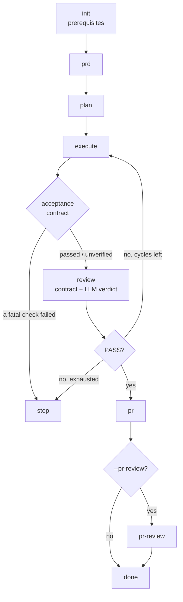

# Issue Flow CLI — experimental

[Project overview](../README.md) · [Recommended Agent Skills workflow](../skills/README.md)

## Experimental status and when to use it

The CLI is an independent interface for unattended issue-to-PR execution. It
manages agent processes, persistent state, locks, queues, verification, reviewer
routing, recovery and telemetry. Choose it when evaluating those runtime
capabilities; start with Agent Skills for work in your current coding agent.

> [!WARNING]
> The CLI and the rest of Issue Flow are experimental. Read the canonical
> [project status](project-status.md) before evaluating a run.

## Requirements and installation

Run inside a Git repository with:

- **Node.js ≥22.13.0**, npm and Git available in `PATH`.
- **An installed, authenticated coding agent.** Claude Code is the default;
  Codex CLI, Cursor CLI and Antigravity CLI are opt-in alternatives. Follow
  [agent setup and authentication](agents.md).
- **Authenticated GitHub CLI (`gh`)** for GitHub issues and PR publication.
  The [local provider](issues.md) can work without GitHub access.
- The consumer project's own toolchain for its build and quality checks.

Use `npx issue-flow` without a global installation, or install once:

```bash
npm install -g issue-flow
```

Examples below use `issue-flow` after global installation. Prefix it with `npx`
when using the package directly. Neither installation method installs Skills.

## First run

From a disposable consumer repository, choose a GitHub issue with observable
acceptance criteria. Replace `42` with its number:

```bash
issue-flow init       # check prerequisites and repository conventions
issue-flow run 42     # plan, implement, review and create the PR
```

`init` reports missing prerequisites and conventions. `init --apply` can create
missing conventions; it preserves existing files. See
[repository initialization](conventions.md#initializing-a-repository).

The CLI creates a branch by default. When the run finishes, inspect its verdict,
commits, checks and PR. A failed or blocked phase needs attention before the
whole task can be considered complete. For offline input, start with
[local issue creation and selection](issues.md#local-issue-format) and use
`issue-flow init --local` to check the local environment.

## Pipeline and outputs



| Phase | What it produces |
|-------|------------------|
| `init` | A pass/fail gate on the environment. Nothing is written |
| `prd` | `prd.md` — the requirements, derived from the issue |
| `plan` | `tasks.json` — ordered user stories with acceptance criteria |
| `execute` | Commits, one story at a time, each with quality checks |
| `review` | A `PASS`/`FAIL` conformance verdict against the acceptance criteria |
| `pr` | The Pull Request, with a summary and a test plan |
| `pr-review` | Optional. A whole-PR review — diff, architecture, risks, coverage |

A failing `review` triggers correction cycles (re-execute + re-review) up to
`maxCorrectionCycles` (3 by default). `analyze` exists as a standalone
deep-analysis command and is deliberately **not** part of `run`.

Each phase can be run on its own — `issue-flow prd 42`, `issue-flow plan 42` — and
`run` resumes from the first incomplete phase automatically.

```bash
issue-flow run 42 --from execute   # start at a given phase
issue-flow run 42 --no-branch      # current branch, no branch creation, no PR
issue-flow run 42 --pr-review      # add the whole-PR review at the end
issue-flow run 42,43,50            # a queue: one branch, one PR
issue-flow resume                  # continue an interrupted run, explicitly
```

Full reference: [**Commands**](commands.md).

Pipeline artifacts are machine-local under
`~/.issue-flow/projects/<project-id>/issues/<issue-id>/`, including the PRD,
task plan and session projections. The repository's code changes and commits
remain in the working tree. For SQLite storage, project identity, schemas,
telemetry and legacy migration, see [Storage and artifacts](storage.md).

## Monitor and resume a run

```bash
issue-flow run 42 --web --host 127.0.0.1
issue-flow status
issue-flow logs --follow
issue-flow resume
issue-flow web stop
```


The monitor is one detached server per machine and can show runs from multiple
projects. The explicit host above limits access to this machine; the default
binds to `0.0.0.0`. See [Web monitoring](web-monitor.md) for screenshots, access,
server lifecycle and API, and [Operating a run](commands.md#operating-a-run)
for history, usage, pause and cancellation.

For unattended experiments, `issue-flow run 42 --continuous --background`
selects the continuous resilience profile and detaches the run. Read
[Resilience](resilience.md) for retry limits, failover and failure handling.

## Configuration and agents

No configuration file is required. Use [Configuration](configuration.md) for
`.issue-flow.json`, global preferences, environment variables, precedence and
prompt overrides. These settings configure the CLI runtime.

```bash
issue-flow agent
issue-flow run 42 --agent codex
issue-flow policy
```

The first command reports the resolved agent; the second explicitly selects
Codex for a run; the third explains discovered repository policy. Per-phase
selection, authentication, permissions and token reporting belong in
[CLI agents](agents.md). Shared Git naming is documented in
[Git conventions](git-conventions.md).

## Known limitations

- **Execution state is not transferable to Skills.** See the
  [Skill artifact boundary](../skills/README.md#artifacts-resumption-and-limits).
- **`--mode manual` does not stop the CLI after planning.** It records the mode
  and rejects background execution. Planning-only behavior belongs to the
  `resolve-issue` Skill; see [the command contract](commands.md#run--the-full-pipeline).
- **Local CLI artifacts are not shared through Git.** See
  [storage](storage.md) and [issue publication options](commands.md#generate--draft-and-create-an-issue).
- **Usage reporting has limits.** Per-story cost is an allocation of invocation
  usage; missing USD values are not zero. See [tokens and cost](storage.md#tokens-and-cost).
- **Web configuration and controls have specific boundaries.** The global file's
  `web` key is not read; settings and future-run preferences are explained in
  [monitor configuration](web-monitor.md#configuration) and
  [execution controls](web-monitor.md#active-execution-is-read-only).
- **Text-derived dependencies are heuristic.** See [issue discovery](issues.md#discovery).
- **Whole-PR review is read-only by policy, not a complete sandbox guarantee.**
  See [PR review permissions](agents.md#permission).
- **Routing defaults to shadow mode.** See [routing and escalation](verification.md#shadow-routing).

## CLI reference

| Topic | Document |
|---|---|
| Commands, flags and exit codes | [Commands](commands.md) |
| Configuration and prompt overrides | [Configuration](configuration.md) |
| Agent setup, selection, permissions and troubleshooting | [Agents](agents.md) |
| GitHub/local providers, hierarchies and queues | [Issue sources](issues.md) |
| Artifacts, SQLite, schemas, telemetry and migration | [Storage](storage.md) |
| Dashboard and HTTP API | [Web monitoring](web-monitor.md) |
| Retries, failover and recovery | [Resilience](resilience.md) |
| Acceptance contract, independent review and routing | [Verification](verification.md) |
| Repository policy and initialization | [Conventions](conventions.md) |

To work on the CLI itself, start with [Contributing](../CONTRIBUTING.md), then
[local CLI testing and release](../packages/issue-flow/CONTRIBUTING.md).
