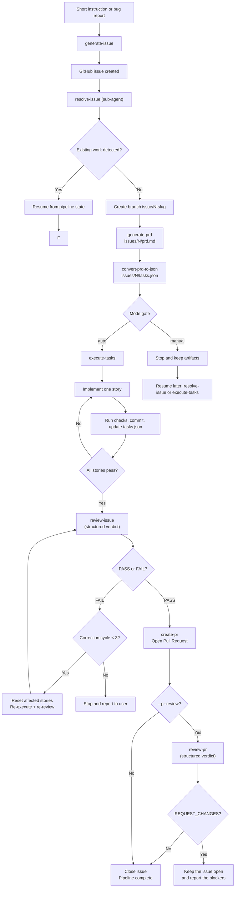

# The `resolve-issue` sub-agent

This document covers the **Claude Code-specific** half of the interactive usage
model: the `resolve-issue` sub-agent, which orchestrates the Agent Skills into
one pipeline with modes, an auto-correction loop and phase resumption.

> **The skills themselves are not Claude Code-specific and do not need this.**
> They follow the open [Agent Skills](https://agentskills.io) format, work in
> any compatible agent, and require neither the sub-agent nor the Issue Flow
> CLI. Start at [**Agent Skills**](skills.md) — the catalogue, installation per
> agent, the verified compatibility matrix and the contribution rules.
>
> For the CLI-first approach, see the [main README](../README.md) and the
> [command reference](commands.md).

## Architecture

Issue Flow uses a **sub-agent + skills** architecture:

- **`resolve-issue`** is a Claude Code **sub-agent** ([`agents/resolve-issue.md`](../agents/resolve-issue.md)) that orchestrates the full pipeline
- All other components are **skills** preloaded into the sub-agent, callable without nesting
- Two execution modes: `auto` (no stops), `manual` (artifacts only)
- Auto-correction loop: review finds issues -> fix -> re-review (up to 3 cycles)
- Pipeline state tracking enables resumption from any phase

### Where the artifacts go

**This is the one place the two surfaces genuinely differ.** The skills and the
sub-agent write to `<projectRoot>/issues/{N}/` — inside the repository, where the
session that invoked them is already working. The CLI writes compatibility
artifacts to `~/.issue-flow/projects/<project-id>/issues/{N}/` and, with the
default driver, keeps structured state in SQLite (see [Storage](storage.md)). It
never writes back to the repository-level tree.

There is one directional compatibility bridge. When the CLI first encounters a
legacy issue whose global destination does not exist, it copies the local
artifacts without overwriting anything and imports valid structured state into
SQLite. A skill-created `tasks.json` can therefore seed the CLI, including its
pipeline flags: `issue-flow resume` continues from the next incomplete phase.
This is a **one-time adoption, not synchronization**:

- after the global issue directory exists, later edits under the repository's
  `issues/{N}/` are not merged into CLI state;
- CLI changes are never exported back for `@resolve-issue` to read;
- a copied `session.json` is not adopted as live execution state, and legacy
  journal events require an explicit `issue-flow db import --with-events`.

In practice, pick one surface per issue. The only supported switch is an initial
skills → CLI handoff, after which the CLI remains authoritative. CLI → skills
and repeated alternation are unsupported. Add `/issues` to `.gitignore` unless
you deliberately want the interactive artifacts committed. The reproduced
behaviour and loss matrix are recorded in the
[#107 investigation](research/2026-09-05-pipeline-iterations-corrections-continuity.md#4-continuity-between-skills-and-cli).

### Issue sources

The issue can live on GitHub or in the repository itself (`issues/<N>/issue.md` +
`issues/<N>/metadata.json`). Both `generate-issue` / `generate-local-issue` and the
`resolve-issue` sub-agent work with either origin: when `issues/{N}/issue.md`
exists, it is the statement to work from and `gh` is not needed. The CLI
implements the same idea as a provider layer with conflict resolution -- see
[Issue sources](issues.md) for the file format, the flags, and the `issues` key of
`.issue-flow.json`.

### Skills vs Sub-agent: how they are invoked

Skills and sub-agents are invoked differently in Claude Code:

| | Skills | Sub-agent (`resolve-issue`) |
|--|--------|---------------------------|
| **Slash command** | `/skill-name` (e.g., `/generate-issue`, `/review-issue`) | Not available -- sub-agents do not use `/` |
| **@-mention** | Not available | `@resolve-issue` + instructions |
| **Natural language** | Claude auto-invokes based on description | Claude auto-delegates based on description |
| **Session-wide** | Not available | `claude --agent resolve-issue` |
| **Headless** | `claude -p "/review-issue #42"` | `claude --agent resolve-issue -p "#42 --mode auto"` |

> **Important**: The `resolve-issue` sub-agent is **not** a skill and cannot be invoked with `/resolve-issue`. Use `@resolve-issue` or natural language instead.

## Components

The skills below are documented in full — requirements, side effects,
compatibility — in [Agent Skills](skills.md). This table is the orchestration
view.

| Component | Type | Description |
|-----------|------|-------------|
| [`resolve-issue`](../agents/resolve-issue.md) | **Sub-agent** | Orchestrates the full pipeline end-to-end with mode support and auto-correction loop. |
| [`init-repository`](../skills/init-repository/) | Skill | Analyzes what a repository already declares and fills only the gaps — Issue Forms, PR template, `AGENTS.md`, `CLAUDE.md`, conventions. Incremental, non-destructive and idempotent. |
| [`generate-issue`](../skills/generate-issue/) | Skill | Generates architect-quality GitHub issues from short instructions with duplicate detection and label management. |
| [`generate-local-issue`](../skills/generate-local-issue/) | Skill | Generates architect-quality issues as local files (`issues/<N>/issue.md` + `metadata.json`) with no GitHub involved. |
| [`analyze-issue`](../skills/analyze-issue/) | Skill | Analyzes a GitHub issue to extract context, scope, affected areas, and complexity. Standalone use only -- not part of the default pipeline. |
| [`generate-prd`](../skills/generate-prd/) | Skill | Generates a structured PRD with user stories, acceptance criteria, and functional requirements. |
| [`convert-prd-to-json`](../skills/convert-prd-to-json/) | Skill | Converts a PRD markdown file into a structured JSON task plan for autonomous execution. |
| [`execute-tasks`](../skills/execute-tasks/) | Skill | Iteratively implements user stories from a JSON task plan with quality checks and commits. |
| [`create-pr`](../skills/create-pr/) | Skill | Creates a Pull Request from the current branch with context from issue data, PRD, and git history. |
| [`review-issue`](../skills/review-issue/) | Skill | Reviews whether a GitHub issue has been fully resolved, with structured output for the correction loop. |
| [`review-pr`](../skills/review-pr/) | Skill | Reviews a Pull Request as a whole (diff, architecture, duplication, tests, commits, description) and returns a structured verdict. Optional -- runs after `create-pr` when `--pr-review` is requested. |

## Agent entry points: `AGENTS.md` and `CLAUDE.md`

```text
CLAUDE.md  →  AGENTS.md  →  specialized documentation  →  single source of truth
```

**`AGENTS.md` is canonical** — the entry point for any coding agent of any
vendor, following the [open convention](https://agents.md) where agents read the
nearest file in the directory tree. Issue Flow treats it as an **index**: it names
the documents to read and holds no rule of its own.

**`CLAUDE.md` is a bridge**, and nothing else. One line:

```markdown
Read and follow the instructions in AGENTS.md.
```

Both formats allow their own content; Issue Flow deliberately restricts that.
Instructions duplicated in an agent file age out of sight and start contradicting
their source without anyone noticing. Any other tool-specific adapter follows the
same rule — a pointer, never a second copy.

Discovery walks the hierarchy from the root down to the working scope, so a
nested `AGENTS.md` wins over the root one, and it **follows a pointer file rather
than stopping at it**. The full policy, and what does not belong in an
`AGENTS.md`, is in [Conventions](conventions.md#agent-entry-points).

## Resuming an interrupted run

The CLI has an explicit command for it -- [`issue-flow resume`](commands.md#resume--continue-an-interrupted-pipeline)
-- and the sub-agent does not need one: `@resolve-issue` re-invoked on the same
issue reads the same `tasks.json` and continues from the first incomplete phase,
which is exactly what `resume` computes.

The parity is therefore in the **decision**, not in the surface: both paths
resume from `PipelineManager.getNextPhase()`, and neither ever repairs the
repository to get there. What the CLI adds is what only a CLI can do -- refuse
when another process owns the run, read the journal to name the phase that was
interrupted, and stop on a repository state that needs a human. A skill running
inside your session has you sitting in front of it, which is the same guarantee
by other means.

That parity does not imply a shared checkpoint. Each surface normally resumes
its own `tasks.json`; the initial skills → CLI adoption described above can
transfer phase flags, but not a live owner/session, and there is no reverse
transfer.

## Operating a run: a CLI-only surface, by construction

`status`, `runs`, `logs`, `pause` and `cancel` have no skill counterpart, and
the parity contract is not broken by that. Parity is about **decisions** a user
is entitled to get from both paths; these five commands take no decision at all
-- they read state and, in two cases, signal the process that owns it.

A skill runs inside your session, where "what is happening" is on screen and
"stop" is `Esc`. The commands exist because a headless `issue-flow run` has
neither.

## Repository policy: parity with the CLI is a contract

The skills and the CLI are two paths to the same outcome, and **a user is
entitled to the same decisions from both**. That is a contract, not an
aspiration, and it is pinned by `src/policy/policy-parity.test.ts`.

The skills are markdown and cannot import TypeScript, so the rule they both
follow is written once, in
[`skills/_shared/contracts/repository-conventions.md`](../skills/_shared/contracts/repository-conventions.md),
and materialised into every skill's own `references/` — see
[how the skills stay in one piece](skills.md#how-the-skills-stay-in-one-piece).
A skill that re-derives the invocation is a skill that will drift from it, and
the parity test fails on the attempt.

That contract names **three providers**, in order:

1. `issue-flow policy --json` — preferred, because it normalises everything into
   one payload with a `schemaVersion`. Adding a field is safe (readers ignore
   what they do not know); removing or renaming one bumps the version.
2. **Reading the repository directly** — `.github/ISSUE_TEMPLATE/`, the PR
   template, `AGENTS.md`, `gh label list`, `gh api orgs/{org}/issue-types`,
   `origin/HEAD`. Not a degraded mode: everything the CLI resolves is
   discoverable from the repository itself.
3. The documented defaults, only when neither answered.

The step is **best-effort by design**: without the CLI, without the network, on
a timeout, or in a repository that declares nothing, each skill continues. A
skill that needs the network to work is a regression, so the fallback is part of
the contract rather than an error path.

### What each path decides from

| Decision | Source |
|---|---|
| Issue Template and its required fields | `issues.templates` |
| Issue Type | `issues.types` |
| Labels — validated, **never created** | `issues.labels`, `issues.allowLabelCreation` |
| Issue title format | `issues.titleConvention` |
| Pull Request body | `pullRequests.template` |
| Base branch of the diff and of the PR | `pullRequests.baseBranch` |
| Branch and commit format | `git.branchConvention`, `git.commitConvention` |
| Which documents state the rules | `docs[].path` |
| Who owns the changed paths | `codeowners` |

### Where the two used to disagree

Establishing the parity meant choosing, for each divergence, which behaviour was
the right one — and in two cases the answer was neither:

| Divergence | Resolution |
|---|---|
| Issue body structure | the skill's was richer → the CLI prompt adopted it, now conditional on a repository template |
| Duplicate detection | the skill's multi-strategy search was better → the CLI prompt adopted it |
| Human-language detection | the skill had it, the CLI did not → the CLI prompt adopted it |
| Label creation | **neither** was right → both stopped creating labels |
| Title prefix under Issue Types | **neither** was right → both omit the textual prefix when the repository uses Issue Types |
| Who persists the issue | the CLI's separation of drafting from persistence was better → the skill keeps `gh`, with the same content decisions |

## Execution Modes

| Mode | Behavior | Use Case |
|------|----------|----------|
| `auto` | Full pipeline without stops (default) | Headless / CI / unattended |
| `manual` | Generates artifacts only, no execution | Planning / review before coding |

**Via @-mention (explicit):**
```
@resolve-issue #42
@resolve-issue #42 --mode auto
@resolve-issue #42 --mode manual
```

**Via natural language (Claude auto-delegates):**
```
Resolve issue #42
Resolve issue #42 --mode auto
```

**Via headless CLI:**
```bash
claude --agent resolve-issue -p "#42 --mode auto"
```

## End-to-End Workflow



> `review-pr` is **opt-in**: without `--pr-review` the flow ends at `create-pr` + closing the issue, exactly as before.

## Interactive Walkthrough

<details>
<summary><strong>1. Create the GitHub issue with <code>generate-issue</code></strong></summary>

The pipeline can start from a short natural-language request such as "create an issue for adding rate limiting to the API".

`generate-issue` then:
- inspects the repository and stack
- expands the short request into a well-scoped technical issue
- checks for duplicates
- validates labels
- creates the issue with `gh`

Output: a published GitHub issue that is ready to be planned and executed.

With no GitHub access (offline, no remote, or a demand that is not public yet), use `generate-local-issue` instead: it writes `issues/<N>/issue.md` and `issues/<N>/metadata.json`, and the rest of the pipeline is identical.
</details>

<details>
<summary><strong>2. Resolve the issue with the <code>resolve-issue</code> sub-agent</strong></summary>

`resolve-issue` is a **sub-agent** that orchestrates the full pipeline. It runs in an isolated context window with all skills preloaded.

**Planning phases (automatic):**
1. Check for existing work and pipeline state in `issues/{N}/`
2. Create the working branch (`issue-flow conventions branch`, see [`docs/git-conventions.md`](git-conventions.md))
3. Generate PRD with `generate-prd` -> `issues/{N}/prd.md`
4. Convert to task plan with `convert-prd-to-json` -> `issues/{N}/tasks.json`

**Mode-conditional gate:**
- `auto`: skips confirmation, proceeds directly to execution
- `manual`: stops here with artifacts saved

**Execution phases (if proceeding):**
5. Implement stories with `execute-tasks`
6. Validate with `review-issue` (structured verdict)
7. If FAIL: auto-correction loop (reset affected stories, re-execute, re-review -- up to 3 cycles)
8. If PASS: create PR with `create-pr` and close the issue
</details>

<details>
<summary><strong>3. Auto-correction loop</strong></summary>

After execution completes, the sub-agent automatically invokes `review-issue` which produces a structured verdict:

- **PASS**: All requirements met, tests pass, no regressions -> proceeds to create PR
- **FAIL**: Returns findings with affected user story IDs -> enters correction loop

The correction loop:
1. Saves review findings to `issues/{N}/review-findings.md`
2. Resets affected stories in `tasks.json` (`passes: false`)
3. Re-invokes `execute-tasks` to fix the issues
4. Re-invokes `review-issue` to validate the fixes
5. Repeats up to `maxCorrectionCycles` (default: 3) times
6. After 3 failed cycles, stops and reports to the user

This eliminates the need for manual back-and-forth between implementation and review.
</details>

<details>
<summary><strong>4. Pipeline resumption</strong></summary>

The `tasks.json` file tracks pipeline state:

```json
{
  "pipeline": {
    "prdCompleted": true,
    "jsonCompleted": true,
    "executionCompleted": false,
    "reviewCompleted": false,
    "prCreated": false
  }
}
```

When re-invoking `resolve-issue`, the sub-agent reads these flags and resumes from the last incomplete phase. In `auto` mode, this happens without any user interaction.

`prReviewCompleted` joins these flags only when the optional `pr-review` phase runs -- its absence means the phase was never requested, not that it is pending.
</details>

## Reviewing the Pull Request (`review-pr` / `pr-review`)

The `review-issue` skill is a **conformance gate**: it checks the implementation against the acceptance criteria of `tasks.json`. `review-pr` answers a different question -- is this Pull Request, as a whole, good enough to merge? It reads the PR description, the issue/PRD/implementation alignment, the full diff, architecture, complexity, duplication, project conventions, regressions, risks, test coverage, documentation, commit messages, and simplification opportunities.

Both surfaces produce the same verdict from the same axes:

| Surface | Invocation |
|---------|-----------|
| Skill | `/review-pr #184`, or natural language ("review this PR", "revisar o PR") |
| Sub-agent | Step 6b of `resolve-issue`, opt-in via `--pr-review` |
| CLI phase | `issue-flow pr-review [pr]`, or `issue-flow run 42 --pr-review` |

**Pull Request discovery** (both the skill and the CLI resolve it in the same order, and neither ever reviews a guessed PR):

1. The explicit argument (`184`, `#184` or a PR URL)
2. `pullRequest` in `issues/<N>/tasks.json`, written when the PR was created (when an issue is known)
3. The active in-memory session publisher (populated during `run --web` -- CLI only; not by reading `session.json` from disk)
4. `gh pr list --head <current branch>` -- the most recent PR
5. Failure with an actionable message asking for the number

**Artifacts** are versionable and rounds are additive -- a new round never overwrites an earlier report:

```
issues/42/pr-review/          # issues/pr-184/pr-review/ when there is no associated issue
  pr-184-round-1.md           # the eight canonical report sections
  index.json                  # { schemaVersion, pullRequest, rounds[] } with structured findings
```

**Exit codes** (CLI):

| Code | Meaning |
|------|---------|
| `0` | `APPROVE` or `APPROVE_WITH_SUGGESTIONS` |
| `2` | `REQUEST_CHANGES` |
| `1` | Execution failure: headless run, `gh`, PR not found, invalid options, or an unparseable verdict |

A malformed verdict is never coerced into `APPROVE`: it fails with `1` and the raw output is preserved in the report. `--fail-on <level>` shifts the threshold (`suggestions` also fails on `APPROVE_WITH_SUGGESTIONS`, `none` never fails on a verdict), but it never suppresses code `1`.

The review is **intended to be read-only** on both surfaces: Write/Edit are not allowed, and the prompt forbids edits, commits and `gh pr review|comment|merge` (Bash remains available for inspection). On `REQUEST_CHANGES`, the sub-agent and `run` leave the issue open (and do not mark the local plan completed) and report the blockers with the report path; `run` itself still exits `0`. See [the CLI reference](commands.md#pr-review--reviewing-a-pull-request-as-a-whole) for the flags and the [`prReview` key](configuration.md#prreview) of `.issue-flow.json`.

## Installation

| Component | Type | Portable | Claude Code required |
|---|---|---|---|
| The ten skills in [`skills/`](../skills/) | Agent Skills | **Yes** — any compatible agent | No |
| `resolve-issue` | Claude Code sub-agent | **No** | **Yes** |

**Skills:** see [Agent Skills → Installing](skills.md#installing). In short,
`npx skills add fabioassuncao/issue-flow` — which installs into
`~/.agents/skills/` (or the project's `.agents/skills/`) and links each agent's
own directory at it — or copy a skill's directory into the location your agent
scans.

**The sub-agent**, which is what adds the orchestration:

```bash
mkdir -p .claude/agents
curl -sSL https://raw.githubusercontent.com/fabioassuncao/issue-flow/main/agents/resolve-issue.md \
  -o .claude/agents/resolve-issue.md
```

It needs the skills it orchestrates to be installed as well.

> **It runs with `permissionMode: bypassPermissions`.** It does not ask before
> writing files, running commands or calling `gh` — which is the point of an
> unattended pipeline, and a reason to install it deliberately rather than by
> default. The skills have no such setting.

### What works without the sub-agent

Every skill, on its own: creating issues locally or on GitHub, analysing one,
generating a PRD, converting it to a task plan, executing the stories, opening a
Pull Request, reviewing an issue, reviewing a Pull Request.

What the sub-agent adds, and only it: the orchestrated end-to-end pipeline, the
`auto`/`manual` mode gate, the auto-correction loop, and resumption across
phases. Without it you can still run the whole workflow by invoking each skill
in sequence.

## Headless / CI Usage

```bash
# Full pipeline, no stops (sub-agent)
claude --agent resolve-issue -p "#42 --mode auto"

# Planning only (sub-agent)
claude --agent resolve-issue -p "#42 --mode manual"

# Individual skills (headless)
claude -p "/execute-tasks for issue #42"
claude -p "/review-issue #42"
claude -p "/create-pr for issue #42"
claude -p "/review-pr #42"
```

## Quick Start (Interactive)

**Skills (slash command):**
```
/generate-issue Add rate limiting to the API

/review-issue #42

/execute-tasks for issue #42
```

**Sub-agent (@-mention):**
```
@resolve-issue #42

@resolve-issue #42 --mode auto
```

**Sub-agent (natural language -- Claude auto-delegates):**
```
Resolve issue #42

Fix issue #42 in auto mode
```

See each skill's README for standalone usage.
