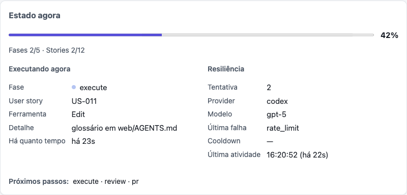

# Web monitoring

`run` and `execute` accept `--web`: a local HTTP server serves a self-contained,
dashboard showing live progress — current phase and activity, user
stories, resilience state, commits, pull requests, logs, tokens, cost and time
estimates. It is off by default, works offline (no CDN, no external resource),
and polls the server at a configurable interval.

```bash
issue-flow run 42 --web                            # http://localhost:3737
issue-flow run 42 --web --port 8080 --refresh 10
issue-flow run 42 --web --host 127.0.0.1           # this machine only
issue-flow run 42 --restart-web                    # restart, then monitor
issue-flow web stop                                # stop the monitor explicitly
```

Monitoring never affects the pipeline: publishing failures are swallowed with a
single warning, a busy port (`EADDRINUSE`) just skips the server, and killing the
server or closing the browser mid-run has no effect on the execution. With
`--web` off, the terminal output and behaviour are byte-for-byte identical.

## The dashboard

With two or more active sessions, the panel opens on the executions dashboard —
one card per run, from every project on this machine:


Clicking a card opens that session's detail view. A *"Todas as execuções"*
control returns to the dashboard even when only one run exists; with exactly one
active session the panel opens straight into the detail view.

## The detail view


At the top, two cards give the full context of the run without leaving the
browser: **"Resumo da issue"** (number, title, full description, labels and
open/closed state — with a neutral "Não definida" placeholder for priority, since
the `Issue` domain has no such field) and **"Repositório"** (current branch,
short HEAD commit, repository name and the project's working directory).

Below the header and the alerts, the panel is split into three tabs.

**"Execução"** is the view above: progress, the *"Executando agora"* card, the
live resilience projection (current attempt, provider/model, last failure kind,
cooldown and last real agent activity), the phase list with per-phase tokens and
cost, effective harness/model configuration, user stories, commits, pull
requests and recent logs.

The resilience card is where a provider migration shows up:



**"Kanban"** is a second reading of the same data — every story in four columns
(**Backlog**, **Em andamento**, **Em revisão**, **Concluído**), grouped by the
story's [`status`](storage.md#story-status), each column showing its own count:


A story whose `status` is absent (an older `session.json`) or unrecognized falls
into Backlog rather than disappearing, and every column renders even when empty.
Clicking a Kanban card, story row or phase — or focusing it and pressing Enter —
opens the same **side drawer**. It shows status and timing, effective
harness/model, token/cache/cost telemetry per invocation, stage transitions,
retries/fallbacks/corrections, and expandable process output and correlated
global diagnostics. Story-specific content (description, acceptance criteria
and dependencies) remains in that same component. The drawer closes
on the overlay, the close button or `Esc`, and returns focus to the card that
opened it. It issues **no** additional network requests: everything it shows
already came with the snapshot.

**"Histórico"** reads the append-only [journal](resilience.md#the-event-journal)
and lists the run's pipeline, retry, failure and failover events, with
pipeline/resilience filters. When journaling is disabled or the files do not
exist, it renders an empty state.

Switching tabs never interrupts polling: both views are re-rendered on every
refresh, so the Kanban is already current the moment it is opened, and an open
drawer stays open across refreshes, updating in place.

## Light and dark theme

The panel ships both themes and a **"Tema"** select next to the **"Atualizar"**
control — in the dashboard header *and* in the detail header, mirrored, so
changing it in one immediately reflects in the other. It has three states:

| State | What it does |
|-------|--------------|
| **Sistema** (default) | Follows the operating system, live: switching the OS theme repaints the panel with no reload |
| **Claro** | Forces the light theme, whatever the OS says |
| **Escuro** | Forces the dark theme, whatever the OS says |

The choice is stored in `localStorage` under `issue-flow:theme`, so it is **per
browser** (per origin, in fact), not per session, per project or per machine:
another browser — or the same browser on another device watching the same
monitor over the network — keeps its own preference. There is no CLI flag, no
environment variable and no `.issue-flow.json` key for it; it is a client-side
display setting and never reaches the server.

The stored theme is applied by a tiny inline script in the `<head>`, before the
stylesheet loads, so a reload with a forced theme never flashes the opposite
palette. With `localStorage` unavailable (a private window with storage
blocked, a hardened profile) the panel still loads and the select still switches
the theme for that tab — the choice just does not survive the reload.

Both themes declare their own `color-scheme`, so `<select>`, `<progress>` and
the scrollbars follow the **effective** theme rather than the OS one, and every
text/background pair meets WCAG AA (4.5:1 for text, 3:1 for the focus ring).
Nothing here is loaded from the network: the palette is plain CSS custom
properties in `app.css`, and the panel remains offline-capable.

## Active execution is read-only

`snapshot.readOnly` stays `true`: the interface never edits, deletes, reorders
or changes the status of the active run. On a loopback binding, health advertises
`config:agent:write` and `config:routing:write`; those capabilities reveal
controls that save **global preferences for future executions** only. Each phase
can save a harness and concrete tier/model, and routing mode, profile and the
recommended policy can be changed in the same card. Remote bindings advertise
neither capability and expose no mutation controls.

## Single instance, detached from the pipeline

There is at most **one** monitoring server per machine, and it outlives any
single `run`/`execute` invocation:

- The first `--web` invocation on a machine spawns the server as its own
  **detached background process** instead of binding inline — the pipeline
  process that triggered it can exit normally (including a plain `Ctrl-C`)
  without taking the monitor down. Ownership is tracked in
  [`~/.issue-flow/web.lock`](storage.md#issue-flowweblock).
- Every subsequent `--web` invocation, from the same project or a different one,
  detects the live instance (`pid` alive **and** `GET /api/health` answers) and
  **reuses it** — no port conflicts, no silently-degraded second monitor.
- The server is single-instance, not single-session: it watches the whole
  `~/.issue-flow` tree and reflects **every** active run, from every project, at
  once.
- `issue-flow web stop` sends a graceful shutdown signal and waits for
  `web.lock` to be removed; with no monitor running, it says so and exits `0`.
  There is no other way to stop it short of killing the pid — closing every
  browser tab or ending every `run --web` does **not** stop it, by design, since
  it may still be serving other sessions.

A stale lock (dead `pid`, or a live one that does not answer the health probe) is
removed and re-claimed. The claim uses an exclusive create (`wx`) **after** a
successful bind, so two invocations racing to become the owner still agree on
exactly one winner.

### Explicit restart and stale UI assets

`--restart-web` is an ephemeral action flag accepted by `run` and `execute`. It
implies `--web`, gracefully stops the previous verified monitor, and starts a
new detached process through the entry point of the CLI handling the command.
Without it, the normal reuse behaviour above is unchanged.

The distinction matters after upgrading Issue Flow: `web/public` is not copied
through a separate frontend build. The server reads `index.html`, `app.css` and
`app.js` once at startup and retains them in memory, together with its status
ETag cache. A process started by an older package therefore keeps serving that
older UI even if the package files on disk are later replaced. Restarting the
process invalidates those process-local caches. There is no web build cache on
disk, service worker or HTTP browser cache to delete; responses use
`Cache-Control: no-store`, and `--restart-web` deliberately does not remove npm
cache, `dist`, session files or browser `localStorage`.

If `~/.issue-flow` was deleted while the detached monitor was alive, the
process becomes an orphan with no `web.lock`. Issue Flow probes the configured
port and restores the lock only after both the health endpoint and the listener
command line prove that it is `issue-flow web serve`. An ambiguous owner is
never killed. Restart operations are serialized, and failures remain non-fatal
to the pipeline.

New monitor versions expose an instance id; an already-open current dashboard
detects the replacement and reloads itself. A tab loaded from a release that
predates instance ids needs one manual reload. `--restart-web` uses the package
version currently executing; to request an npm update as well, use for example
`npx issue-flow@latest run 42 --restart-web`.

### Which version is on screen

Two processes are involved and they can be on different releases: the CLI
running the pipeline, and the detached monitor serving the dashboard. Both are
named, so the difference is visible rather than inferred.

| Surface | Shows | Source |
|---|---|---|
| Terminal headline | `Issue Flow v0.16.0 · #42 · …` | `session.json` → `environment.cliVersion` |
| `run` / `execute` first line | `Issue Flow v0.16.0 · starting pipeline for issue #42 …` | the running package |
| Panel header (version chip) | `v0.16.0` | `GET /api/health` → `version` |
| Configuration card | both, side by side | the snapshot and `/api/health` |
| `--version` | the running package | the manifest |

The terminal reads the version from the snapshot, not from the manifest, so a
resumed or replayed session keeps naming the build that produced it. The chip in
the panel header names the **monitor**, because the monitor is what served the
page you are looking at.

When the two differ, both surfaces say so: the CLI warns while reusing an
existing monitor, naming both versions and pointing at `--restart-web`, and the
configuration card renders the same warning in the panel. Neither one enforces
anything — the run proceeds against the older monitor.

If the global storage tree itself is unavailable (no resolvable home directory
and no `ISSUE_FLOW_HOME`), monitoring falls back to the pre-single-instance
behaviour instead of being lost: the server binds **inline**, in the pipeline's
own process, serving only that run's snapshot from memory, with no lock file and
no detached process. A warning is printed when this happens.

## Multiple sessions

Because the server is decoupled from any one run, it cannot rely on that run's
in-memory state. It polls
`~/.issue-flow/projects/*/issues/*/session.json` on disk (the same file each run
already writes) every 3 seconds, validates each one, and keeps every well-formed,
recently-updated one as an **active session**. While a run is live, a 10-second
mtime-only heartbeat keeps it visible without changing the snapshot content or
its ETag; after **90 seconds** without a heartbeat, the session is no longer
reported.

Polling rather than `fs.watch` is deliberate: `fs.watch`'s `recursive` option is
only reliable on macOS and Windows, while the `~/.issue-flow` tree is small and
local.

## HTTP API

| Route | Returns |
|-------|---------|
| `GET /` | The dashboard |
| `GET /api/health` | Liveness, PID, version and instance identity used by ownership/restart probes |
| `GET /api/sessions` | Every active session, with the summary fields the dashboard cards need |
| `GET /api/status?session=<id>` | That session's full [snapshot](storage.md#sessionjson). Also served at `/status.json` |
| `GET /api/events?session=<id>` | Journal entries for that session |
| `GET /api/config?session=<id>` | Captured effective configuration, resolved routing settings and the installed-harness model catalog |
| `GET /api/diagnostics?session=<id>` | Correlated records from the global diagnostic log |
| `POST /api/config/agent` | Save a global provider/model preference for future runs; loopback only |
| `POST /api/config/routing` | Save global routing mode/profile/policy for future runs; loopback only |

`GET /api/sessions` exists so the client does not need N× `/api/status` fetches
just to paint the list. `issueDescription` is a short whitespace-collapsed
preview, not the full body:

```json
[
  {
    "sessionId": "3f9e2b7a-…",
    "issueNumber": 42,
    "issueTitle": "Add multi-project dashboard",
    "issueDescription": "Short preview of the issue body…",
    "repositoryName": "acme/app",
    "currentPhase": "execute",
    "progressPercent": 40,
    "elapsedSeconds": 320,
    "status": "running",
    "startedAt": "2026-08-04T16:00:00Z",
    "updatedAt": "2026-08-04T16:05:00Z",
    "attempt": 2,
    "provider": "codex",
    "lastFailureKind": "provider_down",
    "cooldownUntil": "2026-08-04T16:06:00Z",
    "lastActivityAt": "2026-08-04T16:05:58Z",
    "statusUrl": "/api/status?session=3f9e2b7a-…",
    "eventsUrl": "/api/events?session=3f9e2b7a-…"
  }
]
```

`GET /api/status` without `?session=` keeps the pre-multi-session behaviour when
it is unambiguous: with **exactly one** active session it answers that one; with
**zero** or **more than one**, it answers `404` / `409` instead of guessing — the
`409` body lists every active `sessionId` so a client can disambiguate.

`GET /api/events` reads the rotated journal (`events.1.jsonl`) before the current
generation, tolerating absent, partial or malformed lines, and returns `[]` when
journaling is disabled.

The configuration card renders the captured value, not a new resolution done by
the browser, so a run keeps explaining exactly which layers determined it.
Changing a provider/model writes only the global user preference and only when
the monitor is bound to loopback; it never mutates an active run. On a LAN or
Tailscale binding the route is absent from `/api/health.capabilities` and returns
`403`.

ETags are content-hashed (`sha1` of the serialized snapshot) rather than
counter-based, so they work uniformly for both the directory-backed and the
in-memory session sources.

## Configuration

Each setting resolves with the precedence **CLI flag > environment variable >
`.issue-flow.json` > default**:

| CLI flag | Environment variable | `.issue-flow.json` key | Default |
|----------|----------------------|------------------------|---------|
| `--web` / `--serve` | `ISSUE_FLOW_WEB` | `web.enabled` | `false` |
| `--restart-web` | — | — | one-shot action; implies `--web` |
| `--port <n>` | `ISSUE_FLOW_WEB_PORT` | `web.port` | `3737` |
| `--host <h>` | `ISSUE_FLOW_WEB_HOST` | `web.host` | `0.0.0.0` |
| `--refresh <s>` | `ISSUE_FLOW_WEB_REFRESH` | `web.refreshSeconds` | `5` |
| `--web-log-limit <n>` | `ISSUE_FLOW_WEB_LOG_LIMIT` | `web.logLimit` | `200` |
| `--web-no-logs` | — | `web.includeLogs` | logs included |

The global `~/.issue-flow/config.json` also has a `web` key, but
`loadWebConfig()` does not read it yet — see
[configuration](configuration.md#the-precedence-ladder).

## Remote access

The server binds to **`0.0.0.0` by default**, so it is reachable from your local
network as soon as it starts. The CLI prints an explicit warning when it does.
Pass `--host 127.0.0.1` to restrict it to this machine.

To watch a run from another device — a phone, over
[Tailscale](https://tailscale.com) — bind to your machine's tailnet IP instead of
exposing the whole LAN:

```bash
issue-flow run 42 --web --host 100.101.102.103
# then open http://100.101.102.103:3737 from any device in your tailnet
```

Execution state is always read-only. Global agent preferences are writable only
on loopback; on a remote binding the entire interface is read-only. Prefer the
Tailscale IP over `0.0.0.0` when remote monitoring is needed.

## Rebuilding the screenshots

The images above were produced by serving real `session.json` and `events.jsonl`
files — written through the pipeline's own publishers and reducer, not hand-made
fixtures — from a throwaway `ISSUE_FLOW_HOME`, then driving the real server with
Playwright. To reproduce them, point `ISSUE_FLOW_HOME` at a scratch directory,
run any pipeline with `--web`, and screenshot `http://localhost:3737`.
