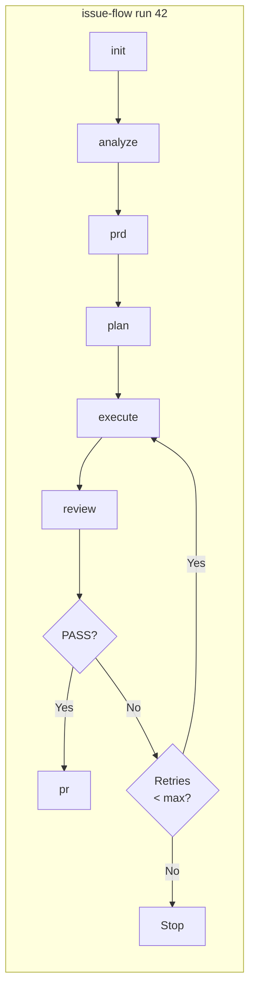

# issue-flow

> This is the npm package README. For full project documentation, see the [root README](../../README.md).

Unified CLI that orchestrates the full issue-to-PR pipeline via [Claude Code](https://docs.anthropic.com/en/docs/claude-code) Headless mode. Analyzes issues, generates PRDs, creates task plans, implements code iteratively, reviews results, and opens pull requests -- all programmatically, without interactive sessions.

Built on the [Ralph pattern](https://ghuntley.com/ralph/) for autonomous AI agent loops.

## Pipeline Flow



## Requirements

- **Node.js** >= 18.0.0
- **git** installed and available in PATH
- **Claude Code** (`npm install -g @anthropic-ai/claude-code`)
- **GitHub CLI** (`gh`) authenticated (`gh auth login`)

Run `npx issue-flow init` to verify all prerequisites.

## Installation

```bash
# Run directly via npx (no install needed)
npx issue-flow run 42

# Or install globally
npm install -g issue-flow
issue-flow run 42
```

## Global Options

All commands support the following options:

| Flag | Description |
|------|-------------|
| `-v, --verbose` | Show Claude progress output in real time |
| `-t, --timeout <seconds>` | Override headless timeout in seconds (0 = no limit) |

```bash
# Run with verbose output
npx issue-flow analyze 42 --verbose

# Override timeout to 10 minutes
npx issue-flow analyze 42 --timeout 600

# Disable timeout entirely
npx issue-flow run 42 --timeout 0

# Combine flags
npx issue-flow analyze 42 -v -t 600
```

Every phase that invokes Claude once (`analyze`, `prd`, `plan`, `review`, `pr`, `pr-review`, `generate`) shares a default limit of **15 minutes** per invocation; `execute` has no limit, since its iteration budget is what bounds it. Use `--timeout` to raise it on a large issue, or `--timeout 0` to remove it. When an invocation is cut short the phase reports it as a timeout and retries with backoff, so the limit is the first thing to raise if a phase keeps dying at the same elapsed time.

## Commands

### `run` -- Full pipeline (end-to-end)

```bash
# Run the complete pipeline for an issue
npx issue-flow run 42

# Resume from a specific phase
npx issue-flow run 42 --from execute

# Manual mode (artifacts only, no execution)
npx issue-flow run 42 --mode manual

# Watch the run live in the browser (see "Web Monitoring" below)
npx issue-flow run 42 --web

# Continue User Story numbering from the last used in this project
npx issue-flow run 42 --continue

# Force User Story numbering to start at a specific number
npx issue-flow run 42 --start-us 27
```

Executes all phases in order: **init** → **analyze** → **prd** → **plan** → **execute** → **review** → **pr**. Automatically resumes from the last incomplete phase if pipeline state exists. On review failure, its findings are saved verbatim to `lastReviewFindings` in `tasks.json`, and a correction cycle (re-execute + re-review) runs up to `maxCorrectionCycles`. The re-execute step reads `lastReviewFindings` and treats the issue as unresolved even if every user story already has `passes: true`, until the findings are addressed and the field is cleared back to `null`.

`--continue` and `--start-us <n>` control User Story (`US-NNN`) numbering continuity across `plan` runs of the same project — see [`plan`](#plan----convert-prd-to-task-plan) below.

### `init` -- Check prerequisites

```bash
npx issue-flow init
```

Verifies that `claude`, `gh` (authenticated), and `git` (inside a repo) are available. Reports pass/fail for each with install hints.

### `analyze` -- Analyze an issue

```bash
npx issue-flow analyze 42
```

Invokes Claude headlessly to fetch issue data, analyze the codebase, and produce a structured analysis saved to `~/.issue-flow/…/issues/42/analysis.md` (see [Pipeline State](#pipeline-state)).

### `prd` -- Generate a PRD

```bash
npx issue-flow prd 42
```

Generates a Product Requirements Document from the issue analysis. Reads `analysis.md` from the same directory as context if available. Saves to `~/.issue-flow/…/issues/42/prd.md`.

### `plan` -- Convert PRD to task plan

```bash
npx issue-flow plan 42

# Continue User Story numbering from the last used in this project
npx issue-flow plan 42 --continue

# Force numbering to start at a specific number, ignoring history
npx issue-flow plan 42 --start-us 27
```

Converts the PRD into a structured `~/.issue-flow/…/issues/42/tasks.json` with ordered user stories, acceptance criteria, and pipeline state. Validates the output with zod schemas.

`US-NNN` numbering continues automatically across `plan` runs of the same project: the highest number already used in any of the project's `tasks.json` files is recovered and the next story continues from there, falling back to `US-001` when the project has no history yet. `--continue` names that automatic recovery explicitly; `--start-us <n>` forces a specific starting number instead, ignoring history — the two flags are mutually exclusive. The decision is always printed to the terminal and recorded in the project's `metadata.json` (`userStoryNumbering`) for audit. See the root [README](https://github.com/fabioassuncao/issue-flow#user-story-numbering-continuity) for the full cascade.

### `execute` -- Run the story execution loop

```bash
npx issue-flow execute --issue 42
npx issue-flow execute --issue 42 --max-iterations 15
npx issue-flow execute --issue 42 --retry-forever
```

Runs the iterative agent loop. Each iteration is a fresh Claude instance that picks the next pending story, implements it, runs quality checks, and commits.

| Flag | Description |
|------|-------------|
| `--issue N` | Issue number -- reads artifacts from `~/.issue-flow/…/issues/N/` |
| `--max-iterations N` | Stop after N iterations (default: unlimited) |
| `--retry-limit N` | Retry transient Claude failures up to N consecutive times (default: 10) |
| `--retry-forever` | Retry transient Claude failures indefinitely |

### `review` -- Validate the implementation

```bash
npx issue-flow review 42
```

Invokes Claude headlessly to verify acceptance criteria, run tests, and check for regressions. Outputs `PASS` or `FAIL` with findings.

### `pr` -- Create a pull request

```bash
npx issue-flow pr 42
```

Creates a well-structured PR referencing the issue, with summary and test plan.

### `generate` -- Create a new issue

```bash
npx issue-flow generate --prompt "Add dark mode support to the settings page"
```

Analyzes the project and creates a detailed GitHub issue via Claude headless.

## Web Monitoring

`run` and `execute` support an optional (off by default) real-time monitoring mode: a local HTTP server (plain `node:http`, zero new dependencies) serves a self-contained, read-only web UI with live progress -- current phase and activity, user stories, commits, pull requests, logs, and time estimates.

```bash
# Enable with defaults -- binds to 0.0.0.0:3737, reachable from your LAN/VPN
npx issue-flow run 42 --web

# Restrict to this machine only
npx issue-flow run 42 --web --host 127.0.0.1
```

Each setting resolves with the precedence **CLI flag > environment variable > `.issue-flow.json` > default**:

| CLI flag | Environment variable | `.issue-flow.json` key | Default |
|----------|----------------------|------------------------|---------|
| `--web` / `--serve` | `ISSUE_FLOW_WEB` | `web.enabled` | `false` |
| `--port <n>` | `ISSUE_FLOW_WEB_PORT` | `web.port` | `3737` |
| `--host <h>` | `ISSUE_FLOW_WEB_HOST` | `web.host` | `0.0.0.0` |
| `--refresh <s>` | `ISSUE_FLOW_WEB_REFRESH` | `web.refreshSeconds` | `5` |
| `--web-log-limit <n>` | `ISSUE_FLOW_WEB_LOG_LIMIT` | `web.logLimit` | `200` |
| `--web-no-logs` | -- | `web.includeLogs` | logs included |

Monitoring never affects the pipeline: with `--web` off the behavior is byte-for-byte identical, a busy port just skips the server with a warning, and killing the server mid-run has no effect on the execution. While enabled, the snapshot served at `/api/status` is also persisted to `~/.issue-flow/…/issues/N/session.json` -- outside your working tree, so there is nothing to add to `.gitignore`.

For the full documentation (endpoints, `session.json` format, Tailscale setup), see the [root README](../../README.md#web-monitoring).

## Pipeline State

Each issue's state is tracked in a directory of its own under `~/.issue-flow`, keyed by a deterministic project id and the issue identifier:

```
~/.issue-flow/projects/<project-id>/issues/42/
  analysis.md    # Issue analysis
  prd.md         # Product requirements
  tasks.json     # Task plan with pipeline state and user stories
  progress.txt   # Execution log
  session.json   # Live session snapshot (web monitoring only)
  pr-review/     # PR review reports and index
```

Nothing is written to your repository. A `<projectRoot>/issues/` tree left by an earlier release is copied here automatically on first use and then treated as read-only -- see the [root README](../../README.md#global-storage) for the full layout, the project id derivation and the migration.

The `pipeline` field tracks which phases have completed, enabling resume from any point:

```json
{
  "pipeline": {
    "analyzeCompleted": true,
    "prdCompleted": true,
    "jsonCompleted": true,
    "executionCompleted": false,
    "reviewCompleted": false,
    "prCreated": false
  }
}
```

The top-level `lastReviewFindings` field (`string | null`) holds the verbatim findings of the most recent failed `review` phase. Non-null overrides the "issue already complete" check even when every user story has `passes: true`, so a correction cycle's re-execute step is guaranteed to run instead of exiting immediately — see `core/engine.ts`.

## Architecture

```
src/
  cli.ts                  # Entry point, subcommand registration (commander)
  config.ts               # Configuration resolution and defaults
  types.ts                # Shared TypeScript interfaces
  schemas.ts              # Zod validation schemas
  commands/
    init.ts               # Prerequisite verification
    generate.ts           # Headless issue creation
    run.ts                # Full pipeline orchestrator
    analyze.ts            # Headless issue analysis
    prd.ts                # Headless PRD generation
    plan.ts               # Headless PRD-to-JSON conversion
    execute.ts            # Iterative story execution (engine wrapper)
    review.ts             # Headless implementation review
    pr.ts                 # Headless PR creation
  core/
    engine.ts             # Main agent loop
    executor.ts           # Claude CLI invocation via execa
    headless.ts           # Typed wrapper for claude -p invocations
    pipeline.ts           # Pipeline state machine
    state-manager.ts      # Typed CRUD for tasks.json
    prompt-resolver.ts    # Prompt resolution and templating
    session-state.ts      # Session snapshot reducer and publishers
    session-publisher.ts  # Global session publisher slot
    session-git.ts        # Commit/PR enrichment for the snapshot
  web/
    server.ts             # Web monitoring HTTP server (assets in web/public/)
  ui/
    logger.ts             # Colored logging utilities
    progress.ts           # Progress bar and iteration headers
    summary.ts            # Box drawing and summary display
  utils/
    shell.ts              # Shell command execution
    git.ts                # Git operations
    retry.ts              # Transient failure detection and backoff
```

## Development

```bash
# Install dependencies
npm install

# Build
npm run build

# Type check
npm run typecheck

# Run tests
npm test

# Watch mode
npm run dev
```

For the full development setup and local testing guide, see [CONTRIBUTING.md](CONTRIBUTING.md).
The official release procedure (changelog, version bump, tag, `npm publish`, GitHub
Release) is documented in [CONTRIBUTING.md → Release process](CONTRIBUTING.md#release-process).

## Credits

Based on [Geoffrey Huntley's Ralph pattern](https://ghuntley.com/ralph/) and the [snarktank/ralph](https://github.com/snarktank/ralph) repository.

## See Also

- [Skills & Sub-Agent Architecture](../../docs/skills-and-agents.md) -- Using Issue Flow interactively via Claude Code skills and the `resolve-issue` sub-agent.
